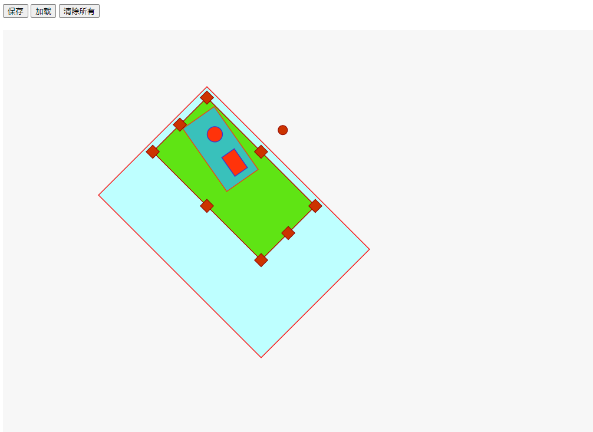
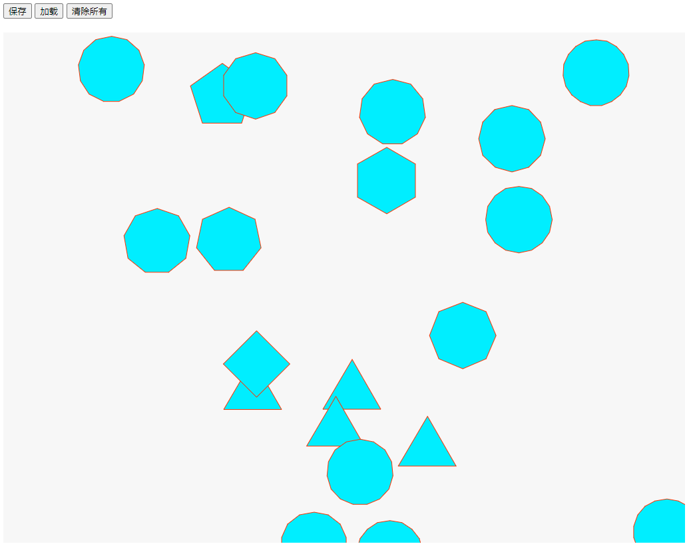
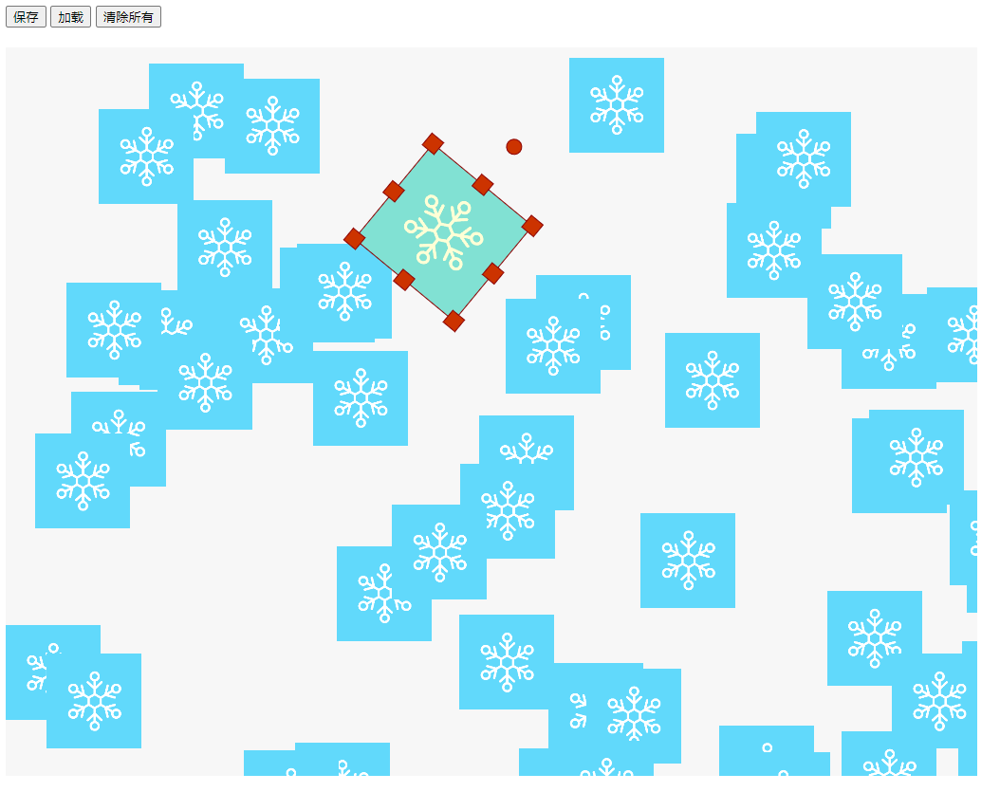
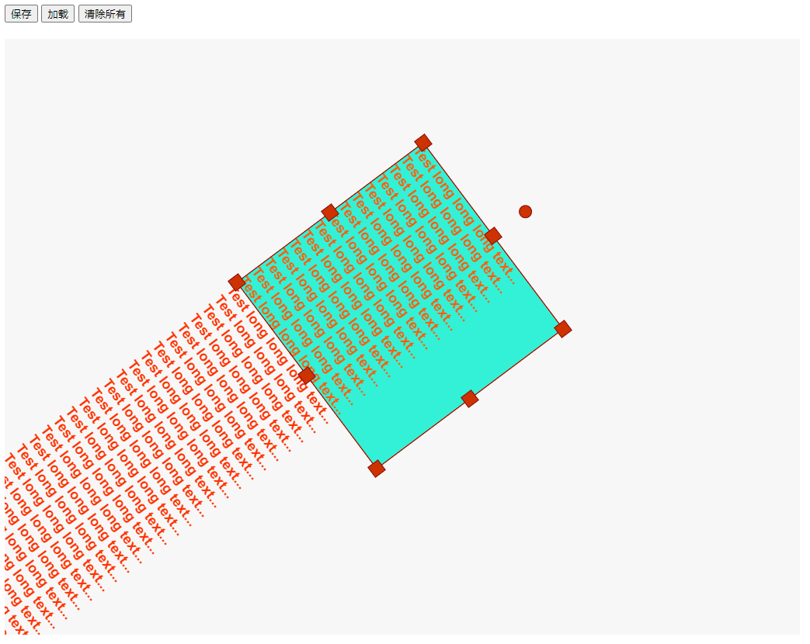
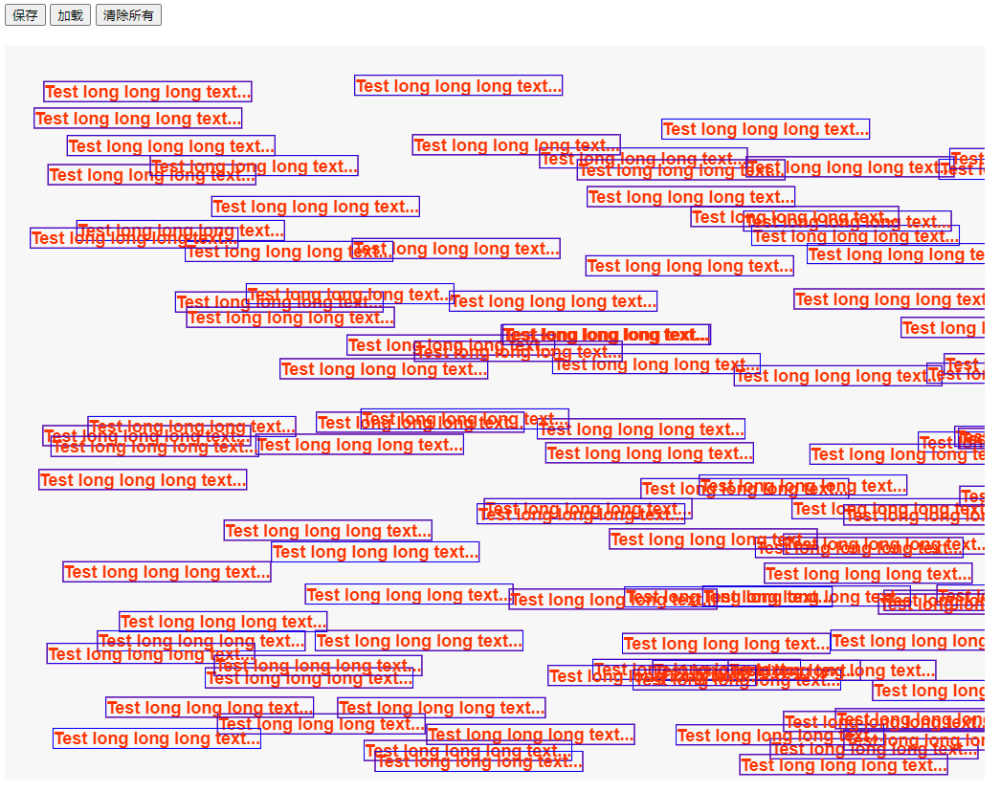
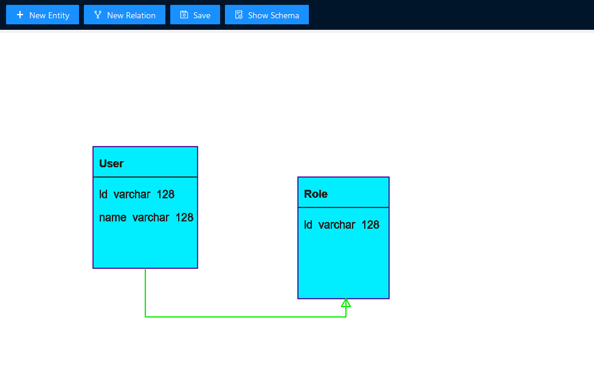
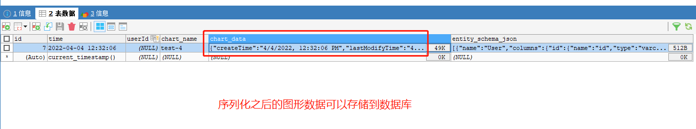

<p align="center">

</p>

<h1 align="center">ICERender - 雪花渲染器</h1>

## 1.简介

ICERender 是一款 canvas 渲染引擎。

## 2.核心特性

- 只依赖 loadash 和 gl-matrix 两个库，无其它依赖。
- 纯 TypeScript 代码。
- 纯 OO 结构，逻辑结构清晰，可持续演进。
- 支持鼠标和键盘事件。
- 图形对象可以形成无限嵌套结构。
- 整张图可以序列化成 JSON 字符串，可以从 JSON 字符串反序列化成图形。
- 支持动画，动画配置方式类似 CSS 的 keyframes 语法。
- 支持 Visio 形态的连接线。
- 性能优异，同一张图 2000 个可交互图元，顺畅无卡顿。

## 3.用法

ice-render 有3个版本的发布包： esm/cjs/umd ，可以在浏览器中直接引用，也可以基于 ES 版本进行二次开发，也可以在 NodeJS 环境中使用。

### 3.1 直接在浏览器中使用

```javascript

<script src="../dist/index.umd.js"></script>

<canvas id="canvas-1" width="1024" height="768" style="background-color: #f7f7f7;"></canvas>

let ice = new ICE.ICE().init('canvas-1');

let rect = new ICE.ICERect({
    left: 1024 * Math.random(),
    top: 768 * Math.random(),
    width:50,
    height:50,
    style:{
    strokeStyle:'#ff3300',
    fillStyle:'#00ff00',
}
});
ice.addChild(rect);

```

在此项目的 /test 目录下，提供了大量直接在浏览器中使用的例子，请参考： https://github.com/ice-render/ice-render

### 3.2 二次开发

在你的项目中安装依赖：

```shell

    npm i ice-render --save

```

基于 ice-render 提供的类和接口二次开发，示例：

```javascript
import { ICEVisioLink } from 'ice-render';

export default class Relation extends ICEVisioLink {
  constructor(props) {
    super({
      title: 'Relation',
      relationType: 'one-to-one',
      referencedColumnName: 'id',
      ...props,
    });
  }

  /**
   * 实体类的 JSON 格式描述，与 type-orm 规定的格式对应
   */
  public toEntityObject(): any {
    let { title, relationType, referencedColumnName } = this.state;
    let fromComponent, toComponent, fromId, fromName, toId, toName;
    if (this.state.links && this.state.links.start && this.state.links.start.id) {
      fromId = this.state.links.start.id;
      fromComponent = this.ice.findComponent(fromId);
      fromName = fromComponent.state.entityName;
    }
    if (this.state.links && this.state.links.end && this.state.links.end.id) {
      toId = this.state.links.end.id;
      toComponent = this.ice.findComponent(toId);
      toName = toComponent.state.entityName;
    }

    let result = {
      title,
      fromId,
      fromName,
      toId,
      toName,
      relationType,
      referencedColumnName,
    };
    return result;
  }
}

```

ice-entity-designer 是一款基于 ice-render 开发的 ER 设计器，完整示范了如何基于 ice-render 引擎进行二次开发， https://github.com/ice-render/ice-entity-designer 。

ice-entity-designer 已经用在了 craft-codeless-designer 低代码项目中， https://github.com/craft-codeless-designer 。

### 3.3 在 NodeJS 环境中使用

【待测试】

## 4.截图
















## 5.License
[MIT licensed](./LICENSE).
