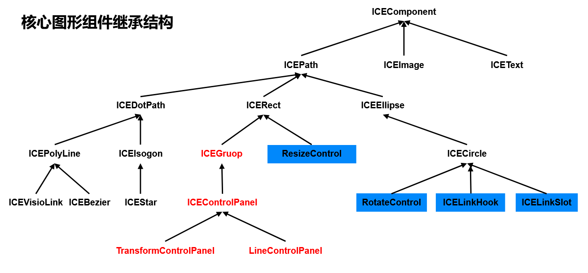
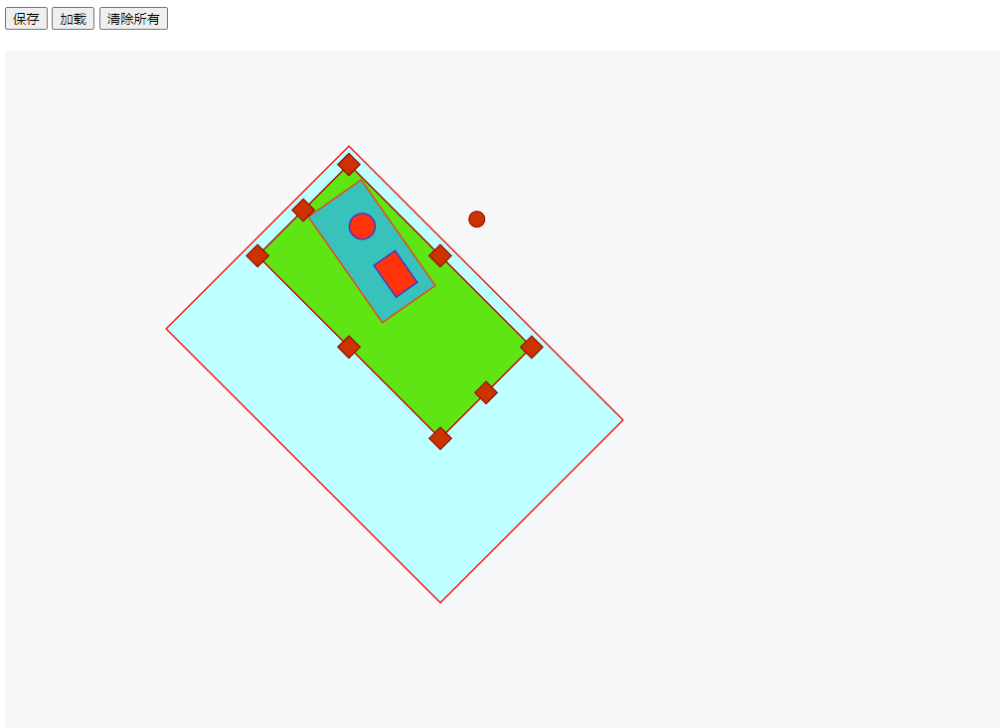
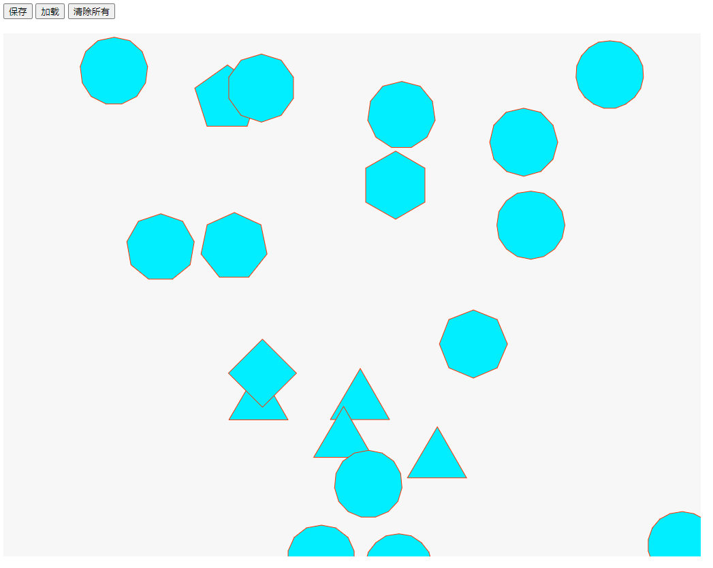
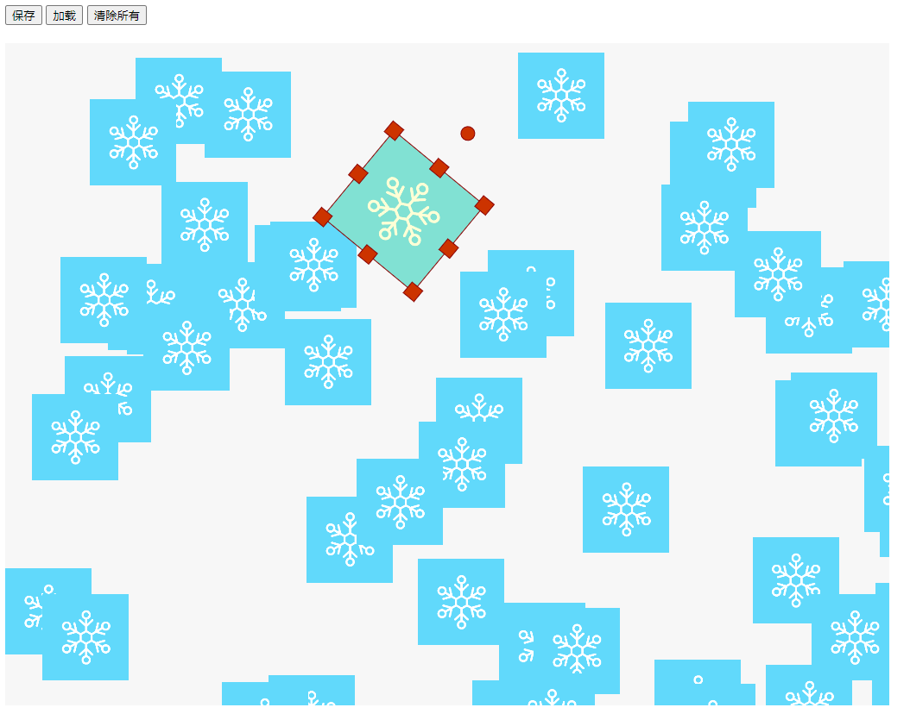
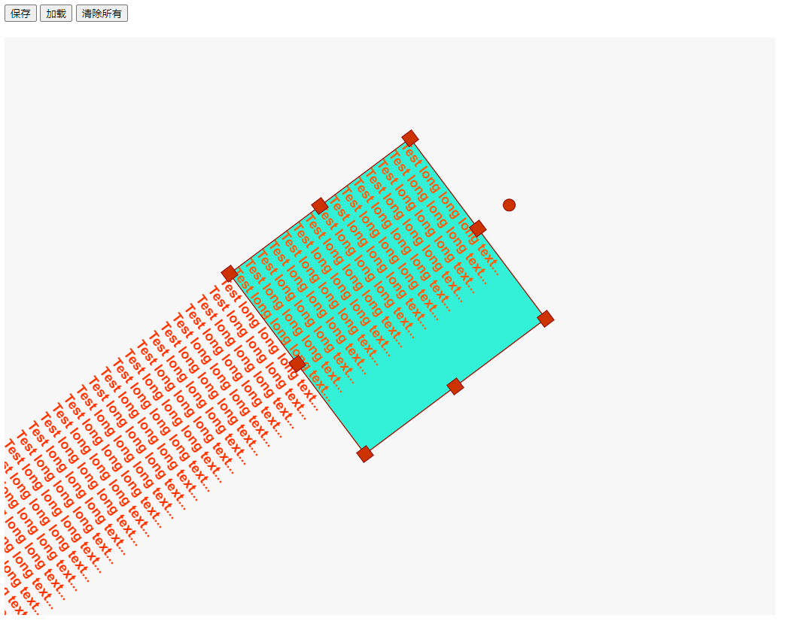
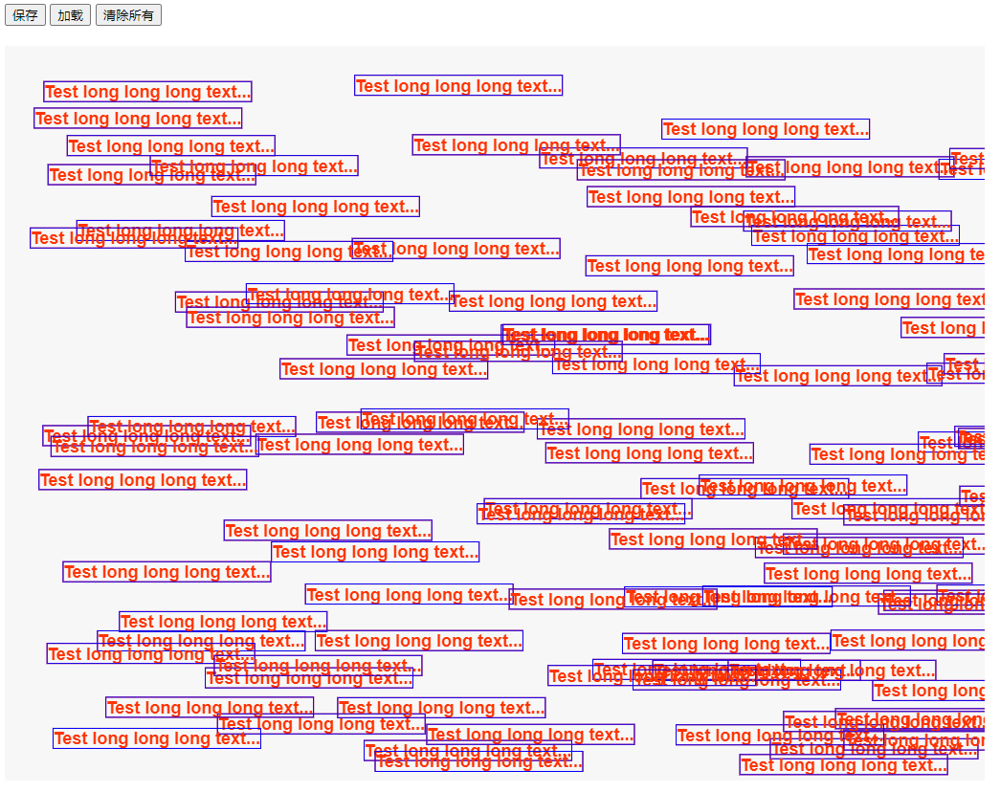
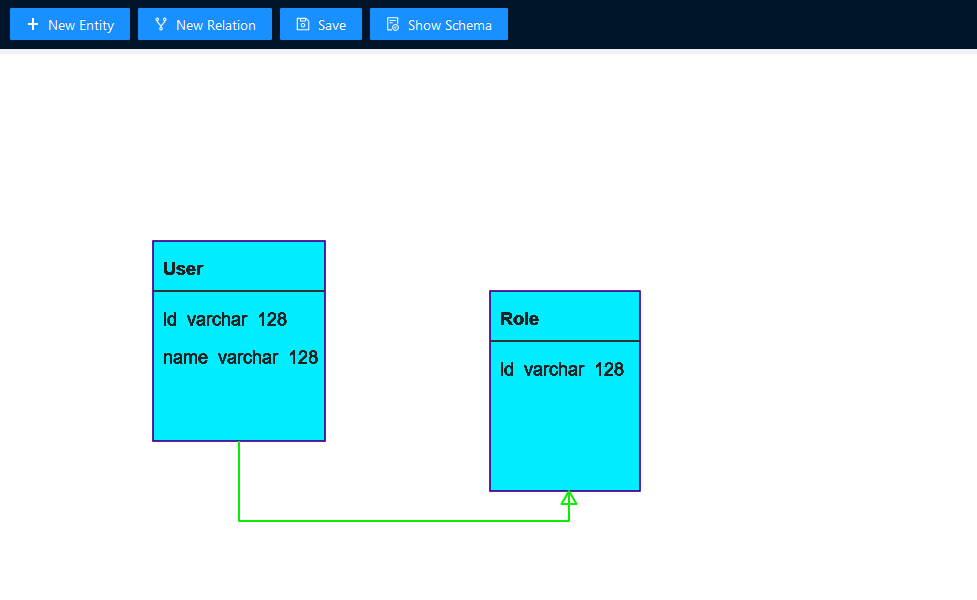
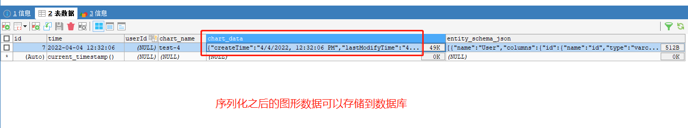

<p align="center">
  
</p>

<h1 align="center">ICERender · 雪花渲染器</h1>

<p align="center">
  <a href="https://www.npmjs.com/package/ice-render"></a>
  <a href="./LICENSE"></a>
  <a href="https://github.com/ice-render/ice-render/actions/workflows/ci.yml"></a>
  
</p>

ICERender 是一款 **Canvas 2D 交互图形渲染引擎**，面向 ER 图 / 流程图 / 拓扑图等图表编辑场景。它借鉴 React 的组件模型与 W3C 的事件模型，提供嵌套坐标系、序列化、动画、Visio 风格连接线等能力，同时以「极简依赖 + 多运行时兼容 + 高性能」为设计约束。

> 概要介绍视频：<https://www.bilibili.com/video/BV1hT4y1v7G5>

## ✨ 核心特性

**架构与组件模型**

- **极简依赖** —— 运行时仅 `lodash` + `gl-matrix` 两个库，无其它依赖。
- **纯 TypeScript** —— 100% TS 源码，产出完整的 `.d.ts` 类型声明，`tsc --noEmit` 零错误。
- **React 式组件模型** —— `props`（不可变构造入参）/ `state`（可变运行时状态）分离，`render()` 模板方法 + 清晰的类继承体系。
- **无限嵌套容器** —— `ICEGroup` 可任意嵌套，形成组件树。

**坐标系与变换**

- **完整仿射变换** —— 平移 / 缩放 / 旋转 / 错切（skew），基于 `gl-matrix` 的列向量 `mat2d` 约定。
- **嵌套坐标系** —— 子组件自动复合祖先变换，`localToGlobal` / `globalToLocal` 双向换算；支持在嵌套场景下做全局位移与旋转。

**交互与连接线**

- **鼠标 + 键盘事件** —— 完整事件系统（`on/off/once/trigger` 及 W3C 别名），支持拖拽、框选、多选。
- **变换控制面板** —— 选中组件后出现旋转 / 缩放手柄。
- **Visio 风格连接线** —— 端点插槽吸附（上 / 右 / 下 / 左 / 中心五个方向），建立组件间的连线关系。

**序列化与动画**

- **整图序列化** —— 组件树可序列化为 JSON 字符串并无损反序列化；自定义组件通过 `registerType()` 注册即可持久化。
- **keyframes 式动画** —— 动画配置类似 CSS `keyframes`，内置线性 / 缓入 / 缓出等缓动函数。

**性能与工程质量**

- **高性能** —— 脏标记 + 全量重绘的简单模型，配合「渲染队列缓存」与「矩阵零分配」，`bench/render.cjs` 实测 **5000 图元静态重绘约 0.8ms/帧（引擎 JS 逻辑开销，不含光栅化）**。
- **完整工程化** —— 46 个单元测试、Playwright 可视化回归（golden-image）、eslint、GitHub Actions CI、架构设计文档。

## 🚀 快速开始

### 浏览器（UMD）

```html
<script src="https://unpkg.com/ice-render/dist/index.umd.js"></script>
<canvas id="canvas-1" width="1024" height="768"></canvas>
<script>
  const ice = new ICE.ICE().init('canvas-1');

  const rect = new ICE.ICERect({
    left: 100, top: 100, width: 50, height: 50,
    style: { strokeStyle: '#ff3300', fillStyle: '#00ff00' },
  });
  ice.addChild(rect);
</script>
```

### npm 安装

```shell
npm i ice-render --save
```

```javascript
import { ICE, ICERect, ICEGroup } from 'ice-render';

const ice = new ICE().init('canvas-1');
ice.addChild(new ICERect({ width: 100, height: 50 }));
```

发布包提供 **ESM（`dist/index.js`）/ CJS（`dist/index.cjs.js`）/ UMD（`dist/index.umd.js`）** 三种格式。

## 📚 文档

- **架构设计文档** —— [`docs/architecture/`](./docs/architecture/README.md)：运行时链路 / 组件模型 / 坐标系与矩阵 / 渲染性能 / 事件 / 序列化 / 交互动画 / 多运行时兼容。
- **示例** —— [`examples/`](./examples/index.html) 目录提供 49 个可直接在浏览器运行的示例（图形、容器、事件、拖拽、连接线、动画等）。

## 🧪 工程化

| 命令 | 说明 |
|---|---|
| `npm test` | 单元测试（jest，46 用例） |
| `npm run test:visual` | 可视化回归（Playwright golden-image） |
| `npm run lint` / `npm run lint:fix` | 代码检查 / 自动修复 |
| `npm run types:check` | TypeScript 类型检查 |
| `npm run bench` | 渲染热路径基准 |
| `npm run build` | 构建（类型声明 + rollup） |

提交前会自动执行 lint-staged（husky）；推送后 CI（GitHub Actions）跑 lint + 类型检查 + 单测 + 构建。

## 🔧 二次开发

基于引擎的类接口即可扩展自定义图元。以 `ice-entity-designer` 中的连线组件为例：

```javascript
import { ICEVisioLink } from 'ice-render';

export default class Relation extends ICEVisioLink {
  constructor(props) {
    super({ title: 'Relation', relationType: 'one-to-one', referencedColumnName: 'id', ...props });
  }

  toEntityObject() {
    const { title, relationType, referencedColumnName } = this.state;
    const resolveEndpoint = (linkKey, prefix) => {
      const id = this.state.links?.[linkKey]?.id;
      if (!id) return {};
      return { [prefix + 'Id']: id, [prefix + 'Name']: this.ice.findComponent(id).state.entityName };
    };
    return {
      title,
      relationType,
      referencedColumnName,
      ...resolveEndpoint('start', 'from'),
      ...resolveEndpoint('end', 'to'),
    };
  }
}
```

> [`ice-entity-designer`](https://gitee.com/ice-render/ice-entity-designer) 是一款基于 ICERender 开发的 ER 图设计器，完整示范了引擎的二次开发方式；它已应用于 [`craft-codeless-designer`](https://github.com/craft-codeless-designer) 低代码项目。

## 📸 截图











## 📄 License

[MIT](./LICENSE) © 大漠穷秋
