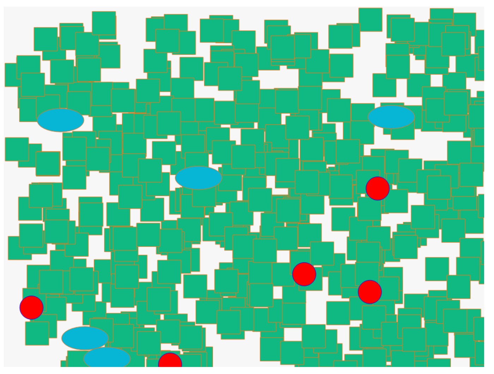
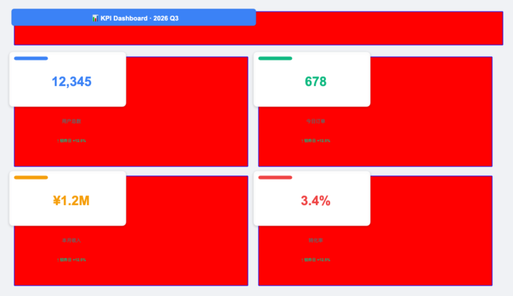
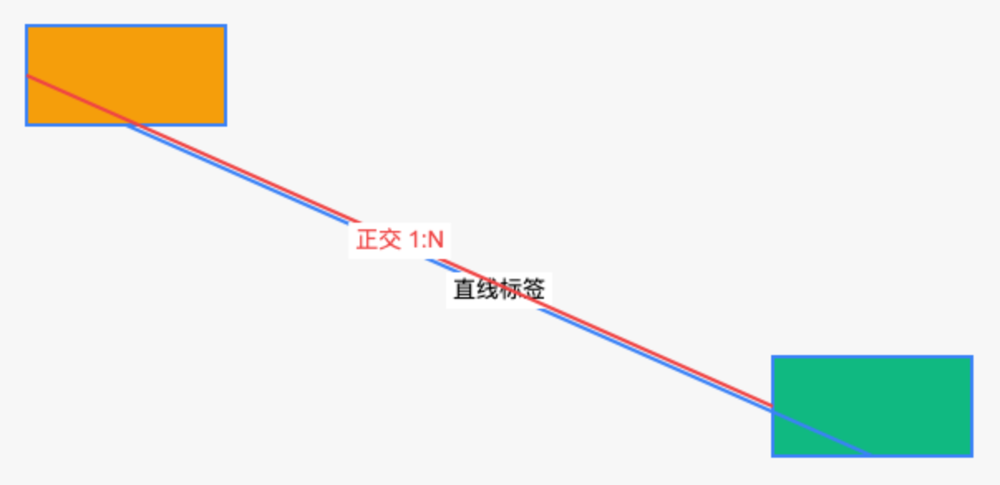
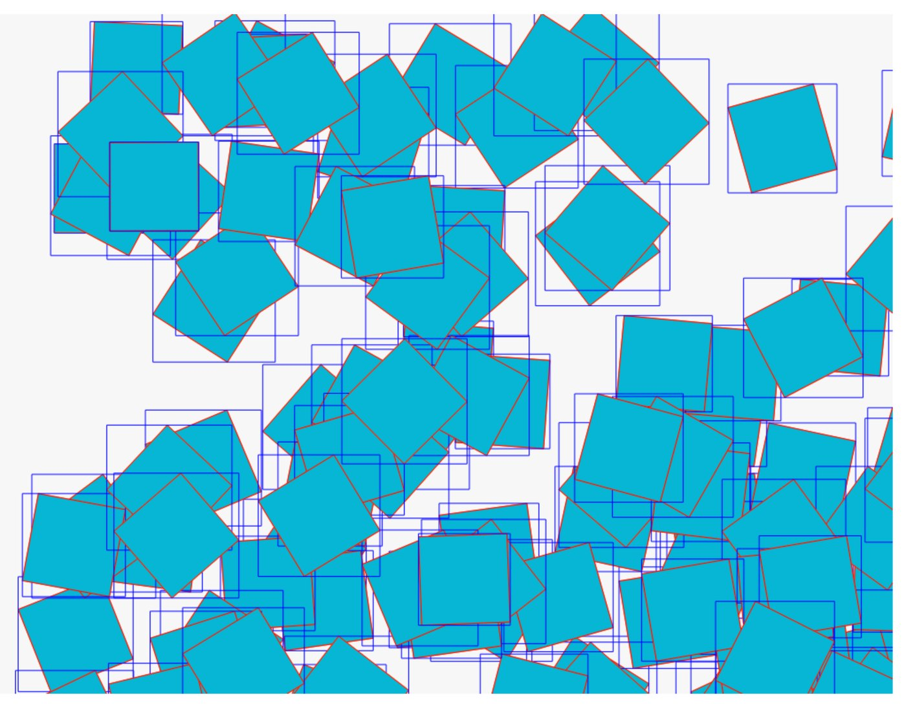
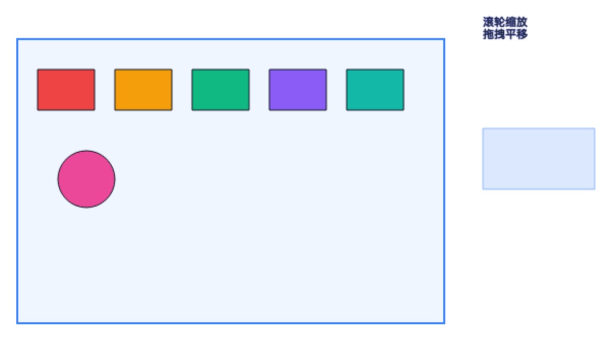
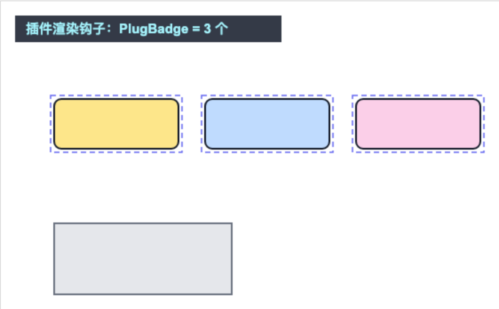
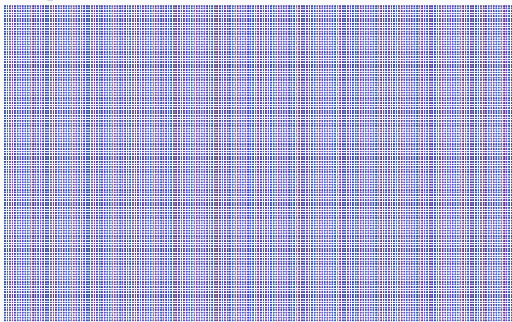

<p align="center">
  
</p>

<h1 align="center">ICERender · 雪花渲染器</h1>

<p align="center">
  <a href="https://www.npmjs.com/package/ice-render"></a>
  <a href="./LICENSE"></a>
  <a href="https://gitee.com/ice-render/ice-render"></a>
  
</p>

ICERender 是一款 **Canvas 2D 交互图形渲染引擎**，面向 ER 图 / 流程图 / 拓扑图等图表编辑场景。它借鉴 React 的组件模型与 W3C 的事件模型，提供嵌套坐标系、序列化、动画、Visio 风格连接线等能力，同时以「极简依赖 + 多运行时兼容 + 高性能」为设计约束。

> 概要介绍视频：<https://www.bilibili.com/video/BV1hT4y1v7G5>

## ⭐ 差异化能力

以下三点是本引擎在同类 Canvas 图形引擎中较少同时具备的能力，且都有回归测试或基准数据支撑。

**1. 极端规模下的内存与构建效率**

- **默认配置不复制** —— 所有实例原型继承同一份默认 `props` / `state`，只有显式传入的字段才落到实例上；嵌套对象在合并时才做写时复制。
- **挂载去重为 O(1)** —— 用 `WeakSet`，批量挂载不再有 `indexOf` 的 O(n²) 放大。
- **实测**：**100 万个最小矩形的堆增量约 0.87GB**（朴素实现约 2.0GB）；**100 万图元构建约 6s**。
- **回归**：`tests/graphic/ICEComponent.props-sharing.test.ts`、`tests/ICE.add-child.test.ts`；微基准见 `bench/micro/`。

**2. 局部重绘是一条可证明的像素契约**

- 默认渲染路径为**脏矩形局部重绘**，不满足局部条件时自动回退全量；`ICE.init(ctx, { renderMode: 'full' })` 可强制全量。
- 为保证两条路径**逐像素一致**，每个组件在 `render()` 末尾把自身污染过的 `ctx` 全局状态（阴影 / `globalAlpha` / 合成模式 / 虚线等）归位，使组件渲染自包含。
- 用 golden image 做像素一致性回归（`e2e/visual/dirty-rect-pixel.spec.ts`），覆盖文本、参数化图元、半透明落墨等场景。
- 配套优化：组件级离屏缓存（含纯平移复用位图）、渲染队列缓存、矩阵零分配。
  **性能数字请以本机 `npm run bench 5000` 的输出为准**（引擎 JS 逻辑开销，不含光栅化）：
  2026-09-11 在 Apple Silicon 开发机上实测 **约 2.2ms/帧**（场景 A 静态重绘，5000 图元、多层嵌套）。
  这里刻意不再写一个固定数字 —— 这类数字跨机器可差数倍，写死就会像本文旧版本那样变成不可复现的宣称。

**3. 小程序是一等公民**

- 一套代码同时面向 **Web 浏览器**与**各类小程序**：所有全局对象访问收敛到 `cross-platform/root` 适配层。
- **无全局 `Path2D` 的运行时自动降级**：`PolyfillPath2D` 记录路径命令、渲染时重放，与原生 `Path2D` 逐像素一致（老版本小程序基础库可用）。
- 字体、图片、离屏画布、像素比全部有平台适配（`FontFace` / 小程序 `loadFont`、`Image` / 小程序 `createImage`、`document.createElement('canvas')` / 小程序 `createOffscreenCanvas`、`devicePixelRatio` / 小程序系统信息）。
- `ICE.init(ctx)` 支持直接传入 Canvas 上下文，完全绕开 DOM。

## ✨ 核心特性

**架构与组件模型**

- **声明式渐变（可序列化）** —— `style.fillGradient` / `style.strokeGradient` 用纯对象描述
  `linear` / `radial` / `conic` 渐变（`{ type, from/to | center/radius | startAngle, stops }`），
  渲染时构造 `CanvasGradient` 并按描述对象引用缓存。与手搓 `CanvasGradient` 的关键差别是
  **能进 JSON**（存盘不丢）且**能写进主题 preset**（随 `setTheme` 重新展开）。
- **`display: false` 是整棵子树隐藏** —— 隐藏父容器后子组件不再被绘制、也不参与命中
  （判定收敛在 `isEffectivelyVisible()`，渲染/命中/a11y/离屏缓存共用）。
- **变换手柄支持修改键约束** —— `Shift` 拖角手柄保持宽高比、`Shift` 拖旋转手柄吸附 15°。
  输入层会把 DOM 事件的修饰键显式透传到组件事件（`shiftKey` 是原型上的不可枚举 getter，
  默认拷贝带不过来）。
- **脏矩形局部重绘在缩放/平移与高分屏下同样生效** —— 脏区按「世界坐标收集、渲染坐标裁剪」
  （`dpr · viewport` 一次换算），并把分散脏区聚合成多块裁剪区，而不是并成一个把干净区域也圈进去的大盒。
- **零运行时依赖** —— `gl-matrix` 在构建时被**内联**进产物（它只列在 devDependencies，产物里没有任何 `import`/`require`），安装后开箱即用，不需要额外装包。内联的第三方代码保留其许可声明，见 `dist/THIRD-PARTY-NOTICES.txt`。
- **纯 TypeScript** —— 100% TS 源码，产出完整的 `.d.ts` 类型声明，`tsc --noEmit` 零错误。
- **React 式组件模型** —— `props`（不可变构造入参）/ `state`（可变运行时状态）分离，`render()` 模板方法 + 清晰的类继承体系。
- **无限嵌套容器** —— `ICEGroup` 可任意嵌套，形成组件树。

**坐标系与变换**

- **完整仿射变换** —— 平移 / 缩放 / 旋转 / 错切（skew），基于 `gl-matrix` 的列向量 `mat2d` 约定。
- **嵌套坐标系** —— 子组件自动复合祖先变换，`localToGlobal` / `globalToLocal` 双向换算；支持在嵌套场景下做全局位移与旋转。
- **容器移动时后代自动跟随** —— `setPosition()` 会向所有后代**递归派发 `AFTER_MOVE`**（只派发事件、
  不改任何 state）：容器移动后，订阅了宿主事件的组件（如 `ICEPolyLine` 监听两端图元重算折点）
  会自动跟上，应用层不必手动遍历子树。`BEFORE_MOVE` 仍只给被移动的组件自己。
- **HiDPI** —— `ICE.init(el, { dpr })` 把 backing store 放大到内容盒尺寸 × dpr（默认 1，行为与旧版一致）。

**交互与连接线**

- **统一输入层** —— 鼠标 / 触控 / 触控笔 / 滚轮收敛到 Pointer 事件族（无 `PointerEvent` 的运行时自动回退 `mouse* + touch*`）；完整事件系统（`on/off/once/trigger` 及 W3C 别名），支持拖拽与方向键微调。
- **变换控制面板** —— 选中组件后出现旋转 / 缩放手柄。
- **连接线形态可切换** —— 同一套「插槽吸附」之上可选 **Visio 正交折线**（默认）或**普通贝塞尔曲线**
  （`linkShape: 'visio' | 'bezier'`）：贝塞尔沿插槽法线出/入，控制点长度随两端距离自适应。
- **Visio 风格连接线** —— 端点插槽吸附（上 / 右 / 下 / 左 / 中心五个方向），建立组件间的连线关系；
  端点箭头**默认实心**（用线色填充），`arrowStyle: 'hollow'` 可切回空心描边。
- **视口缩放 / 平移** —— `setViewport()` 与锚点缩放 `zoomAt(screenX, screenY, factor)`；「视图缩放」与「图元缩放」严格分离。
- **对齐吸附** —— 边缘 / 中心 / 等间距吸附与提示线，默认关闭、按需 `enable()`（零开销）。

**扩展与可访问性**

- **插件机制** —— `ICE.use(plugin)` 开放三层注册点：自定义图元类型（自动获得 typeId 反查，因此可序列化）、每帧渲染回调、自定义交互工具。
- **无障碍原语** —— `getAccessibilityTree()` 产出可访问节点快照（角色 / 可读名称 / 屏幕坐标盒 / tab 顺序），`setFocusedComponent()` 让键盘事件派发给焦点组件。**引擎不自建 DOM 镜像层**：镜像结构、ARIA 与文案由应用层决定（参考实现见 `examples/a11y/`）。

**序列化与动画**

- **整图序列化** —— 组件树可序列化为 JSON 字符串并无损反序列化；类型键用**稳定 typeId**（由构造函数反查注册名，与类的 JS 名解耦，压缩改名不影响已存数据），带 `version` 字段与可扩展迁移表；未注册类型跳过并记录而不是整份数据打不开。自定义组件通过 `registerType()` 注册即可持久化。
- **关键帧动画** —— 动画配置类似 CSS `keyframes`：单段 `{ from, to, duration }` 或
  多段 `{ keyframes: [{ offset, value, easing? }], duration }`（`easing` 写在段起始帧上，只作用于该段；
  `offset` 缺省按顺序均分、超界夹紧）。内置线性 / 缓入 / 缓出等缓动函数与**弹簧类缓动**
  （`spring` / `springSoft` / `springSnappy`，自带过冲）；支持 `delay`、`loop`、`iterationCount`、
  `round`；动画键可为 `'transform.rotate'` 这类**点路径**，取值可为**数组**（`transform.scale` 等逐元素补间）。

**性能与工程质量**

- **高性能** —— 脏标记 + **脏矩形局部重绘**（默认，不满足局部条件时自动回退全量），配合组件级离屏缓存、渲染队列缓存与矩阵零分配。性能数字以本机 `npm run bench 5000` 为准（2026-09-11 实测约 2.2ms/帧，见上文「性能实测」段）。
- **完整工程化** —— **91 个测试文件 / 710 个用例**（jest，带「只许上调」的覆盖率门槛）、Playwright 可视化回归（golden-image + 脏矩形像素一致性 + 视口/对齐/交互）、发布包完整性门禁（`publint` + `attw`）、eslint、架构设计文档。

## 🚀 快速开始

### 浏览器（UMD）

```html
<script src="https://unpkg.com/ice-render/dist/index.umd.js"></script>
<canvas id="canvas-1" width="1024" height="768"></canvas>
<script>
  const ice = new ICE.ICE().init('canvas-1');

  const rect = new ICE.ICERect({
    left: 100, top: 100, width: 50, height: 50,
    style: { strokeStyle: '#ff3300', fillStyle: '#00ff00' },
  });
  ice.addChild(rect);
</script>
```

### npm 安装

```shell
npm i ice-render --save
```

```javascript
import { ICE, ICERect, ICEGroup } from 'ice-render';

const ice = new ICE().init('canvas-1');
ice.addChild(new ICERect({ width: 100, height: 50 }));
```

发布包提供 **ESM（`dist/index.mjs`）/ CJS（`dist/index.cjs`）/ UMD（`dist/index.umd.js`）** 三种格式。

### 导出 SVG（矢量，不依赖 canvas）

画布的 `toDataURL()` / `toBlob()` 是**光栅快照**（分辨率写死、放大就糊）。引擎的路径对象是
`Path2DRecorder`：一边把命令写给原生 Path2D 上屏、一边留下**命令流**，所以同一份场景可以再生成
一份**矢量描述**——任意放大、进 Illustrator/Figma、走打印/PDF 流程，或者在 Node 里出图（不需要 canvas）。

```javascript
const svg = ice.toSvg();                                    // 内容自适应 + 透明背景
const svg = ice.toSvg({ background: '#ffffff', padding: 16 }); // 白底 + 留白
const svg = ice.toSvg({ area: 'viewport' });                 // 当前视口所见即所得
const { svg, width, height } = ice.toSvgResult({ scale: 2 }); // 需要宽高（写文件/排版预览）

// 不在浏览器里也能用：Node 侧同样导出（路径命令流不依赖 canvas）
const svg = exportSvg(ice);   // 或 exportSvg(任意组件) 导出子树
```

导出**镜像渲染口径**而不是另起一套：绘制顺序（z 序稳定排序、工具层默认排除）、每个组件的
`composeMatrix()` 世界矩阵、`props.style`/`state.style` 的合并顺序、有效透明度（自身 × 祖先）、
祖先 `clipChildren` 裁剪、阴影预设（`sm`/`md`/`lg`）、线性/径向渐变、虚线都按同一份口径落到 SVG。

限制（都会明确写进 JSDoc）：阴影用 `feDropShadow` 近似（`stdDeviation = shadowBlur / 2`，模糊观感
与 canvas 不会逐像素一致）；雪碧图切图（`sx/sy/sw/sh`）暂不支持；文本导出的是**静态瞬间**，
且 SVG 与 canvas 的字形度量/基线定义不同，因此导出的文字位置是「对齐口径一致、逐像素允许微差」。

可运行示例：`examples/export/svg-export.html`（画布与 SVG 并排对比，可调背景/留白/倍数、勾选是否
包含工具层），以及 `examples/node/export.mjs`（**服务端出图**：`ICE.headless()` 建树 → `toSvg()`
落盘，装了 `@resvg/resvg-js` 时再转一张 2× PNG）。

```js
// 服务端（Node，没有 document / canvas）
const { ICE, ICERect } = require('ice-render');
const ice = ICE.headless();
ice.addChild(new ICERect({ width: 240, height: 120, radius: 12, style: { fillStyle: '#4f46e5' } }));
const svg = ice.toSvg({ padding: 16, background: '#ffffff' });
```

PNG / PDF 不内置依赖：SVG 是通用中间格式，`resvg`、`sharp`、`rsvg-convert`、headless Chrome
打印都能接着走 —— 引擎保持零运行时依赖。

## 📚 文档

- **架构设计文档** —— [`docs/architecture/`](./docs/architecture/README.md)：共 16 篇 —— 运行时链路 / 组件模型 / 坐标系与矩阵 / 渲染性能 / 事件 / 序列化 / 交互动画 / 多运行时兼容 / 路线图与边界 / Worker 与离屏渲染 / 视口缩放 / 对齐吸附 / 能力缺口分析 / 无障碍 / 应用驱动复盘 / 连线端点（插槽）扩展评估。
- **示例** —— [`examples/`](./examples/index.html) 目录提供 **88 个**可直接在浏览器运行的示例（图形、容器、事件、拖拽、连接线、动画、布局、文本、视口、对齐、插件、无障碍、性能基准等）。

## 🧪 工程化

| 命令 | 说明 |
|---|---|
| `npm test` | 单元测试（jest，镜像 src/ 结构，见 `tests/`） |
| `npm run test:visual` | Playwright：golden 可视化回归 + 脏矩形局部重绘像素一致性（`dirty-rect-pixel.spec.ts`）+ 真实画布/worker 性能采集 |
| `npm run lint` / `npm run lint:fix` | 代码检查 / 自动修复 |
| `npm run types:check` | TypeScript 类型检查 |
| `npm run bench` | 场景基准（stub ctx，`bench/render.cjs`，改 `src/` 后先 `npm run build`） |
| `npm run bench:micro` | 微基准（mitata，`bench/micro/`，逐个测矩阵/渲染/命中/状态热函数，防 DCE，需先 `npm run build`） |
| `npm run pkg:check` | 发布包完整性门禁：`publint`（exports/types/files 契约）+ `attw`（各解析模式下的类型是否正确） |
| `npm run test:visual:ci` | CI 用的可视化回归子集（示例冒烟 + 交互 + 像素一致性），刻意不含跨平台会漂移的 golden 比对 |
| `npm run build` | 构建（类型声明 + rollup） |

提交前会自动执行 lint-staged（husky）；CI 配置在 [`.github/workflows/ci.yml`](./.github/workflows/ci.yml)，依次跑 lint + 类型检查 + 单测（含覆盖率门槛）+ 构建 + 包完整性 + 可视化回归。

> **主仓在 Gitee**（`https://gitee.com/ice-render/ice-render`，`package.json` 的 `repository` 字段亦然），GitHub 是镜像。徽章不再声称 CI 状态——真正运行 CI 需要有对应的 runner。

## 🔧 二次开发

基于引擎的类接口即可扩展自定义图元。以 `ice-entity-designer` 中的连线组件为例：

```javascript
import { ICEVisioLink } from 'ice-render';

export default class Relation extends ICEVisioLink {
  constructor(props) {
    super({ title: 'Relation', relationType: 'one-to-one', referencedColumnName: 'id', ...props });
  }

  toEntityObject() {
    const { title, relationType, referencedColumnName } = this.state;
    const resolveEndpoint = (linkKey, prefix) => {
      const id = this.state.links?.[linkKey]?.id;
      if (!id) return {};
      return { [prefix + 'Id']: id, [prefix + 'Name']: this.ice.findComponent(id).state.entityName };
    };
    return {
      title,
      relationType,
      referencedColumnName,
      ...resolveEndpoint('start', 'from'),
      ...resolveEndpoint('end', 'to'),
    };
  }
}
```

> [`ice-entity-designer`](https://gitee.com/ice-render/ice-entity-designer) 是一款基于 ICERender 开发的 ER 图设计器，完整示范了引擎的二次开发方式；它已应用于 [`craft-codeless-designer`](https://github.com/craft-codeless-designer) 低代码项目。

## 📸 截图

> 截图由 `examples/` 下的示例页直接采集（Playwright、2× 像素比、**按内容包围盒裁切**，不含浏览器外壳与页面留白）。
> 全部 88 个示例都可以在 [`examples/index.html`](./examples/index.html) 里点开运行。

**图元与样式** —— 形状库、渐变、阴影、虚线等（`examples/shapes/shapes-basic.html`）



**卡片 / 网格布局** —— 容器嵌套 + 布局引擎（`examples/layout/dashboard.html`）



**Visio 风格连线** —— 端点插槽吸附 + 连线标签（`examples/line-and-link/link-label.html`）



**嵌套容器** —— `ICEGroup` 任意层级嵌套与坐标复合（`examples/group/group-basic.html`）



**视口缩放 / 平移** —— 视图缩放与图元缩放分离（`examples/viewport/viewport-zoom.html`）



**实例级主题** —— 同一页面两套主题互不污染（`examples/theme/theme-multi-instance.html`）


**插件机制** —— `ICE.use()` 三层注册点（`examples/plugin/plugin-basic.html`）



**极端规模** —— 密集小图元铺满画布；100 万图元构建约 6s、稳态整帧约 1.2s（`examples/performance/max-elements.html`）



## 📄 License

[MIT](./LICENSE) © 大漠穷秋
