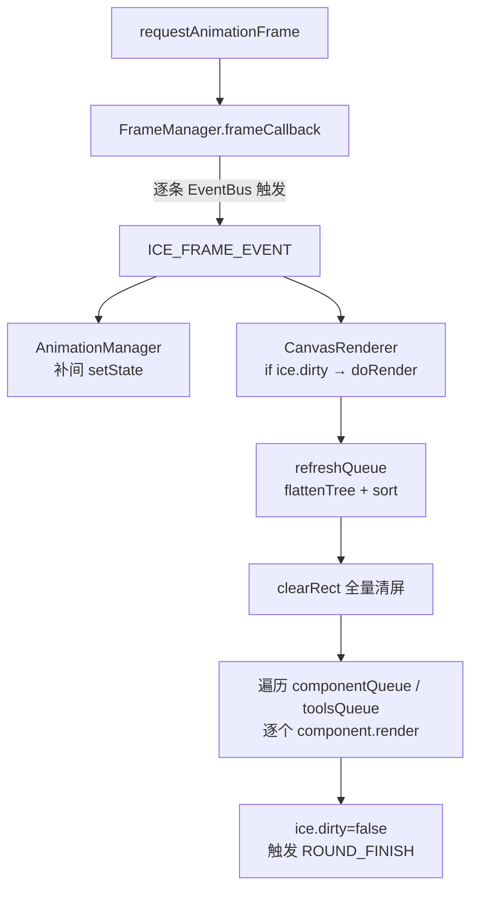

# 01 · 运行时链路

## 职责划分

引擎在运行时是一组**围绕事件总线协作的单例 Manager**。核心原则：**`FrameManager` 只发帧事件、不渲染；渲染由 `CanvasRenderer` 独立完成**。

| 组件 | 职责 | 实例粒度 |
|---|---|---|
| `FrameManager` | 把 `requestAnimationFrame` 回调统一转成 `ICE_FRAME_EVENT` 事件 | **全局单例**（跨所有 ICE 实例共享） |
| `EventBus` | 每 ICE 实例一条的事件总线，Manager 之间的协作通道 | 每 ICE 一条 |
| `DOMEventDispatcher` | 把原生 DOM 事件（mouse/keyboard/touch）转成 `ICEEvent` 注入总线 | 每 ICE 一个 |
| `DOMEventInterceptor` | 拦截文档级 DOM 事件，做统一预处理 | 全局（跨 ICE） |
| `AnimationManager` | 订阅帧事件，对动画组件做补间（tween） | 每 ICE 一个 |
| `ICEControlPanelManager` | 管理选中/变换工具（控制面板） | 每 ICE 一个 |
| `CanvasRenderer` | 脏检查 + 全量重绘，唯一真正操作 `ctx` 的调度方 | 每 ICE 一个 |
| `ICELinkSlotManager` | 管理连接线插槽（LinkSlot）的复用与碰撞检测 | 每 ICE 一个 |

## 帧调度管道



关键点：

- **`FrameManager` 是全局单例**。同一个 `window`/`global` 里只有一个实例，它维护一个 `evtBuses` 数组，逐条触发 `ICE_FRAME_EVENT`。因此一个页面上可以同时存在多幅图，共享同一个 rAF 循环。
- **`CanvasRenderer` 只在 `ice.dirty` 为真时渲染**。脏标记是"惰性渲染"的开关：`setState`/结构变更会置 `dirty=true`，下一帧才真正重绘，最小延迟约一帧（`1/60 ≈ 16.7ms`）。

## `ICE.init()` 的启动顺序（有严格依赖）

`ICE.init(ctx)` 是引擎入口，内部 Manager 启动**顺序不能打乱**：

```
1. evtBus = new EventBus()                 ← 最先，后续所有 Manager 都依赖它
2. FrameManager.regitserEvtBus(evtBus) + start()
3. DOMEventInterceptor.regitserEvtBus + start()
4. eventDispatcher = new DOMEventDispatcher(this).start()
5. animationManager = new AnimationManager(this).start()
6. controlPanelManager = new ICEControlPanelManager(this).start()
7. renderer = new CanvasRenderer(this).start()
8. linkSlotManager = new ICELinkSlotManager(this).start()   ← 必须在 renderer 之后
9. serializer / deserializer / imageCache                   ← 普通构造，无 start()
```

两条**不可违背**的顺序约束：

1. **`evtBus` 必须最先初始化** —— 它是所有 Manager 的依赖根。
2. **`linkSlotManager` 必须在 `renderer` 之后** —— 它的实例化/启动内部会监听 `renderer` 触发的事件，若 renderer 尚未就绪会出错。

## 上下文注入模型

`ICE.init()` 之后，每个被 `addChild` 的组件会被注入运行上下文：

```javascript
component.ice    = this;       // 归属的 ICE 实例
component.ctx    = this.ctx;   // CanvasRenderingContext2D
component.evtBus = this.evtBus; // 事件总线
component.parentNode = null;    // 顶层组件父节点为空
```

只有被加入显示列表的组件才有 `ice`/`ctx`/`evtBus`；未被加入的组件这些字段为 `null`。容器组件（`ICEGroup`）通过 `AFTER_ADD` 事件把上下文同步给子节点。

## `ICE` 与 `FrameManager` 的边界

- `ICE` 是**主入口类**，一个 `canvas` 标签上只能 `init` 一次。
- `ICE.childNodes` = 直接渲染在 canvas 上的组件集合；`ICE.toolNodes` = 工具组件（变换手柄、连接插槽等），**不参与序列化、生命周期内不删除**。
- `ICE` 自身**不是** `ICEComponent` 的子类（它是独立的宿主类），所以顶层组件的 `parentNode === null`。
