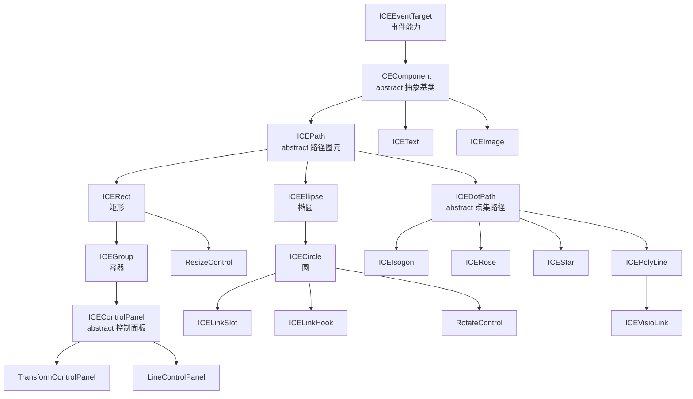

# 02 · 组件模型

## 设计哲学：借鉴 React 的 `props` / `state`

ICERender 的组件模型概念上对齐 React：

| 概念 | 含义 | 可变性 |
|---|---|---|
| `props` | 构造入参，用内部 `merge`（`util/lang.ts`）与默认 props 合并 | **不可变**（构造后不再改） |
| `state` | `cloneDeep(props)` 得到的运行时状态，动画/交互修改它 | **可变** |

- `setState(newState)` 只改 `state`，并把 `this.dirty = true`（需要重绘）、`this.paramsDirty = true`（自身派生参数需要重算）以及 `ice.dirty = true` 置位，**不会立即重绘**，等下一帧由 `FrameManager` 调度。两者的区别见下文「`dirty` 与 `paramsDirty`」。
- 序列化时默认序列化的是 `state`（见 [06 序列化](06-serialization.md)）。

每个组件的默认 `props` 包含一套完整配置，其中与架构相关的关键项：

```javascript
{
  id, left, top, width, height,
  style: { fillStyle, strokeStyle, lineWidth },
  fill, stroke,
  animations: {},                      // 动画配置（类似 CSS keyframes）
  transform: { translate, scale, skew, rotate },
  linearMatrix: [], composedMatrix: [], // 矩阵缓存（见 03）
  origin: 'localCenter', localOrigin, absoluteOrigin,
  zIndex: instanceCounter++,            // 渲染层级
  display: true,                        // false 则整棵子树不渲染
  draggable, transformable, interactive, linkable,
}
```

## 类继承体系



分层说明：

- **`ICEEventTarget`** —— 最顶层，只提供事件能力（`on/off/trigger/once/...`），见 [05 事件系统](05-event-system.md)。`EventBus`、`CanvasRenderer` 也直接继承它（不只组件）。
- **`ICEComponent`（abstract）** —— 所有可见组件的基类，实现 `render()` 模板方法、矩阵组合、边界盒、全局位移/旋转等。**不能直接实例化**。
- **`ICEPath`（abstract）** —— 引入 `Path2D`，把"路径构建"抽象成 `createPathObject()`。
- **`ICEDotPath`（abstract）** —— 基于点集（`dots`）的路径，星形/多边形/玫瑰线/折线据此复用 `calcDots`。
- **`ICERect` → `ICEGroup`（容器）** —— 容器继承矩形：容器本身也是可描边/选中/缩放的图元，可无限嵌套子组件。
- **`ICEEllipse` → `ICECircle`** —— 圆是椭圆的特化；`ICELinkSlot`/`ICELinkHook`/`RotateControl` 复用圆。
- **`ICEPolyLine` → `ICEVisioLink`** —— Visio 连线是折线的特化。
- **`ICEPolyLine` → `ICEBezier`** —— 贝塞尔曲线复用折线的 `curveType`（`quadratic`/`cubic`）曲线绘制。

## 设计溯源：与 Java Swing 的对照

这套深单根继承体系在结构上与 Java Swing（及其源头 AWT）高度相似，是经典 GUI 工具包 OO 思想的延续。

| ice-render | Java Swing | 相似点 |
|---|---|---|
| `ICEComponent`（abstract 基类） | `Component` / `JComponent` | 单根抽象基类 |
| `render()` 模板方法 + `doRender()` 钩子 | `paint()` 模板 + `paintComponent()` 钩子 | **几乎一致**：骨架在基类、肉在子类 |
| `ICEGroup`（容器） | `Container` / `JPanel` | Composite 模式，递归渲染子节点 |
| `ICEPath` / `ICEDotPath`（abstract 中间层） | `AbstractButton` / `JTextComponent` | 抽象中间类聚合一族具体类 |
| `ICEEventTarget` 的 `on/off/trigger` | `EventListenerList` + add/remove/fireXxx | 事件监听器模型 |

三处**明显偏离** Swing 的地方：

1. **容器也是图元** —— `ICEGroup extends ICERect`：容器本身是一个可描边、可选中、可缩放的矩形。Swing 的 `Container` 并不继承某个具体图形。
2. **无可插拔外观（L&F）** —— Swing 的招牌是 `ComponentUI` 委托；ice-render 的样式硬编码在 `props.style`。
3. **数据模型是 React 式** —— Swing 用单一可变 Model（如 `ButtonModel`），ice-render 用 `props`（不可变）/ `state`（可变）分离。

因此更准确地说，ice-render 是 **Swing 的 OO 骨架 + React 的 props/state + W3C 的 EventTarget** 三者的混合体，再加一个 canvas 引擎特有的"容器即图元"设计。这套深继承在现代前端（React 组合/Hooks 取代深继承）里已不多见，是引擎最鲜明的"经典味道"。

## `render()` 模板方法

`ICEComponent.render()` 是所有图元共用的渲染骨架（**调用顺序不可变**）：

```javascript
render() {
  trigger(BEFORE_RENDER);
  if (!state.display) return;          // 隐藏：整棵子树跳过
  refreshParams();                     // 派生参数脏了才重算（内部调子类 calcComponentParams）
  applyStyleToCtx();                   // 把 style 写到 ctx
  applyTransformToCtx();               // 应用 composedMatrix
  doRender();                          // 实际绘制（子类覆盖）
  trigger(AFTER_RENDER);
  dirty = false;                       // paramsDirty 已在 refreshParams() 内清除
}
```

子类只需覆盖两个扩展点：`calcComponentParams()`（算尺寸 / 点集 / 文本量测）和 `doRender()`（画内容），矩阵/样式/事件调度都由基类统一处理。

### `dirty` 与 `paramsDirty`

| 标志 | 含义 | 何时置位 |
|---|---|---|
| `dirty` | **需要重绘** | 本组件 `setState`；祖先变换变化时由容器 `setState` 递归给**所有后代**置位 |
| `paramsDirty` | **自身派生参数需要重算**（`calcComponentParams()` 产出的尺寸 / 点集 / 文本量测） | 只在本组件自身 `setState` 时（以及直接改几何的内部路径，如折线重算端点） |

拆成两级的原因：祖先变换变了 → 后代的绝对矩阵变了 → **必须重绘**；但后代的派生参数只取决于自身 `state`，
与祖先变换**无关** → **不需要重量测**。旧实现只有一个 `dirty`，于是「移动一个大容器」会让所有后代
（尤其点集类图元）白白重跑 `calcDots()`。

统一入口 **`refreshParams()`**：`paramsDirty` 为假时直接返回；否则调用 `calcComponentParams()` 并清标志。
凡是要读派生参数（尺寸 / 点集）之前都先调它，不要直接调 `calcComponentParams()`。

> 点集类图元另有一条相关不变量：`ICEDotPath.calcLocalOrigin()` 会把 `dots` 平移到「以 origin 为原点」。
> 旧实现每次 compose 都无条件再平移一个 origin（连续 compose 会累积偏移），因此调用方被迫保证
> 「compose 之前先重算 dots」。现在改为记录「已应用平移量」、只补差额，**`composeMatrix()` 对 dots 是幂等的**；
> `calcDots()` 是重建 dots 的唯一入口（子类实现 `__calcDots()`，不要覆盖 `calcDots()`）。

## 容器与 `zIndex`

- 普通组件直接 `ICE.addChild()` 加到 canvas；容器组件用 `ICEGroup.addChild()` 形成树。
- **渲染顺序由 `zIndex` 决定**：每帧 `flattenTree` 把组件树展平成数组，再按 `state.zIndex` 升序排序（见 [04 渲染](04-rendering-performance.md)）。
- `zIndex` 默认取 `instanceCounter++`（构造顺序），因此后加入的组件默认画在上面；可通过 `setState({ zIndex })` 手动调整层级。

## 组件的生命周期

| 阶段 | 说明 |
|---|---|
| 构造 | `merge(props)` → `cloneDeep` 得到 `state`，注册默认事件（`mousedown/keydown/keyup`） |
| 挂载 | `addChild` 注入 `ice/ctx/evtBus`，触发 `BEFORE_ADD`/`AFTER_ADD` |
| 渲染 | 每帧 `render()` 模板方法 |
| 卸载 | `destory()`：清空事件、置空 `ice/ctx/root/evtBus/parentNode`；容器会先递归销毁子节点 |

> 注意：`display:false` 的组件在 `render()` 早期 return，**不会走到末尾的 `dirty=false`**，因此其 `dirty`（以及 `paramsDirty`）会一直保持为 `true`——这是有意为之的惰性：被隐藏的组件重新显示时会立即重算。
