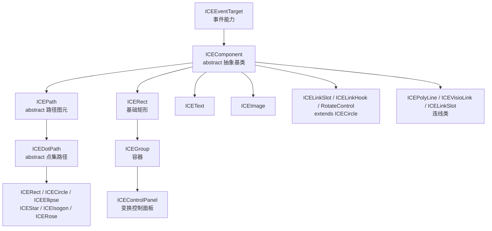

# 02 · 组件模型

## 设计哲学：借鉴 React 的 `props` / `state`

ICERender 的组件模型概念上对齐 React：

| 概念 | 含义 | 可变性 |
|---|---|---|
| `props` | 构造入参，用 `lodash.merge` 与默认 props 合并 | **不可变**（构造后不再改） |
| `state` | `cloneDeep(props)` 得到的运行时状态，动画/交互修改它 | **可变** |

- `setState(newState)` 只改 `state`，并把 `this.dirty = true`（以及 `ice.dirty = true`）置位，**不会立即重绘**，等下一帧由 `FrameManager` 调度。
- 序列化时默认序列化的是 `state`（见 [06 序列化](06-serialization.md)）。

每个组件的默认 `props` 包含一套完整配置，其中与架构相关的关键项：

```javascript
{
  id, left, top, width, height,
  style: { fillStyle, strokeStyle, lineWidth },
  fill, stroke,
  animations: {},                      // 动画配置（类似 CSS keyframes）
  transform: { translate, scale, skew, rotate },
  linearMatrix: [], composedMatrix: [], // 矩阵缓存（见 03）
  origin: 'localCenter', localOrigin, absoluteOrigin,
  zIndex: instanceCounter++,            // 渲染层级
  display: true,                        // false 则整棵子树不渲染
  draggable, transformable, interactive, linkable,
}
```

## 类继承体系



分层说明：

- **`ICEEventTarget`** —— 最顶层，只提供事件能力（`on/off/trigger/once/...`），见 [05 事件系统](05-event-system.md)。
- **`ICEComponent`（abstract）** —— 所有可见组件的基类，实现 `render()` 模板方法、矩阵组合、边界盒、全局位移/旋转等。**不能直接实例化**。
- **`ICEPath`（abstract）** —— 引入 `Path2D`，把"路径构建"抽象成 `createPathObject()`。
- **`ICEDotPath`（abstract）** —— 基于点集（`dots`）的路径，圆/椭圆/星形/多边形/玫瑰线等图元据此复用 `calcDots`。
- **`ICEGroup extends ICERect`** —— 容器型组件，可无限嵌套子组件；`ICEControlPanel` 又在它之上叠加交互。
- **`ICELinkSlot`/`ICELinkHook`/`RotateControl` 继承 `ICECircle`** —— 复用圆的绘制，只是语义不同。

## `render()` 模板方法

`ICEComponent.render()` 是所有图元共用的渲染骨架（**调用顺序不可变**）：

```javascript
render() {
  trigger(BEFORE_RENDER);
  if (!state.display) return;          // 隐藏：整棵子树跳过
  calcComponentParams();               // 计算原始宽高（子类覆盖）
  applyStyleToCtx();                   // 把 style 写到 ctx
  applyTransformToCtx();               // 应用 composedMatrix
  doRender();                          // 实际绘制（子类覆盖）
  trigger(AFTER_RENDER);
  dirty = false;
}
```

子类只需覆盖两个扩展点：`calcComponentParams()`（算尺寸）和 `doRender()`（画内容），矩阵/样式/事件调度都由基类统一处理。

## 容器与 `zIndex`

- 普通组件直接 `ICE.addChild()` 加到 canvas；容器组件用 `ICEGroup.addChild()` 形成树。
- **渲染顺序由 `zIndex` 决定**：每帧 `flattenTree` 把组件树展平成数组，再按 `state.zIndex` 升序排序（见 [04 渲染](04-rendering-performance.md)）。
- `zIndex` 默认取 `instanceCounter++`（构造顺序），因此后加入的组件默认画在上面；可通过 `setState({ zIndex })` 手动调整层级。

## 组件的生命周期

| 阶段 | 说明 |
|---|---|
| 构造 | `merge(props)` → `cloneDeep` 得到 `state`，注册默认事件（`mousedown/keydown/keyup`） |
| 挂载 | `addChild` 注入 `ice/ctx/evtBus`，触发 `BEFORE_ADD`/`AFTER_ADD` |
| 渲染 | 每帧 `render()` 模板方法 |
| 卸载 | `destory()`：清空事件、置空 `ice/ctx/root/evtBus/parentNode`；容器会先递归销毁子节点 |

> 注意：`display:false` 的组件在 `render()` 早期 return，**不会走到末尾的 `dirty=false`**，因此其 `dirty` 会一直保持为 `true`——这是有意为之的惰性：被隐藏的组件重新显示时会立即重算。
