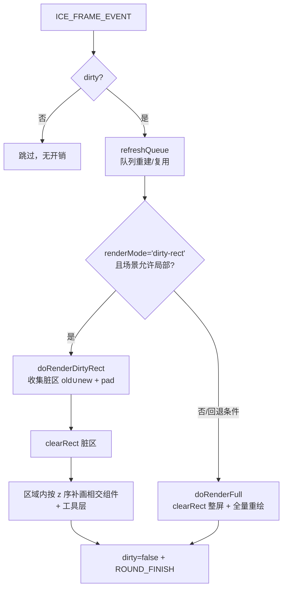

# 04 · 渲染与性能

## 渲染策略：脏标记 + 脏矩形局部重绘（默认），条件回退全量

引擎采用「脏标记 + 惰性渲染」，并在 v1（2026-09-09）起把默认绘制路径从「整屏全量重绘」升级为「**脏矩形局部重绘**」：

1. **脏标记** `ice.dirty`：任何状态变化（`setState`、增删组件）置 `true`；渲染器仅在为真时工作。
2. **帧入口决策**：`refreshQueue()` 后，若 `renderMode==='dirty-rect'` 且场景满足局部条件 → `doRenderDirtyRect()`；否则回退 `doRenderFull()`（旧全量逻辑**原样保留**，为参考与兜底）。
3. **局部重绘**：脏区按组件**旧世界盒 ∪ 新世界盒 + paint pad** 收集，聚合成若干块**互不相接**的裁剪区（`coalesceRegions`，上限 6 块，超出时合并「面积增量最小」的两块），逐块 `clearRect` + `clip`，块内按 z 序重画与区域相交的组件。渲染器用 `WeakMap` 保存每组件「上次实际绘制的世界轴对齐盒」快照，用于旧区域擦除与相交判断。
   - **两个坐标系**：脏区收集与相交判定在世界坐标里做（快照盒是世界盒），而 `clearRect`/`clip` 必须用**渲染坐标** = 世界坐标 × 渲染视口（`dpr · viewport`）。两者之间只有一个换算点 `mapBoxToRender()`（向外取整防接缝）。
4. **组件上下文自包含**：每个组件 render 末尾把本组件写过的泄漏 ctx 属性（shadow/globalAlpha/composite/lineCap/lineJoin/miterLimit/textAlign/textBaseline/虚线）归位为 canvas 默认值——这是 full 与 partial **逐像素一致**的前提。



**门控与回退条件**（几何纯函数见 `src/renderer/dirty-rect-util.ts`，阈值常量在 `CanvasRenderer`）。
2026-09-10 把「risky 组件」的判定由 **v1 的整场景级**放宽到 **相交级**，这是让默认渲染路径在真实场景里真正生效的关键一步：

| 条件 | 动作 | 原因 |
|---|---|---|
| 结构变更（`markQueueDirty`） | 全量并重建快照 | 队列/层级整体变化，旧盒不可复用 |
| 快照未 prime（结构变更后首帧） | 全量 | 旧区域未知，无法擦除 |
| 无可见脏组件且无隐藏擦除（手动置脏/图片 onload 帧） | 全量 | 保语义 |
| 脏可见组件占比 > 20% | 全量 | 相交裁剪收益小 |
| 脏区域（多块之和）面积 / 画布面积 > 35% | 全量 | 接近整屏成本 |
| 可见的 dot-path（折线/星形等）、ICEText 或非不透明落墨（alpha 色/阴影/globalAlpha/合成模式）**且与本次脏区相交** | 全量 | clip 边界与半透明落墨/字形/折线抗锯齿相交会产生接缝。实测「文本内容变更」时字形+描边的墨迹会超出几何盒，clip 下重绘无法与全量逐像素一致（像素回归曾报 594px 差异，差异色正是文本的描边色） |
| 上述 risky 组件**刚变脏**、但**只是位置变化**（`paramsDirty === false`，即祖先变换导致的平移）且**非文本** | 不阻塞 | 脏组件的 old∪new 盒（含 paint pad）本来就会被并进脏区，所以 clip 切不到它的墨迹 —— 墨迹形状不变、只是整体平移，逐像素必然一致 |
| 上述 risky 组件**刚变脏、只是位置变化**、且**是文本** | 命中离屏缓存则放行，否则全量 | 文本字形墨迹可能超出几何盒，只有走离屏缓存（主画布只是 `drawImage` 平移复用位图、clip 只作用于整像素采样）才能保证逐像素一致 |
| 上述 risky 组件**干净**、且已离屏缓存 | 不阻塞局部重绘 | 主画布只是 `drawImage` 一张不透明位图，clip 只作用位图的整像素采样，不改变字形内部 AA |
| 场景含折线（`isLine`）且其带宽盒较大 | 富场景下会**稳定回退全量** | 折线包围盒修复为真实值后属「clip 会切断描边抗锯齿」的风险类别。这是**正确的保守行为** —— 此前「能走局部重绘」恰恰是因为盒子退化、漏画了折线（见 [13](13-gap-analysis.md) §4.4） |
| 新/旧包围盒含 NaN；ctx 无 clip/save/restore（老小程序 canvas） | 全量 | 安全兜底 |

**不再回退的两类（2026-09-11 落地）**：以前「视口非单位变换」与「dpr ≠ 1」都直接回退全量 ——
理由是「世界盒与屏幕 `clearRect/clip` 不一致」。但这两类恰好就是真实使用场景（编辑器必然缩放平移；
高分屏要开 `dpr` 才不发虚），等于招牌优化在最需要的地方完全失效。现在改为把脏区映射到渲染坐标后照常局部重绘：

| 场景 | 以前 | 现在 |
|---|---|---|
| 视口缩放/平移（`scale≠1` 或 `tx/ty≠0`） | 回退全量 | 局部重绘（脏区 × 视口换算） |
| `dpr > 1` 高分屏 | 回退全量 | 局部重绘（脏区 × dpr） |
| 分散脏区（多选拖拽、布局重排、多条独立动画） | 并成**单个**大盒 → 极易撞 35% 阈值 → 回退全量 | 聚合成多块裁剪区，各擦各的 |

回归证据：`e2e/visual/dirty-rect-pixel.spec.ts` 新增 `?zoom=1`、`?hidpi=1`、`?zoom=1&hidpi=1`、`?multi=1`
四个场景，均断言「局部重绘执行次数 > 0」且 10 步逐像素与全量 100% 一致。

**实测收益**：富场景（含旋转组 / 文本 / 星形 / 连线 / 半透明控制面板）的局部重绘执行次数由 **0 → 2**，且 10 步逐像素比对仍 100% 一致。
编辑器里控制面板长期存在，旧的整体门控因此几乎永久失效 —— 所以这一步是「把已经花掉的优化成本真正收回来」。

**这些收益以前只在「单位视口 + dpr=1」时成立**（见上表）；2026-09-11 补齐坐标映射后，缩放/平移与高分屏下同样生效。

**仍待解决（2026-09-11 应用层实测钉出的真实瓶颈）**：`ice-entity-designer` 编辑器里局部重绘**仍然 100% 回退**
（拖动实体 22/22 帧 `__collect()` 返回 null）。逐条排查后的阻塞源是**干净、不可缓存的 `ICEPolyLine`（关系连线）
与脏区相交** —— 连线横跨画布，任何脏区都会与它相交，而 `ObjectCache` 有意排除 `isLine`（位图过大，
`drawImage` 反而不划算）。解开它需要一次产品级取舍，二者之一：

1. **缓存连线位图**：命中时主画布只是贴图，clip 安全；代价是每条连线一张（可能很大的）位图；
2. **接受 clip 边缘的 AA 接缝**：放弃「full 与 partial 逐像素一致」这条既有不变量（当前所有像素回归都在守它）。

在做出这个取舍前，局部重绘对这个应用**没有收益**（其余优化都被这一条门吃掉）—— 这也是后续排期该优先处理它的原因。
另外两条已被本次验证排除的猜测：文本离屏缓存命中率是 100%（240/240），所以不是缓存问题；
工具层（变换面板）不参与阻塞（实验：禁用工具层 risky 判定后仍 0 次局部重绘）。

## 组件级离屏缓存（ObjectCache）

`CanvasRenderer` 内置 `ObjectCache`（`WeakMap`，与 `__snap` 同生命周期，不写入组件 state/props）。
缓存「非编辑态、可见」的 `ICEText` 与「封闭点集路径」（星形/正N边形/玫瑰；排除连线类 `isLine`
与蚂蚁线 `lineDashFlow`；且面积 `>= 40000`（200x200）），把组件预渲染成一张不透明位图，
主画布上只 `drawImage`。此外缓存「半透明普通 path 图形」（rgba/阴影/globalAlpha/composite；
排除容器/图片/连线），把 alpha 落墨先画进位图，再 source-over 贴回。
大量小图形不缓存——小图形的 `drawImage` 光栅化会反超直接 `fill/stroke`。

收益三点：

1. 缓存命中帧跳过 `measureText`（DOM 测量）与 `fillText/strokeText`，或跳过 `calcDots`、路径重建与 `fill/stroke`；
2. 纯平移（内容与线性变换不变，仅 left/top 变化）复用位图，只刷新贴图位置；
3. 已缓存组件在 `__sceneAllowsPartial` 中按「不透明位图贴图」处理，不再阻塞局部重绘。
   clip 只作用于最终位图的整像素采样，不改变字形内部 AA，因此 full 与 partial 逐像素一致。

实现要点：

- `root.createOffscreenCanvas(width, height)`：浏览器 `document.createElement('canvas')`，
  小程序 `wx.createOffscreenCanvas({ type: '2d', width, height })`；物理尺寸按 `root.devicePixelRatio` 缩放。
- `ICEComponent.renderTo(targetCtx, baseMatrix)`：渲染期间临时重定向 `this.ctx`，
  最终 CTM = `baseMatrix · composedMatrix`（`baseMatrix` 把世界盒平移到离屏左上角）。`render()` 语义不变。
- 缓存决策（`ObjectCache.render`）：
  - 未 dirty 且已有 cache → 直接贴图；
  - dirty → 先 `refreshParams()` **按需**刷新派生状态（只有自身派生参数变脏时才重算点集 / 文本量测；
    祖先移动导致的「只需重绘」不重算），再 `composeMatrix()` 后比较 `contentKey` 与 `linearKey`（a,b,c,d）；
    （`composeMatrix()` 对 dots 的平移已改为幂等，不再要求每次 compose 前都重算 dots，见 [02](02-component-model.md)）
  - 内容或线性变化 → 重建位图（`renderTo` 到离屏）；
  - 仅平移变化 → 复用位图，刷新贴图位置。

像素一致性回归：`e2e/visual/dirty-rect-pixel.spec.ts` 的 `?opaque=1&text=1`、`?opaque=1&star=1`
与 `?opaque=1&alpha=1` 场景，验证含文本 / 含星形 / 含半透明矩形的全不透明场景局部重绘真正执行
（`collectOk>0`）且与 full 路径 10 步逐像素一致。
引擎 JS 层基准：`npm run bench` 的场景 C（文本缓存命中）对比场景 D（每帧重建）可观察加速比。

## 渲染队列（flattenTree + 排序 + 缓存）

每帧需要把组件树"展平"成有序数组再渲染：

- `flattenTree(childNodes)` 递归遍历，产出 `componentQueue`（普通组件）与 `toolsQueue`（工具组件），同时标注 `_level`/`_pid`。
- 两个队列各自按 `state.zIndex` **升序**排序，确定绘制顺序。

**性能优化（2026-09-08 引入）**：渲染队列带缓存。

- 仅当组件树**结构变化**（`addChild`/`removeChild`/`addTool`/`removeTool` 等）时，由 `renderer.markQueueDirty()` 触发重建（重新 flatten + sort）。
- 稳态帧只做一次 **O(n) 的 zIndex 稳定性比对**：若所有 `zIndex` 未变，直接复用上一帧的队列数组，不重复递归展平、不重新分配数组。
- `zIndex` 变化（经 `setState`）无需手动标记，稳态比对会自动发现并重新排序。

**铁律**：所有改变组件树结构的入口都必须调用 `renderer.markQueueDirty()`，否则稳态帧会沿用过期队列，导致增删组件不渲染或层级错乱。回归用例见 `tests/renderer/CanvasRenderer.queue.test.ts`。

## 矩阵零分配

矩阵运算在动画（每帧全量 compose）场景下是最大开销之一。引擎把热路径的矩阵计算改为**复用缓冲、零分配**：

| 方法 | 复用对象 |
|---|---|
| `calcLinearMatrix()` | 复用 `state.linearMatrix`（原地 identity + skew/rotate/scale） |
| `calcAbsoluteLinearMatrix()` | 复用每实例 `__absScratchA/B` 两个缓冲做祖先连乘 |
| `composeMatrix()` | 复用 `state.composedMatrix` + 平移 scratch `__transScratch` |
| `calcAbsoluteOrigin()` | 复用 `__originScratch` + 原地 `transformMat2d` |

两点关键约定：

1. **这些缓冲是普通数组**（非 `mat2d.create()` 返回的 `Float32Array`），以保持矩阵为 `Array` 类型，兼容 `Array.isArray` 与序列化。
2. **优化不得破坏语义**：`calcAbsoluteLinearMatrix` 仍要实时重算祖先（见 [03](03-coordinate-system.md)），零分配只是复用存储、不是复用缓存值。

`applyStyleToCtx` 同样做了零分配：用 `for...in` 直接遍历 `props.style`/`state.style` 写 `ctx`，**不用** `Object.keys`（会分配 key 数组、加重 GC）也不做对象展开合并。

## 渲染循环内的细节

- **全量路径** `doRenderFull()` 先 `clearRect(0,0,canvasWidth,canvasHeight)` 整屏清屏；**局部路径** `doRenderDirtyRect()` 只 `clearRect` 脏区域（旧盒 ∪ 新盒 + paint pad）。两条路径的正确性以逐像素一致为验收标准。
- 对每个组件注入 `root/ctx/evtBus/ice` 后调用 `component.render()`（稳态下这些引用已一致，跳过重复注入）。
- 一轮结束后 `ice.dirty=false`，并触发 `ROUND_FINISH` 事件（供 `linkSlotManager` 等订阅）。
- **折线的端点箭头**：`ICEPolyLine.calcArrowPoints()` 把三角形顶点**插进点集**（`[P0,A1,A2,P0,…]`），路径本身只描边；填充是描边之后单独做的一次 `fill`（用线色，`arrowStyle:'hollow'` 可关闭）。
  ⚠️ 那次 `fill` **必须先 `beginPath()`**：无全局 `Path2D` 的运行时（小程序低版本 / Node）走 `replayPath()`，它会把整条开放折线留在 ctx 当前路径上，不重开路径会把折线一并填满。

## 性能基线

`bench/render.cjs` 提供可复跑的引擎级基准（node + stub ctx，测的是**引擎 JS 逻辑开销，不含光栅化**）：

```bash
npm run bench            # 默认 1000 组件
node bench/render.cjs 5000
```

参考数据（N=5000，2026-09-08 优化后）：

| 场景 | 每帧耗时 |
|---|---|
| 静态重绘（稳态，仅 `ice.dirty`） | ~0.8ms |
| 动画（每帧全量 compose） | ~5.9ms |

> 光栅化开销需在真实浏览器用 DevTools Performance 面板另测；可视化回归用 `npm run test:visual`（见 `e2e/visual/README.md`）。

## 最大图元数压测

`examples/performance/max-elements.html` 用纯色小矩形逐档上探图元数，测构建/首帧/稳态全量重绘。
数据（Playwright + Chromium，`?full=1` 满档，2026-09-10 挂载去重优化后）：

| 图元数 | 构建 | 首帧 | 稳态整帧 |
|---|---|---|---|
| 10万 | ~0.36s | ~0.19s | ~0.11s |
| 50万 | ~2.0s | ~1.1s | ~0.48s |
| 100万 | ~6.1s | ~4.3s | ~1.17s |

真实堆内存（node 实测，不含浏览器光栅化 buffer；2026-09-10 默认 props/state 原型共享后）：

| 图元数 | 堆内存增量 | 每图元约 |
|---|---|---|
| 10万 | ~179MB | ~1.8KB |
| 50万 | ~695MB | ~1.4KB |
| 100万 | ~868MB（累计约 1.75GB） | ~0.9KB |

首帧构成（stub ctx 拆解，不含光栅化）：`flattenTree + sort` 约 5%，首次 `composeMatrix` 约 15%，
其余为渲染调用与浏览器光栅化。排序不是首帧瓶颈（队列缓存 + V8 TimSort 对递增 zIndex 近乎 O(n)）。

结论：**最大可交互图元数约 50 万**（稳态整帧 ≤ 1s）；10 万是流畅舒适区；100 万可构建渲染但不实用。
真正的硬约束是内存——100 万最小矩形**堆增量约 868MB（累计约 1.75GB）**，先于渲染成为天花板（默认 props/state 原型共享优化前，同一场景约 2.0GB 增量，见上表）。
该结论对应最简单图元，文字/连线/阴影/半透明等复杂组件的实际上限会明显更低。

## 动画机制压测

`examples/performance/animation-stress.html` 给 N 个矩形各挂一个循环动画（`left` 0→100 loop），
同步驱动 `ICE_FRAME_EVENT`，测量「tween + setState + 全量重绘」单帧成本：

| 动画组件数 | p50 | 等效帧率 |
|---|---|---|
| 1000 | ~0.9ms | ~1111fps |
| 5000 | ~4.7ms | ~213fps |
| 10000 | ~14.4ms | ~69fps |
| 20000 | ~26.2ms | ~38fps |
| 50000 | ~61.2ms | ~16fps |

结论：约 1 万个同时动画的组件还能贴近 60fps，2 万掉到 ~38fps。动画 tween 本身很轻，
主要成本是所有动画组件每帧标脏触发的全量重绘；若后续做「动画组局部重绘」或「脏组件分帧」，
动画容量还有提升空间。
