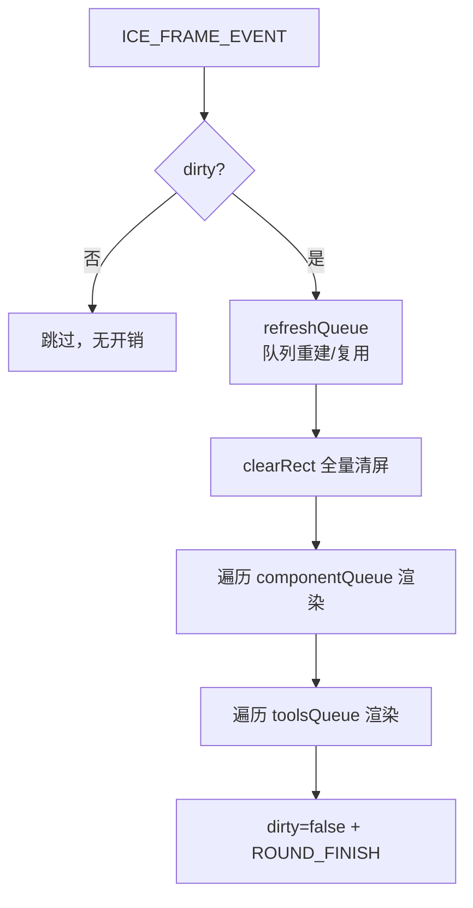

# 04 · 渲染与性能

## 渲染策略：脏标记 + 全量重绘

引擎采用**最简单且可预测**的渲染模型：

1. **脏标记** `ice.dirty`：任何状态变化（`setState`、增删组件）置 `true`。
2. **惰性渲染**：`CanvasRenderer` 订阅帧事件，仅在 `ice.dirty` 为真时执行 `doRender()`。
3. **全量重绘**：清空整块 canvas，重绘所有可见组件。**没有**局部重绘 / 脏矩形。



> 全量重绘是刻意选择：它规避了脏矩形方案对"重叠/透明区域"的复杂处理，正确性更高、心智负担低；配合下面的缓存与零分配优化，全量重绘的性能足够支撑数千图元。

## 渲染队列（flattenTree + 排序 + 缓存）

每帧需要把组件树"展平"成有序数组再渲染：

- `flattenTree(childNodes)` 递归遍历，产出 `componentQueue`（普通组件）与 `toolsQueue`（工具组件），同时标注 `_level`/`_pid`。
- 两个队列各自按 `state.zIndex` **升序**排序，确定绘制顺序。

**性能优化（2026-09-08 引入）**：渲染队列带缓存。

- 仅当组件树**结构变化**（`addChild`/`removeChild`/`addTool`/`removeTool` 等）时，由 `renderer.markQueueDirty()` 触发重建（重新 flatten + sort）。
- 稳态帧只做一次 **O(n) 的 zIndex 稳定性比对**：若所有 `zIndex` 未变，直接复用上一帧的队列数组，不重复递归展平、不重新分配数组。
- `zIndex` 变化（经 `setState`）无需手动标记，稳态比对会自动发现并重新排序。

**铁律**：所有改变组件树结构的入口都必须调用 `renderer.markQueueDirty()`，否则稳态帧会沿用过期队列，导致增删组件不渲染或层级错乱。回归用例见 `tests/renderer/CanvasRenderer.queue.test.ts`。

## 矩阵零分配

矩阵运算在动画（每帧全量 compose）场景下是最大开销之一。引擎把热路径的矩阵计算改为**复用缓冲、零分配**：

| 方法 | 复用对象 |
|---|---|
| `calcLinearMatrix()` | 复用 `state.linearMatrix`（原地 identity + skew/rotate/scale） |
| `calcAbsoluteLinearMatrix()` | 复用每实例 `__absScratchA/B` 两个缓冲做祖先连乘 |
| `composeMatrix()` | 复用 `state.composedMatrix` + 平移 scratch `__transScratch` |
| `calcAbsoluteOrigin()` | 复用 `__originScratch` + 原地 `transformMat2d` |

两点关键约定：

1. **这些缓冲是普通数组**（非 `mat2d.create()` 返回的 `Float32Array`），以保持矩阵为 `Array` 类型，兼容 `Array.isArray` 与序列化。
2. **优化不得破坏语义**：`calcAbsoluteLinearMatrix` 仍要实时重算祖先（见 [03](03-coordinate-system.md)），零分配只是复用存储、不是复用缓存值。

`applyStyleToCtx` 同样做了零分配：用 `for...in` 直接遍历 `props.style`/`state.style` 写 `ctx`，**不用** `Object.keys`（会分配 key 数组、加重 GC）也不做对象展开合并。

## 渲染循环内的细节

- `doRender()` 先 `clearRect(0,0,canvasWidth,canvasHeight)` 全量清屏。
- 对每个组件注入 `root/ctx/evtBus/ice` 后调用 `component.render()`（稳态下这些引用已一致，跳过重复注入）。
- 一轮结束后 `ice.dirty=false`，并触发 `ROUND_FINISH` 事件（供 `linkSlotManager` 等订阅）。

## 性能基线

`bench/render.cjs` 提供可复跑的引擎级基准（node + stub ctx，测的是**引擎 JS 逻辑开销，不含光栅化**）：

```bash
npm run bench            # 默认 1000 组件
node bench/render.cjs 5000
```

参考数据（N=5000，2026-09-08 优化后）：

| 场景 | 每帧耗时 |
|---|---|
| 静态重绘（稳态，仅 `ice.dirty`） | ~0.8ms |
| 动画（每帧全量 compose） | ~5.9ms |

> 光栅化开销需在真实浏览器用 DevTools Performance 面板另测；可视化回归用 `npm run test:visual`（见 `e2e/visual/README.md`）。
