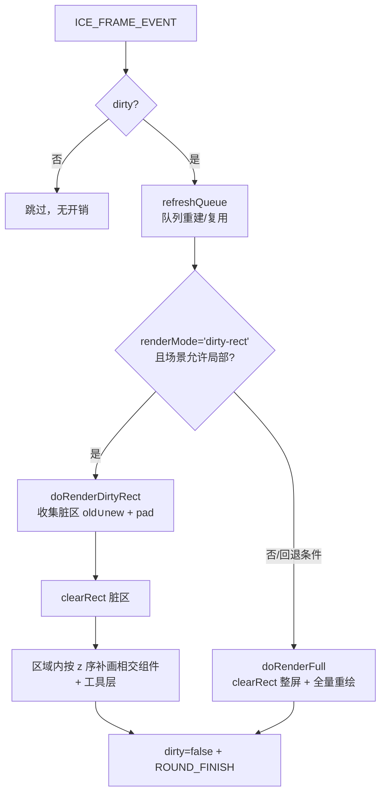

# 04 · 渲染与性能

## 渲染策略：脏标记 + 脏矩形局部重绘（默认），条件回退全量

引擎采用「脏标记 + 惰性渲染」，并在 v1（2026-09-09）起把默认绘制路径从「整屏全量重绘」升级为「**脏矩形局部重绘**」：

1. **脏标记** `ice.dirty`：任何状态变化（`setState`、增删组件）置 `true`；渲染器仅在为真时工作。
2. **帧入口决策**：`refreshQueue()` 后，若 `renderMode==='dirty-rect'` 且场景满足局部条件 → `doRenderDirtyRect()`；否则回退 `doRenderFull()`（旧全量逻辑**原样保留**，为参考与兜底）。
3. **局部重绘**：脏区按组件**旧世界盒 ∪ 新世界盒 + paint pad** 收集，聚合成若干块**互不相接**的裁剪区（`coalesceRegions`，上限 6 块，超出时合并「面积增量最小」的两块；**脏块数超过聚合预算 `MAX_COALESCE_REGIONS = 32` 时直接塌缩成并集盒**，避免 O(k³) 聚合把一帧卡死），逐块 `clearRect` + `clip`，块内按 z 序重画与区域相交的组件。渲染器用 `WeakMap` 保存每组件「上次实际绘制的世界轴对齐盒」快照，用于旧区域擦除与相交判断。
   - **两个坐标系**：脏区收集与相交判定在世界坐标里做（快照盒是世界盒），而 `clearRect`/`clip` 必须用**渲染坐标** = 世界坐标 × 渲染视口（`dpr · viewport`）。两者之间只有一个换算点 `mapBoxToRender()`（向外取整防接缝）。
4. **组件上下文自包含**：每个组件 render 末尾把本组件写过的泄漏 ctx 属性（shadow/globalAlpha/composite/lineCap/lineJoin/miterLimit/textAlign/textBaseline/虚线）归位为 canvas 默认值——这是 full 与 partial **逐像素一致**的前提。
   - **文本语言也是"画出来是什么"的一部分**（2025 年补）：同一个汉字有简/繁/日/韩多套字形，
     Canvas 按元素的 **`lang`** 选字形，`dir` 影响双向文本的排布。离屏层（静态层位图、组件缓存位图）
     因此必须与主画布**同语言** —— 所以 `root.createOffscreenCanvas(w, h, sourceEl)` 会从主画布
     镜像 `lang` / `dir`（不支持该属性的运行时会忽略）。
     回归：`tests/renderer/offscreen-text-lang.test.ts`（含"宿主对象写不进去不阻断渲染"的降级分支）。



**门控与回退条件**（几何纯函数见 `src/renderer/dirty-rect-util.ts`，阈值常量在 `CanvasRenderer`）。
2026-09-10 把「risky 组件」的判定由 **v1 的整场景级**放宽到 **相交级**，这是让默认渲染路径在真实场景里真正生效的关键一步：

| 条件 | 动作 | 原因 |
|---|---|---|
| 结构变更（`markQueueDirty`） | 全量并重建快照 | 队列/层级整体变化，旧盒不可复用 |
| 快照未 prime（结构变更后首帧） | 全量 | 旧区域未知，无法擦除 |
| 无可见脏组件且无隐藏擦除（手动置脏/图片 onload 帧） | 全量 | 保语义 |
| 脏可见组件占比 > 20% | 全量 | 相交裁剪收益小 |
| 脏区域（多块之和）面积 / 画布面积 > 35% | 全量 | 接近整屏成本 |
| 可见的 dot-path（折线/星形等）、ICEText 或非不透明落墨（alpha 色/阴影/globalAlpha/合成模式）**且与本次脏区相交** | 全量 | clip 边界与半透明落墨/字形/折线抗锯齿相交会产生接缝。实测「文本内容变更」时字形+描边的墨迹会超出几何盒，clip 下重绘无法与全量逐像素一致（像素回归曾报 594px 差异，差异色正是文本的描边色） |
| 上述 risky 组件**刚变脏**、但**只是位置变化**（`paramsDirty === false`，即祖先变换导致的平移）且**非文本** | 不阻塞 | 脏组件的 old∪new 盒（含 paint pad）本来就会被并进脏区，所以 clip 切不到它的墨迹 —— 墨迹形状不变、只是整体平移，逐像素必然一致 |
| 上述 risky 组件**刚变脏、只是位置变化**、且**是文本** | 命中离屏缓存则放行，否则全量 | 文本字形墨迹可能超出几何盒，只有走离屏缓存（主画布只是 `drawImage` 平移复用位图、clip 只作用于整像素采样）才能保证逐像素一致 |
| 上述 risky 组件**干净**、且已离屏缓存 | 不阻塞局部重绘 | 主画布只是 `drawImage` 一张不透明位图，clip 只作用位图的整像素采样，不改变字形内部 AA |
| 场景含折线（`isLine`）且其带宽盒较大 | 富场景下会**稳定回退全量** | 折线包围盒修复为真实值后属「clip 会切断描边抗锯齿」的风险类别。这是**正确的保守行为** —— 此前「能走局部重绘」恰恰是因为盒子退化、漏画了折线（见 [13](13-gap-analysis.md) §4.4） |
| 新/旧包围盒含 NaN；ctx 无 clip/save/restore（老浏览器 / 测试桩） | 全量 | 安全兜底 |

**不再回退的两类（2026-09-11 落地）**：以前「视口非单位变换」与「dpr ≠ 1」都直接回退全量 ——
理由是「世界盒与屏幕 `clearRect/clip` 不一致」。但这两类恰好就是真实使用场景（编辑器必然缩放平移；
高分屏要开 `dpr` 才不发虚），等于招牌优化在最需要的地方完全失效。现在改为把脏区映射到渲染坐标后照常局部重绘：

| 场景 | 以前 | 现在 |
|---|---|---|
| 视口缩放/平移（`scale≠1` 或 `tx/ty≠0`） | 回退全量 | 局部重绘（脏区 × 视口换算） |
| `dpr > 1` 高分屏 | 回退全量 | 局部重绘（脏区 × dpr） |
| 分散脏区（多选拖拽、布局重排、多条独立动画） | 并成**单个**大盒 → 极易撞 35% 阈值 → 回退全量 | 聚合成多块裁剪区，各擦各的 |

回归证据：`e2e/visual/dirty-rect-pixel.spec.ts` 新增 `?zoom=1`、`?hidpi=1`、`?zoom=1&hidpi=1`、`?multi=1`
四个场景，均断言「局部重绘执行次数 > 0」且 10 步逐像素与全量 100% 一致。

**实测收益**：富场景（含旋转组 / 文本 / 星形 / 连线 / 半透明控制面板）的局部重绘执行次数由 **0 → 2**，且 10 步逐像素比对仍 100% 一致。
编辑器里控制面板长期存在，旧的整体门控因此几乎永久失效 —— 所以这一步是「把已经花掉的优化成本真正收回来」。

**这些收益以前只在「单位视口 + dpr=1」时成立**（见上表）；2026-09-11 补齐坐标映射后，缩放/平移与高分屏下同样生效。

**仍待解决（2026-09-11 应用层实测钉出的真实瓶颈）**：`ice-entity-designer` 编辑器里局部重绘**仍然 100% 回退**
（拖动实体 22/22 帧 `__collect()` 返回 null）。逐条排查后的阻塞源是**干净、不可缓存的 `ICEPolyLine`（关系连线）
与脏区相交** —— 连线横跨画布，任何脏区都会与它相交，而 `ObjectCache` 有意排除 `isLine`（位图过大，
`drawImage` 反而不划算）。解开它需要一次产品级取舍，二者之一：

1. **缓存连线位图**：命中时主画布只是贴图，clip 安全；代价是每条连线一张（可能很大的）位图；
2. **接受 clip 边缘的 AA 接缝**：放弃「full 与 partial 逐像素一致」这条既有不变量（当前所有像素回归都在守它）。

在做出这个取舍前，局部重绘对这个应用**没有收益**（其余优化都被这一条门吃掉）—— 这也是后续排期该优先处理它的原因。
另外两条已被本次验证排除的猜测：文本离屏缓存命中率是 100%（240/240），所以不是缓存问题；
工具层（变换面板）不参与阻塞（实验：禁用工具层 risky 判定后仍 0 次局部重绘）。

## 组件级离屏缓存（ObjectCache）

`CanvasRenderer` 内置 `ObjectCache`（`WeakMap`，与 `__snap` 同生命周期，不写入组件 state/props）。
缓存「非编辑态、可见」的 `ICEText` 与「封闭点集路径」（星形/正N边形/玫瑰；排除连线类 `isLine`
与蚂蚁线 `lineDashFlow`；且面积 `>= 40000`（200x200）），把组件预渲染成一张不透明位图，
主画布上只 `drawImage`。此外缓存「半透明普通 path 图形」（rgba/阴影/globalAlpha/composite；
排除容器/图片/连线），把 alpha 落墨先画进位图，再 source-over 贴回。
大量小图形不缓存——小图形的 `drawImage` 光栅化会反超直接 `fill/stroke`。

**两条 2026-09-21 收紧的口径**：

0. **每组件常驻数组要当成内存成本来审**（2026-09-21，堆快照驱动的一轮优化）：10 万图元下实测每个图元
   自己持有 **38 个数组**（383 万个），合计约 180MB —— 比图元对象本身还贵。已把"一次调用内用完就扔"的
   临时缓冲改成**模块级共享**（`__localBoxScratch` / `__transScratch` / `__absScratchB` / `__pathSigScratch`），
   并把 `suspendedEventNames` 改成按需创建：每图元数组 **38.3 → 27.3**、快照自有大小 **371.0 → 330.6 MB**。
   **判据**：写进 `state.*` 的缓冲（如 `absoluteLinearMatrix`）不能共享（那是"组件自己的矩阵"，
   共享会让所有组件指向同一块内存）；只在一次调用里活着的才可以。
   **同一天的第二刀是"同几何图元共享 `Path2D`"**（见下条 0b）。
   仍可继续挖的（见 2026-09-21 的堆分析）：`__pathSig`（11.7MB，可改哈希比较）、
   每组件 3 个默认事件监听数组（9.3MB，需要实例级事件委托）、`__activeCtm`/`__activeWorldMatrix`（13.8MB，
   依赖"按队列渲染"这一事实才能共享）。

0b. **同几何图元共享 `Path2D`**（2026-09-21，堆快照驱动的第二刀）：`ICEPath` 现在按
   「类 + 几何签名」查一张有界缓存（512 条，按插入顺序淘汰）。只对**签名能精确描述几何**的类生效
   （`__hasPrecisePathSignature()`：内置四个 builder + 显式实现 `__pathSignature()` 的子类），
   没实现签名的子类继续每实例一份。位置/缩放走 CTM、不进路径坐标，所以"只有位置不同"的图元命中同一条。
   实测（真机 Chrome + CDP 精确对象计数 + V8 堆快照，10 万图元）：`Path2D` **100,018 → 24**、
   快照自有大小 **330.6 → 234.6 MB（−96.0 MB，−29%）**。**前提是"发布即只读"**：
   引擎只在 `createPathObject()` 里写路径、`closePath()` 是幂等标记；子类若在那里做了路径之外的副作用，
   就不能实现 `__pathSignature()`。

1. **"半透明"按 alpha 值判，而不是按字符串**：`transparent` / `rgba(…,0)` / `#RRGGBB00` / `hsla(…,0)`
   的 alpha 是 **0 —— 该通道不落墨**，不构成"半透明落墨"。旧实现看见字符串里有 `transparent` 就判半透明，
   于是 `style: { fillStyle: '#10B981', strokeStyle: 'transparent' }`（= 只填充、不描边，家族代码里 14 处）
   会被逐块缓存。真机 Chrome + V8 堆快照实测（10 万图元）：
   `HTMLCanvasElement` **66,644 → 2**、`CanvasRenderingContext2D` **66,644 → 2**、
   同场景"每帧全量重绘"单帧 p50 **274.7ms → 254ms（−8%）**；代价是空转帧的簿记略升
   （6.8ms → 8.0ms / 10 万图元，因为不可缓存的组件要走一遍缓存判定分支）。
   顺带把 dirty-rect 的 risky 判定也修正回"不透明"。
2. **总位图预算 `MAX_CACHE_BYTES = 32MB` 对全部分支生效**（此前只有连线分支过）：文本 / 点集路径 /
   半透明 path 三条分支此前没有上界，实测一个 10 万图元场景里半透明分支记到 **124MB**。
   现在按"设备像素面积 × 4"估值统一过门，**只约束新增、已缓存的继续复用**（不做 LRU 淘汰）。

收益三点：

1. 缓存命中帧跳过 `measureText`（DOM 测量）与 `fillText/strokeText`，或跳过 `calcDots`、路径重建与 `fill/stroke`；
2. 纯平移（内容与线性变换不变，仅 left/top 变化）复用位图，只刷新贴图位置；
3. 已缓存组件在 `__sceneAllowsPartial` 中按「不透明位图贴图」处理，不再阻塞局部重绘。
   clip 只作用于最终位图的整像素采样，不改变字形内部 AA，因此 full 与 partial 逐像素一致。

实现要点：

- `root.createOffscreenCanvas(width, height)`：浏览器 `document.createElement('canvas')`，
  由 `root.createOffscreenCanvas()` 统一创建；物理尺寸按 `root.devicePixelRatio` 缩放。
- `ICEComponent.renderTo(targetCtx, baseMatrix)`：渲染期间临时重定向 `this.ctx`，
  最终 CTM = `baseMatrix · composedMatrix`（`baseMatrix` 把世界盒平移到离屏左上角）。`render()` 语义不变。
- 缓存决策（`ObjectCache.render`）：
  - 未 dirty 且已有 cache → 直接贴图；
  - dirty → 先 `refreshParams()` **按需**刷新派生状态（只有自身派生参数变脏时才重算点集 / 文本量测；
    祖先移动导致的「只需重绘」不重算），再 `composeMatrix()` 后比较**内容指纹向量**与 `linearKey`（a,b,c,d）；
    （指纹用 `contentKeyVector()` 采样进复用缓冲、`keyEquals()` 逐项比较，**不拼字符串** ——
    字符串形态 `contentKey()` 由同一份向量拼出，只在真要重建位图时才拼。2026-09-14 改）
    （`composeMatrix()` 对 dots 的平移已改为幂等，不再要求每次 compose 前都重算 dots，见 [02](02-component-model.md)）
  - 内容或线性变化 → 重建位图（`renderTo` 到离屏）；
  - 仅平移变化 → 复用位图，刷新贴图位置。

像素一致性回归：`e2e/visual/dirty-rect-pixel.spec.ts` 的 `?opaque=1&text=1`、`?opaque=1&star=1`
与 `?opaque=1&alpha=1` 场景，验证含文本 / 含星形 / 含半透明矩形的全不透明场景局部重绘真正执行
（`collectOk>0`）且与 full 路径 10 步逐像素一致。
引擎 JS 层基准：`npm run bench` 的场景 C（文本缓存命中）对比场景 D（每帧重建）可观察加速比。

### 在 `setState` 之外改画面：用 `ice.requestRepaint()`（v2.14.0）

组件走 `setState` 置脏是常规路径。但有些"画出来是什么变了"并不经过 `setState`：
自绘 painter 读了新数据、换了视口、字体/图片刚就绪、要作废静态层与上屏快照 —— 这类情况用：

```js
ice.requestRepaint(); // 置脏 + 标记渲染队列重排；幂等，可链式
```

**不要再写 `ice.dirty = true`**：那是直摸内部字段（无文档、无保证），而且它只置脏、
不通知渲染队列。`requestRepaint()` 的语义就是"我改了会影响画面的东西，下一帧重画"。
回归：`tests/renderer/request-repaint.test.ts`。

## 渲染队列（flattenTree + 排序 + 缓存）

每帧需要把组件树"展平"成有序数组再渲染：

- **绘制顺序 = 树序（先父后子）+ 兄弟按 `state.zIndex` 升序**（相等时保持加入顺序）；
  **工具层整体画在组件层之上**（`componentQueue` → `toolsQueue`，两层之间不按 zIndex 交叉）。
  口径的唯一出处是 `util/data-util.ts` 的 `flattenTree()`（渲染顺序铁律，v2.13.0）。
- **容器的派生部件永远画在自己的内容之下**（2026-09-19 补，CSS 背景语义）：复合组件
  （`hasDerivedChildren() === true`）把自己的底 / 标题 / 角标也挂在 `childNodes` 里
  （形状由子组件绘制，菱形 / 事件圆 / 圆角框都靠它），而 `getSerializableChildren()` 明确指出
  哪些才是**真实子节点** —— `paintOrderChildrenOf(container)` 据此把一层子节点排成
  「派生部件（按 z 升序）→ 真实子节点（按 z 升序）」。
  ⚠️ 不这么做的后果：容器的底与内容是同层兄弟，底的 `zIndex` 一旦排在内容之后（默认 `'auto'` 就很容易），
  **整段内容被自己的底色盖住**（2026-09 两个真实事故：BPMN 池里的任务矩形全部消失、状态机复合状态变成空框）。
  应用侧因此不需要再给底写"比内容更低"的魔数。**三处必须同源**：`flattenTree`、
  `SvgExporter.collectOrdered`（导出叠放次序）与 `CanvasRenderer.__rebuildQueue`（走 `flattenTree`）；
  命中检测复用渲染队列，自动同源。没有 `getSerializableChildren()` 的组件行为**逐字不变**。
  回归：`tests/renderer/derived-children-paint-order.test.ts`。
- `flattenTree(childNodes)` 递归遍历，产出 `componentQueue`（普通组件）与 `toolsQueue`（工具组件），同时标注 `_level`/`_pid`。
  ⚠️ **只排兄弟**，而且排的是**副本** —— `childNodes` 本身保持加入顺序（调用方按 `childNodes[0]` 取"第一个子节点"是既有语义）。

  旧实现是"展平之后**全局**按 `zIndex` 排序"：父容器的 zIndex 只要比子组件大，就会反超自己整棵子树，
  **父把孩子整个盖住**（画面一片空白、且不报错）。树序下这种倒挂不可能发生 —— 子永远画在父之上。
  （默认 `zIndex` 现在是 `'auto'`（排序当 0），2026-09-19 起；见 [02](02-component-model.md) 的 `zIndex` 一节。）
  回归：`tests/renderer/render-order.test.ts`（顺序）、`tests/renderer/hit-test-ordered.test.ts`（命中与绘制同源）、
  `e2e/visual/render-order.spec.ts`（真机像素）。

**性能优化（2026-09-08 引入）**：渲染队列带缓存。

- 仅当组件树**结构变化**（`addChild`/`removeChild`/`addTool`/`removeTool` 等）时，由 `renderer.markQueueDirty()` 触发重建（重新 flatten + sort）。
- 稳态帧只做一次 **O(n) 的 zIndex 稳定性比对**：若所有 `zIndex` 未变，直接复用上一帧的队列数组，不重复递归展平、不重新分配数组。
- `zIndex` 变化（经 `setState`）无需手动标记，稳态比对会自动发现。**数值变了 ≠ 次序变了**：
  比对发现差异后先判一次"队列在每个父容器内是否**已经**有序"（判据是展平时写下的 `_level`/`_pid`，
  只比相邻同组节点），**有序则只刷新快照、不重建** ——「把一批子件的 zIndex 重写成同一组值」
  「动画把 zIndex 缓动但没跨过邻居」都属于这一类，整队重建纯属白干。
- 次序**真的**变了才**整队重建**；
  重建仍然走 `flattenTree`（树序 + 兄弟排序），**不得**在展平结果上再全局排一次 ——
  那等于把"只排兄弟"退回成旧的全局语义，父容器会再次反超自己的子树。

实测（10000 个顶层矩形，node + 假 ctx，污矩模式）：稳态帧 **0.20ms**；改 1 个组件的
`left`（对照）**0.93ms**；改 1 个 `zIndex` 但次序不变 **1.26ms**（其中判序 0.28ms、
刷快照 0.05ms，零次整队重建）；改 1 个 `zIndex` 跨过邻居 **1.37ms**（其中整队重建 0.69ms）。
差值主要在"脏一个组件"要付的污矩扫描 + 重绘上（改 `left` 那档就是它的底价），与 zIndex 无关。

**铁律**：所有改变组件树结构的入口都必须调用 `renderer.markQueueDirty()`，否则稳态帧会沿用过期队列，导致增删组件不渲染或层级错乱。回归用例见 `tests/renderer/CanvasRenderer.queue.test.ts`。

## 矩阵零分配

矩阵运算在动画（每帧全量 compose）场景下是最大开销之一。引擎把热路径的矩阵计算改为**复用缓冲、零分配**：

| 方法 | 复用对象 |
|---|---|
| `calcLinearMatrix()` | 复用 `state.linearMatrix`（原地 identity + skew/rotate/scale） |
| `calcAbsoluteLinearMatrix()` | 复用每实例 `__absScratchA/B` 两个缓冲做祖先连乘 |
| `composeMatrix()` | 复用 `state.composedMatrix` + 平移 scratch `__transScratch` |
| `calcAbsoluteOrigin()` | 复用 `__originScratch` + 原地 `transformMat2d` |

两点关键约定：

1. **这些缓冲是普通数组**（非 `mat2d.create()` 返回的 `Float32Array`），以保持矩阵为 `Array` 类型，兼容 `Array.isArray` 与序列化。
2. **优化不得破坏语义**：`calcAbsoluteLinearMatrix` 仍要实时重算祖先（见 [03](03-coordinate-system.md)），零分配只是复用存储、不是复用缓存值。

`applyStyleToCtx` 同样做了零分配：用 `for...in` 直接遍历 `props.style`/`state.style` 写 `ctx`，**不用** `Object.keys`（会分配 key 数组、加重 GC）也不做对象展开合并。

## 渲染循环内的细节

- **全量路径** `doRenderFull()` 先 `clearRect(0,0,canvasWidth,canvasHeight)` 整屏清屏；**局部路径** `doRenderDirtyRect()` 只 `clearRect` 脏区域（旧盒 ∪ 新盒 + paint pad）。两条路径的正确性以逐像素一致为验收标准。
- 对每个组件注入 `root/ctx/evtBus/ice` 后调用 `component.render()`（稳态下这些引用已一致，跳过重复注入）。
- 一轮结束后 `ice.dirty=false`，并触发 `ROUND_FINISH` 事件（供 `linkSlotManager` 等订阅）。
- **折线的端点箭头**：`ICEPolyLine.calcArrowPoints()` 把三角形顶点**插进点集**（`[P0,A1,A2,P0,…]`），路径本身只描边；填充是描边之后单独做的一次 `fill`（用线色，`arrowStyle:'hollow'` 可关闭）。
  ⚠️ 那次 `fill` **必须先 `beginPath()`**：它依赖"ctx 当前路径"的语义，不重开路径会把上一条开放折线一并填满。

## 性能基线

`bench/render.cjs` 提供可复跑的引擎级基准（node + stub ctx，测的是**引擎 JS 逻辑开销，不含光栅化**）：

```bash
npm run bench            # 默认 1000 组件
node bench/render.cjs 5000
```

参考数据（N=5000，2026-09-08 优化后）：

| 场景 | 每帧耗时 |
|---|---|
| 静态重绘（稳态，仅 `ice.dirty`） | ~0.8ms |
| 动画（每帧全量 compose） | ~5.9ms |

> 光栅化开销需在真实浏览器用 DevTools Performance 面板另测；可视化回归用 `npm run test:visual`（见 `e2e/visual/README.md`）。

## 最大图元数压测

`examples/performance/max-elements.html` 用纯色小矩形逐档上探图元数，测构建/首帧/稳态全量重绘。
数据（Playwright + Chromium，`?full=1` 满档，2026-09-10 挂载去重优化后）：

| 图元数 | 构建 | 首帧 | 稳态整帧 |
|---|---|---|---|
| 10万 | ~0.36s | ~0.19s | ~0.11s |
| 50万 | ~2.0s | ~1.1s | ~0.48s |
| 100万 | ~6.1s | ~4.3s | ~1.17s |

真实堆内存（不包含画布/光栅化 buffer）——**2026-09-15 用 `npm run bench:mem` 重测**：

| 图元数 | 堆内存增量 | 每图元约 |
|---|---|---|
| 10万 | 232MB | 2.37KB |
| 50万 | 1156MB | 2.37KB |
| 100万 | 2312MB（累计约 2.26GB） | 2.37KB |

> **口径说明（为什么和旧版本的数字差 2.7×）**：本表此前写作 `~179 / ~695 / ~868MB`、每图元 `1.8 / 1.4 / 0.9KB`，
> 并标为"node 实测的堆增量"。实际上那组数来自 `examples/performance/max-elements.html` 里读取的
> `performance.memory.usedJSHeapSize` —— 浏览器**已用堆绝对值**（还带采样/量化），既不是增量、也不是 node 读数，
> 所以它不随图元数线性变化（"每图元越算越小"就是这么来的）。
> 现在这张表的口径是：node 加载 `dist/index.cjs`、每个规模**独立进程**、造对象前后**各强制两次 gc**，
> 指标 =(gc 后 `heapUsed` 差)/N = 每实例保留字节数；`npm run bench:mem` 可复现，且已进 `verify:full` 门禁。
> 其中"默认配置"（`props` + `state`）那部分只占 **0.98KB/图元**；同场景把整份默认表显式传给每个实例约 7.7KB/图元（3.3×）——
> 这就是"默认配置不复制"省下来的量级。注意 `style` 是例外：它按主题**每实例派生**一份，不在共享默认里。

首帧构成（stub ctx 拆解，不含光栅化）：`flattenTree + sort` 约 5%，首次 `composeMatrix` 约 15%，
其余为渲染调用与浏览器光栅化。排序不是首帧瓶颈（队列缓存 + V8 TimSort 对递增 zIndex 近乎 O(n)）。

结论：**最大可交互图元数约 50 万**（稳态整帧 ≤ 1s）；10 万是流畅舒适区；100 万可构建渲染但不实用。
真正的硬约束是内存——100 万最小矩形**堆增量约 2.3GB（每图元 2.4KB，累计约 2.26GB）**，先于渲染成为天花板。
该结论对应最简单图元，文字/连线/阴影/半透明等复杂组件的实际上限会明显更低。

## 动画机制压测

### 测量口径（2026-09-13 复测）

- **示例**：`examples/performance/animation-stress.html` —— N 个图元各挂一个 `left` 循环动画，
  同步驱动 `ICE_FRAME_EVENT`；结果写进 `window.__animStressResult`（`?n=10000&frames=60` 可复跑）。
- **环境**：Playwright + Chromium 153，Apple M4 / macOS 26.6.2 / 24GB，画布 1600×1000、`dpr=1`，
  引擎 **2.2.0**。单帧 = tween + `setState` + 重绘，取 p50。
- 数字只用于**量级比较**：换机器 / 分辨率 / 组件类型都会变（尤其文本，见下）。

> 一句话：**动画没有"定时器"成本 —— 全局只有一个 rAF（`FrameManager`）每帧派发一次
> `ICE_FRAME_EVENT`，`AnimationManager` 一次 O(n) 遍历做时间插值；成本全在重绘。**

### ① 驱动成本是常数级：tween 只占 1%~5%

把渲染器 `stop()` 掉、只让动画跑，与完整单帧对照（矩形，见 ②）：

| 动画组件数 | 只算动画（tween + setState） | 完整单帧 |
|---|---|---|
| 1,000 | 0.1 ms | 1.1 ms |
| 5,000 | 0.3 ms | 5.8 ms |
| 10,000 | 0.6 ms | 15.4 ms |
| 20,000 | 1.3 ms | 29.1 ms |

### ② 复测旧表（同一示例）

| 动画组件数 | p50 | 等效帧率 |
|---|---|---|
| 1000 | ~1.1ms | ~909fps |
| 5000 | ~5.8ms | ~172fps |
| 10000 | ~15.4ms | ~65fps |
| 20000 | ~29.1ms | ~34fps |
| 50000 | ~61.2ms（2026-09-08 读数） | ~16fps |

（2026-09-08 的旧读数 14.4ms / 26.2ms 与本次一致，说明该示例的读数可复现。）

### ③ 真正的断崖：脏组件**计数**门（`FULL_FALLBACK_DIRTY_RATIO = 0.2`）

10,000 个静止矩形里只让 K 个动（`CanvasRenderer` 插桩统计走的是全量还是局部）：

| 动画数 K | 脏比 K/可见 | 单帧 p50 | 走哪条路 |
|---|---|---|---|
| 10 | 0.1% | 1.4 ms | 局部重绘 |
| 500 | 5% | 2.2 ms | 局部重绘 |
| 1,500 | 15% | 4.7 ms | 局部重绘 |
| **2,100** | **21%** | **12.7 ms** | **回退全量** |
| 5,000 | 50% | 14.3 ms | 全量 |
| 10,000 | 100% | 16.5 ms | 全量 |

只多 600 个动画组件，单帧从 4.7ms 跳到 12.7ms（**2.7×**）。原因是 `__collect()` 的门控：
**「脏组件数 / 可见组件数 > 0.2 → 放弃局部重绘」**——而动画的脏区**面积**往往很小（平移几十像素），
却按**组件个数**被判死刑。越过这道门后成本与动画数量几乎无关（都是整屏重绘）。

另外两条门同样要记住：脏区**面积**占比 > `FULL_FALLBACK_AREA_RATIO = 0.35` → 全量；
脏区最多聚合 `MAX_DIRTY_REGIONS = 6` 块（脏块数超过 `MAX_COALESCE_REGIONS = 32` 时不再精挑细选，
直接塌缩成并集盒 → 交给面积阈值回退全量，见 [18 §3.3](18-animation-architecture.md)）。

### ④ 文本动画是重灾区

2,000 个组件、全部挂 `left` 动画：

| 场景 | 单帧 p50 | 等效帧率 |
|---|---|---|
| 2,000 个动画矩形 | 2.7 ms | 370 |
| 2,000 个动画文本 | **91.8 ms** | **11** |
| 2,000 个文本、强制整屏重绘（作对照） | 86.2 ms | 12 |
| 2,000 个静止文本（空闲帧） | 0 ms | — |

即：**动画本身的额外成本可以忽略（tween 0.2ms），贵的是"每帧把这批文本整屏重画一遍"**（≈43µs/文本/帧）。
而且文本属于"risky"类别（字形墨迹会溢出几何盒），再叠加动画写值走 `setState`（每帧 `paramsDirty`），
**哪怕只有 100/2000 个文本在动（5% 脏）也已经回退全量**，局部重绘一次都用不上。

### ⑤ 根因拆解：文本动画贵在"离屏位图每帧重建"（N=1,000 文本，离屏缓存插桩）

| 写法 | 单帧 p50 | 位图重建 / 复用次数 |
|---|---|---|
| **只置 `dirty`**（不置 `paramsDirty`） | **2.6 ms** | 1000（仅建一次） / **23000 次纯平移复用** |
| **走 `setState`**（= 现在动画的写法） | **34.8 ms** | **24000 / 0**（每帧重建） |
| 矩形走 `setState`（对照） | 1.3 ms | 0 / 0 |

**13 倍差距**，且原因明确：`setState` 无条件置 `paramsDirty` → `ObjectCache` 视为"内容可能变了"
→ 丢弃位图、每帧重新 `renderTo` 离屏画布；而"只标 dirty 的纯平移"能命中 `refreshPosition`
（整数设备像素位移时复用位图，只换贴图落点）。
这就是「动画写值专用通道」这条优化（见下）的量化依据。

### ⑥ 与 CSS / WAAPI 的本质差别

Canvas 2D 没有合成器通路：CSS/WAAPI 的 `transform` / `opacity` 可以只在合成器线程 + GPU 上完成，
**不触发重绘**；画布上的每一帧都要在主线程跑 JS + 光栅化。绕开只有三条：

1. **整层动画交给 CSS**：动 `<canvas>` 元素自身（CSS transform / opacity / 转场）→ 零 JS 绘制。
   平移、缩放、淡入淡出、翻页这类"**场景级**动画"都该这么做；
2. **分层与位图复用**：静态背景预渲染成位图，只重绘动画层；纯平移时位图 `drawImage` 复用
   （`ObjectCache` 已支持，但需要动画写值不置 `paramsDirty`，见 ⑤）；
3. **OffscreenCanvas / Worker**：把光栅化搬离主线程（成本最高，见 [10](10-worker-offscreen.md)）。

### 动画性能预算（做动画功能前先看这张表）

| 约束 | 阈值 | 依据 |
|---|---|---|
| 同时动画的**矩形 / 路径**类组件 | **≤ 10,000**（2026-09-14 实测 **60.6fps**；20,000 → 35.1fps） | 规模基线（下方） |
| 同时动画的**文本**组件 | **≤ 1,000~2,000**（实测 1,000 → 60.1fps、2,000 → 58.8fps；5,000 → 43.7fps） | 规模基线（下方）；原"100~200"是**位图每帧重建时代**的数字，⑤ 修完之后已放宽一个数量级 |
| 脏组件占比 | ≤ 20%，否则必然整屏重绘 | ③ |
| `stagger` / 入场动画 | 典型"全员同时动"场景（脏比≈100%）→ 必然会撞 20% 门 | ③ |

#### 规模基线（2026-09-14 实测，回答"再多就不行了"）

口径：Apple M4 / Playwright Chromium（**headless**）/ 1600×1000 / dpr=1；
场景与 `bench/anim` 同构（网格排布的小矩形 18×14 或文本 `label i`，**全部**挂 `left` 循环动画 =
最坏情况）；每个变体开**全新页面**测 1.5s，统计真实 fps、帧内 JS 耗时、CDP `TaskDuration`/`ScriptDuration`。

| 场景 | 真实 fps | 帧内 JS | 主线程忙 | 其中 JS | 非 JS | setTimeout 最坏延迟 |
|---|---|---|---|---|---|---|
| 2,000 矩形动画 | 61.5 | 2.5ms | 273ms/s | 155ms/s | 118ms/s | 8.6ms |
| 5,000 矩形动画 | 60.8 | 5.9ms | 500ms/s | 359ms/s | 141ms/s | 13.1ms |
| **10,000 矩形动画** | **60.6** | **11.7ms** | 855ms/s | 710ms/s | 145ms/s | 35.5ms |
| 20,000 矩形动画 | 35.1 | 27.7ms | 1003ms/s | 973ms/s | 30ms/s | 64ms |
| 1,000 文本动画 | 60.1 | 4.0ms | 350ms/s | 243ms/s | 107ms/s | 9.5ms |
| 2,000 文本动画 | 58.8 | 6.2ms | 524ms/s | 366ms/s | 158ms/s | 13.2ms |
| 5,000 文本动画 | 43.7 | 15.8ms | 995ms/s | 692ms/s | 303ms/s | 40.5ms |

**三条结论（都会影响"下一步投什么"）**：

1. **瓶颈在我们自己的每组件 JS，不在光栅化。** 把画布面积缩到 1/4、1/16（N 不变、JS 成本不变）：
   fps 仍是 60.4 / 60.6，帧内 JS 仍是 11.3ms，只有"非 JS 的主线程工作"从 145ms/s 掉到 85 / 72ms/s。
   所以 GPU 后端（它只换光栅化那一侧）对这个场景**几乎没用**；真正的杠杆是**减少每组件 JS 与提交次数**（合批）。
2. **"1 万"这条线是准的，但余量很小**：10,000 → 60.6fps，20,000 → 35.1fps；超过 1 万之后主线程接近饱和
   （1003ms/s），`setTimeout` 最坏延迟涨到 64ms（交互会明显发木）。
3. **文本约束已放宽一个数量级**：写值通道 + 设备像素量化之后，2,000 个文本同时动画仍有 58.8fps
   （旧表里 2,000 文本是 91.8ms/帧 ≈ 11fps）。到 5,000 才掉到 43.7fps。

> 口径提醒：headless Chromium 的光栅化路径与真机 GPU 合成不完全一致 —— 但本节的结论建立在
> **"面积不敏感 + JS 占比高"**这两条与光栅化路径无关的证据上，换成 headed 也不会翻转结论。

#### 规模边界复核：真机 Chrome 逐档实测（2026-09-20）

上面那张表回答的是"同时动画多少个还流畅"，**不回答"哪一类负载在什么量级会塌"**。2026-09-20 用真机
Chrome（CDP 接管可见窗口）与无头各跑了一遍，把三类负载分开量（`examples/performance/bench-scene.html`
与 `max-elements.html`，Apple M4 / Chrome 153 / 1600×1000 / dpr=1，p50，每个变体开全新页面）：

| 图元数 | 静态整屏重绘 | **每帧全量重光栅** | 单组件拖动（局部重绘） | 命中检测/次 |
|---|---|---|---|---|
| 1,000 | 0.1 ms | 2.3 ms（435fps） | 0.2 ms | ~0 ms |
| 5,000 | 0.2 ms | 12.9 ms（78fps） | 0.6 ms | — |
| 10,000 | 0.3 ms | **24.6 ms（41fps）** | 1.2 ms | 0.2 ms |
| 20,000 | 0.7 ms | **53.9 ms（19fps）** | 2.6 ms | — |
| 50,000 | 3.1 ms | 123 ms（8fps） | 11.3 ms（88fps） | 2.0 ms |
| 100,000 | 8.3 ms（120fps） | 282 ms（4fps） | **20.6 ms（49fps）** | **7.6 ms** |

同一批页面里，**常规动画路径**（写值通道 + 设备像素量化 + 位图复用，`examples/performance/animation-stress.html`）
仍是 1,000 → 1.1ms、5,000 → 6.2ms、10,000 → 13.6ms（73fps）、20,000 → 27.4ms（36.5fps）；
**构建 / 首帧 / 整屏重绘**（`max-elements.html?full=1`）在 10 万是 0.51s / 0.26s / 89ms，
50 万是 2.6s / 1.5s / 213ms，100 万（堆约 2.3GB）是 6.1s / 4.3s / 455ms。

**四条结论**：

1. **"不可用"要按负载分类说，不能只看图元数**：每帧全屏重光栅的 60fps 线只有 **4~5 千**、2 万就掉到 19fps；
   常规动画（位图复用）是 **1 万** 60fps、2 万 30fps；而"静态大图 + 局部编辑"到 **10 万** 仍可用
   （稳态 120fps、拖动 49fps）。差别来自"每帧要重新光栅化多少面积"，不是图元数本身。
2. **命中检测在 10 万会吃满半个帧预算**（7.6ms/次，`mousemove` 逐次调）—— 带 hover 的交互，
   60fps 线大约在 3~5 万。这是 `hitTestComponents` 复用渲染队列 + 世界盒预筛之后的数字（改前 10 万级更差）。
3. **内存先于渲染成为硬天花板**：每图元约 2.37KB（`npm run bench:mem` 同口径），100 万 ≈ 2.3GB；
   上面这些数都是**最简单图元**，文本 / 连线 / 阴影 / 半透明的实际上限更低。
4. **真机 GPU 只帮"光栅化密集"那一档**：与无头同口径对比，每帧全量重光栅快 1.6~1.7×（10 万 448ms → 282ms），
   而静态整屏、局部重绘、命中检测、常规动画四类**基本一致** —— 与本节"瓶颈在每组件 JS"的判断吻合。

#### 每组件热路径：两处重复计算（2026-09-14 修）

上表那 11.7ms / 6.2ms 里，有两块是**纯重复计算**，与"这一帧到底要不要干活"无关：

1. **命令流重建**：`ICEPath.doRender()` 原先以 `dirty` 决定是否重建 `Path2D`，
   而 `dirty` 的语义是"本帧要重绘" —— 平移动画每帧都置脏，几何却一动没动。
   改为**双信号**判据：派生参数重算过（`paramsRev`）**或**几何签名变了（`__pathSignature()`）才重建。
2. **内容指纹**：`ObjectCache.render()` 原先每帧给每个已缓存组件拼一个 40 段字符串再 `!==`。
   改为**向量采样 + 逐项比较**（`contentKeyVector()` + `keyEquals()`），字符串只在真要重建时拼。

同机 A/B（Playwright Chromium **headed**、1600×1000、dpr=1；两轮各 5 次取中位数，口径一致）：

| 场景 | 改前 | 改后 | 变化 |
|---|---|---|---|
| 10,000 矩形全部动画（平移动画） | 11.2~11.3 ms | **9.9~10.1 ms** | **−11%** |
| 10,000 矩形全量写 `left`（非动画通道） | 10.6~10.7 ms | **9.5 ms** | **−10%** |
| 2,000 文本全部动画 | 5.8~5.9 ms | **5.3~5.4 ms** | **−9%** |

四套门禁同步复核（干净环境、N=2000）：场景 B **0.94×**、文本静态 **0.87×**、文本动画 **0.82×**、
micro 基准 `anim 每帧全量 compose` **0.93×** —— 关键项全部**快于**基线，不是"没退化"而已；
其余 micro 项多在 ±10% 内（`refreshQueue 稳态`、`路径重建·只转发不记录(对照)` 两项在机器有负载时波动较大，
实测 0.93~1.34×，量级未变）。

**已知的剩余空间（有意留着，未做）**：几何签名每帧每组件都要采样一次，实测约 **80ns/组件**，
在 10k 全动画场景里合 **~0.8ms/帧（≈8%）**。可以做到"仅在真有外部写几何迹象时才采样"
（动画写值通道声明 `paramsDirty: false` 时几何必然未变；容器重算时给后代打"几何可疑"标记以覆盖
父写子几何的写法），但那条路要新增一个**不变量**（白名单必须诚实），这一轮按"正确性优先"没有引入。

#### 静态层位图：把"一大段静态组件"整层贴回（2026-09-14 新增）

**要解决的问题**：编辑器最典型的场景是「很多静态 + 少量分散动画」。此前它每帧**全量重画每一个组件** ——
200 个分散动画的脏区撑不住合并预算（6 块）、面积门（35%）必然触发，局部重绘整条路径退回全量。
实测（1600×1000，dpr=1，真实浏览器）：

| 场景 | 关层（逐组件重画） | 开层 | |
|---|---|---|---|
| 2000 文本 + 1000 折线 + 7000 矩形 + 200 个**分散**动画 | 23.75 ms | **1.32 ms** | **18.0×** |
| 10000 静态 + 200 个**铺满画布**的动画 | 11.83 ms | **1.30 ms** | **9.1×** |
| 10000 静态 + 200 个**聚在一角**的动画 | 3.60 ms | 3.55 ms | 层不介入（局部重绘已够好） |
| 2000 静态 + 50 个分散动画 | 1.75 ms | 1.70 ms | 层不介入 |

最后两行同样是结论的一部分：这条路径**只在局部重绘不成立时**才接管，不会去抢局部重绘的地盘；
静态帧的成本因此低到 `performance.now()` 量不出来（`mode=static` 的 p50 = 0）。

**机制**：`CanvasRenderer.__renderWithStaticLayer()`。把 z 序队列里**最长的一段连续可入层组件**
整体光栅化成一张离屏位图，之后每帧只「清屏 + 贴一张图 + 逐组件画剩下的（脏的 / 段外的）」。
成员集合、渲染视口、队列结构任一变化才重建位图（成本 = 重画这些成员一次，实测 1 万个 ≈ 19.5ms，
只在变化那一帧付）。`renderer.setStaticLayerEnabled(false)` 可关掉（A/B 与像素对比测试用）。

**视口手势期间不建层**：位图的栅格按当时的渲染视口对齐，视口一变整层作废 —— 此时「重建 + 贴回」
比重画一遍还贵（多一次整层 blit），而下一帧视口又变。**实测拖拽平移 / 滚轮缩放下每帧慢约 35%**
（13.0ms → 17.6ms，每帧重建 301 次）。现在与组件级离屏缓存同一条纪律：**视口变化的帧一律不建位图**，
手势停下后的第一帧再统一重建一次 → 回到 13.0ms 持平、建层 301 → 1 次。
配套地，`setViewport()` 在**视口值没变**时不再 `markQueueDirty()` —— 平移驱动里重复下发同一视口
（钳制边界、视口跟随同步）很常见，每帧白打掉一次队列就等于每帧丢一次静态层。

**四条安全边界**（都有回归用例兜着）：

1. **只有 z 序上连续的干净段能成层**。队列是**树序 + 兄弟按 zIndex**（工具层整体在组件层之上），
   位图只能整层贴回；
   成员与非成员在 z 序上交错，叠放次序就会变（画错）。成员数下限 256（低于它，贴一张图还不如逐组件画）。
2. **排除三类组件**：有 `clipChildren` 祖先（位图里没有那层裁剪）、`globalCompositeOperation`
   非 `source-over`（依赖"画布已有内容"的算子会算出不同结果）、`display:false`（旧墨迹要擦）。
3. **位图栅格对齐纪律与离屏缓存逐字相同**：缩放取渲染视口 `scale`、贴图落点取整数设备像素、
   `drawImage(img, dx, dy)` 不传目标宽高（1:1、零重采样）。贴之前必须把 CTM 归回单位变换 ——
   组件渲染不还原 CTM，沿用上一个组件的矩阵会把整层画歪（这条踩过）。
4. **渲染进离屏位图时的异常绝不能抛出去**：此刻在帧回调里，抛出去就是未捕获异常（宿主页面直接白屏）。
   捕获后整个会话关掉静态层，退回逐组件重画（与 `ObjectCache` 的降级口径一致）。

**像素验收**：`e2e/visual/static-layer-pixel.spec.ts`（dpr=1 / dpr=2 各 10 步；
开层 vs 关层，同一确定性场景逐步驱动：分散改色 / 结构变更 / 改 zIndex / 文本变更 / 小范围损伤）。
判据与离屏缓存同口径：**alpha 逐位相同**（覆盖率错位一票否决）、**预乘通道差 ≤3/255**（实测 ≤1；注意这组界只在**简单场景**成立 —— 密集文本 / 重叠 / 底下已有墨迹时，组件缓存本身的实测上界是：差异像素 ≤1.4%、alpha 差占比 ≤0.5%、最大通道差 ≤5、最大预乘差 ≤2，见 `e2e/visual/component-cache-fidelity-repro.spec.ts` 文件头）、
差异像素占比 <0.5%。位图是 8bit 预乘存储，贴回不透明底时多一次量化往返，这是位图路径的既定容差，
不是缺陷 —— 真出问题（缩放取整错、位图原点丢、亚像素位移）时 alpha 会立刻整片变。

#### 另一条热路径：命中测试（每次鼠标命中，2026-09-14 修）

渲染之外还有一条**按事件频率**触发、且在应用层被逐次 `mousemove` 调用的热路径：
`hitTestComponents`（`ICE.hitTest` 与 `DOMEventDispatcher` 共用同一份实现；
`ice-web-components` 的 `ICEHoverManager`、`ice-chart` 的 `HitResolver` 都走它）。

它原先每次调用都 `flattenAllComponents()`（分配一个上万元素的数组）+ `sort()` 再线性扫描。
改成复用渲染器手里那份「只在结构 / zIndex 变化时才重建」的 z 序队列并**倒序**扫描
（第一个命中即 z 序最高者），结构或 zIndex 变更时按需刷新：

| 场景 | 改前 | 改后 |
|---|---|---|
| 1,000 组件，`ice.hitTest` | 0.1 ms/次 | < 0.05 ms/次（低于计时精度） |
| **10,000 组件，`ice.hitTest`** | **0.8 ms/次** | **0.3~0.4 ms/次** |

省下的是每次命中的**展平 + 排序**（约 0.45ms@10k）与随之而来的数组分配；
扫描本身（世界盒预筛 + 精确点判定）仍然要做，内联对照显示那部分约 0.1ms。
更重要的是释放的**频率**：hover 类交互每次鼠标移动一次 → 10k 组件下从 0.8ms/次 降到 0.3ms/次。

判据是**与独立预言机逐点一致**（`tests/renderer/hit-test-ordered.test.ts`：不做盒预筛、
不复用队列，6 类场景 × 9800 个点），因为这条路径一旦与渲染队列不同源，
就会退化成「看得见却点不中」——那是最难查的一类问题。

**给编排功能的提醒**：`stagger`、入场动画这类"错峰"编排天然让大部分组件同时处于动画中
（脏比接近 100%），所以**做编排之前必须先解决重绘路径**，否则"错峰入场"会比"一起动"更慢
（每一帧都整屏重绘）。

### 已落地：动画写值通道 + 设备像素量化（2026-09-13）

⑤ 的根因（`setState` → 每帧 `paramsDirty` → 位图重建）已经修掉两块：

1. **动画写值通道**：`setState(patch, { paramsDirty })` 支持显式跳过派生参数重算；
   `AnimationManager` 按组件的「动画安全键」白名单判断 —— 本帧写出的键**全部**是纯绘制/变换类
   （位置、`transform.*`、透明度、颜色、装饰线、光标/选区…）时才跳过。白名单由子类显式声明，
   **未声明/未知键一律保守地照旧置脏**（第三方组件不声明 = 零风险）。
2. **设备像素量化**：位图纯平移复用要求位移是**整数设备像素**，而动画每帧位移通常是小数。
   `AnimationManager.snapToDevicePixel`（默认开）会把**飞行中的纯平移**吸附到设备像素栅格；
   只对"当前可离屏缓存"的组件生效，且**终点值永远精确写入**（配置 100.5 就落在 100.5）。
   单条动画可写 `snapToDevicePixel: false` 关掉，需要极致平滑的应用可整体关。

效果（`npm run bench:anim`，Chromium / Apple M4 / N=1000 / 40 帧，与 ⑤ 同口径）：

| 场景 | 改前 | 改后 |
|---|---|---|
| 1,000 个文本各挂一个 `left` 循环动画 | 35.1 ms/帧（位图重建 40000 次、复用 0） | **2.7 ms/帧**（重建 0、复用 40000，复用率 100%） |
| 同上、关掉量化（`snapToDevicePixel = false`） | — | 34.7 ms/帧（回到每帧重建） |
| 1,000 个矩形（对照） | 1.4 ms/帧 | 1.4 ms/帧（不受影响） |

### 基准门禁（4 套工具 + 判定口径，2026-09-14）

性能数字必须**可复跑、可判定**，不能只写在文档里靠人记。四套工具与它们的门禁：

| 命令 | 口径 | 判定 |
|---|---|---|
| `npm run bench <N> -- --check` | Node + stub ctx：引擎 JS 热路径（静态重绘 / 全量 compose / refreshQueue / 文本离屏缓存） | ✅ 基线 `bench/baselines/render.json`，实测 ≤ 基线 × 2.0 |
| `npm run bench:micro -- --check` | mitata 微基准（矩阵/坐标、渲染、命中、util、路径记录、序列化、SVG 导出，共 37 项） | ✅ 基线 `bench/micro/baseline.json`（ns/iter），实测 ≤ 基线 × 2.5 |
| `npm run bench:anim -- --check` | **真浏览器**：动画写值通道 + 设备像素量化 | ✅ 阈值写死在脚本（p50 8ms / 复用率 90%） |
| `npm run bench:layers -- --check` | **真浏览器**：分层渲染 | ✅ 阈值写死在脚本 |

其中前三项分别接在 `verify`（render）与 `verify:full`（anim / layers / micro）里。
判定刻意用**宽松倍数**（2.0 / 2.5）：它挡的是"机制被改坏"这类**数量级**退化
（写值通道退回 `setState`、位图复用失效、矩阵零分配被破坏…），不是几个百分点的抖动 ——
跨机器、跨负载只要量级对就算过。基线刷新是有意动作：
`npm run bench <N> -- --update-baseline` / `npm run bench:micro -- --update-baseline`。

> 稳定性提示：本机单轮差异小于 5% 属噪声（实测见过一次 61ms 的 GC 停顿把某个 median 抬高一倍）。
> 判断"有没有退化"请看多轮中位数与数量级，别盯单轮数字。

**当前基线（2026-09-14，Apple M4 / Node 25 / darwin-arm64 / Chromium，dpr=1，N=2000）**

| 指标 | 实测 | 说明 |
|---|---|---|
| 场景 A 静态重绘（稳态，仅 `ice.dirty`） | **1.05 ms** | 2000 组件；等效 ~950fps（仅引擎 JS，不含光栅化） |
| 场景 B 动画（每帧全量 compose） | **1.75 ms** | 2000 组件；等效 ~570fps |
| `refreshQueue`（flattenTree + sort） | **0.011 ms** | 单次 |
| 场景 C 文本命中离屏缓存（N=501） | **0.12 ms** | 跳过 `measureText/fillText` |
| 场景 D 文本每帧重建缓存（N=501） | **1.06 ms** | 对照；**缓存加速比 ≈ 8.7×** |

跨版本复核（同脚本、同机器、各 3 轮）：2.3.1 与 2.3.0 / 1.4.10 全部落在 ±3% 以内（N=5000/10000 亦然），
即 2026-09-13 那批改动（事件派发、连线插槽、脏区聚合预算）**没有引入热路径退化**。

### 优化方向（逐条状态；**标 ❌ 的别当成已有能力**）

1. ~~**把「计数门」换成「面积门」**（或对"纯平移 + 已缓存"直接放行）~~ ——
   **2026-09-13 实测后否决**（结论与数据见
   [18 · 动画机制 §3.3](18-animation-architecture.md)）：脏区一散开，并集盒必然撞 0.35 的面积阈值，
   面积门并不能把 ③ 的断崖补回来，反而让"注定回退全量"的帧白花 ~30% 做收集与聚合；
   成片脏区的交叉点在 20~30% 且低于测量噪声。**该场景的正解是分层渲染**（见 18 §3.1 与本文末）。
   评估中撞出并修掉了 `coalesceRegions` 的 O(k³) 卡帧缺陷（聚合预算 `MAX_COALESCE_REGIONS = 32`，
   1000 脏块 111s → 1ms，单测钉住）；
2. ~~**帧率分级 + 空闲停帧**~~ —— **✅ 已落地（2026-09-13，详见
   [18 §3.4](18-animation-architecture.md)）**：`FrameManager` 改成按需续帧（宿主用 `needsFrame()` 回答
   "这一帧还要吗"），次要动画可写 `fps: 30` 降频，`prefers-reduced-motion` 下直接落终态。
   真实浏览器实测：静止页面 500ms 内 **0 次帧回调**（改造前约 30 次）。回归
   `tests/FrameManager.idle.test.ts`、`tests/animation/animation-scheduling.test.ts`、
   `e2e/visual/animation-scheduling.spec.ts`。
3. ❌ **OffscreenCanvas / Worker**（见 [10](10-worker-offscreen.md)：目前只有设计 + 最小可行性原型，
   引擎尚未正式移植到 worker）。

### 已落地：分层渲染（静态层 + 动画层，2026-09-13）

`npm run bench:layers`（10000 静态元素 + 200 个动画标记；静态内容故意用"贵"的文本/折线）：

| 方案 | 单帧 p50 | 动画期间静态层重绘次数 |
|---|---|---|
| 单画布（已在走局部重绘） | 26~34 ms | — |
| 双实例分层（静态层画一次 + 动画层） | **0.4~0.6 ms**（≈60×） | **0** |

机制：单画布即使走局部重绘，也要重画**与脏区相交的静态内容**（文本/折线是 risky 类别，clip 下重绘
与全量不一致 → 门控还会回退）；分层把静态层位图整层复用，动画帧只画动画层。
引擎只提供原语（视口同步 `ICE.linkViewport`、输入穿透 `setInputPassthrough`、多实例事件归属过滤），
**分层由应用按配方组织**（层数 ≤2~3、上层默认穿透、静态层只在内容变化时置 dirty）——
完整配方与约束见 [18 · 动画机制 §3.1](18-animation-architecture.md#31-分层渲染静态层--动画层)。

> 这几条的**目标架构、约束与验收指标**已整理成 [18 · 动画机制](18-animation-architecture.md)
> （含"不用 CSS 变换做图元动画""不做每动画一个定时器"等决策记录）；本节只保留实测数据。
>
> 写值通道与量化已固化进门槛：`npm run bench:anim`（`--check` 会按宽松阈值判定，已接进 `verify:full`）。
