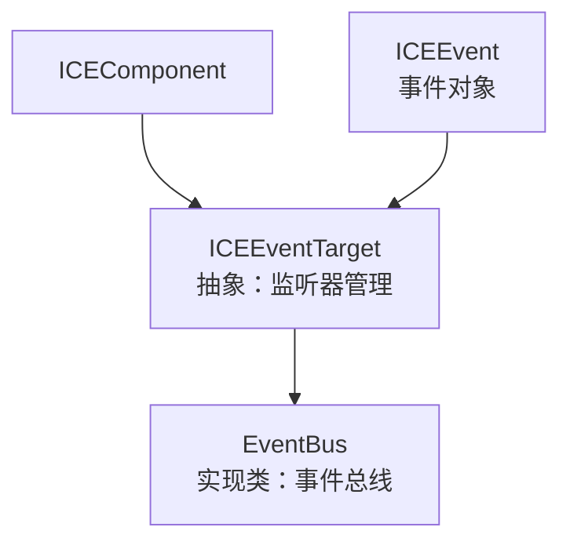
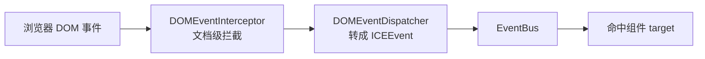

# 05 · 事件系统

## 设计目标

Canvas 标签内部没有事件机制。引擎借鉴 W3C `EventTarget` 接口 + jQuery 风格 API，在 canvas 内部实现一套事件机制，并把原生 DOM 事件（mouse/keyboard/touch）桥接进组件。

## 类关系



- `ICEEventTarget` 是**抽象基类**，提供事件监听能力；`EventBus` 与所有组件（`ICEComponent extends ICEEventTarget`）都是它的子类。
- `ICEEvent` 是事件对象，实现 W3C `Event` 接口。

## ICEEventTarget 的 API

| 方法 | 作用 |
|---|---|
| `on(name, fn, scope)` | 注册监听（`(fn, scope)` 去重） |
| `off(name, fn, scope)` | 移除监听 |
| `trigger(name, originalEvent, param)` | 触发事件，回调拿到 `ICEEvent` |
| `once(name, fn, scope)` | 触发一次后自动移除 |
| `suspend(name)` / `resume(name)` | 挂起/恢复某事件（挂起后 `trigger` 直接返回 false） |
| `purgeEvents()` | 清空所有监听 |
| `hasListener(name, fn, scope)` | 查询是否已监听 |

**W3C 别名**：`addEventListener = on`、`removeEventListener = off`、`dispatchEvent = trigger`。

**监听器结构**（`listeners`）：

```javascript
{ "click": [ { callback, scope }, ... ], "mousemove": [...] }
```

**语义要点**：

- `on` 会先 `off` 同 `(fn, scope)` 再 push，**天然去重**。
- `trigger` 若 `originalEvent` 非空，会把它包成 `ICEEvent` 并保留 `originalEvent` 引用；否则新建一个只含 `type/timeStamp/param` 的轻量事件。
- `scope` 决定回调里 `this` 的指向，默认是 `root`（跨平台根对象）。

## EventBus：协作通道

`EventBus` 是 `ICEEventTarget` 的**实现类**（无额外逻辑），每 ICE 实例一条。它是引擎内部 Manager 之间的协作通道：

- `FrameManager` 通过它广播 `ICE_FRAME_EVENT`；
- 各 Manager 通过 `on/off` 订阅感兴趣的事件（见 [01 运行时](01-runtime.md)）。

## DOM 事件桥接

原生 DOM 事件 → 引擎内部事件的链路：



- `DOMEventInterceptor` 在文档层做统一拦截/预处理（全局，跨 ICE）。
- `DOMEventDispatcher` 把原生事件转成 `ICEEvent`（保留 `originalEvent`、`target` 指向命中组件），再注入 `EventBus` 分发。
- 组件通过 `initEvents()` 注册默认事件（`mousedown`/`keydown`/`keyup`），子类可覆盖。

## 常见事件名

引擎定义了一批事件常量（`ICE_EVENT_NAME_CONSTS`），例如：

- 生命周期：`BEFORE_ADD` / `AFTER_ADD` / `BEFORE_REMOVE` / `BEFORE_RENDER` / `AFTER_RENDER`
- 交互：`BEFORE_MOVE` / `AFTER_MOVE` / `BEFORE_ROTATE` / `AFTER_ROTATE` / `BEFORE_RESIZE` / `AFTER_RESIZE`
- 框架：`ICE_FRAME_EVENT` / `ROUND_FINISH`
- 连线钩子：`HOOK_MOUSEDOWN` / `HOOK_MOUSEMOVE` / `HOOK_MOUSEUP`

回归用例见 `tests/event/EventBus.test.ts`。
