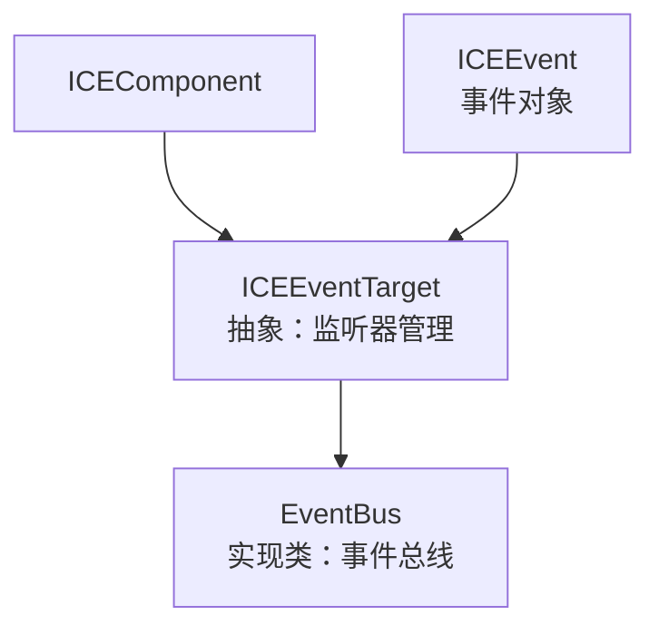
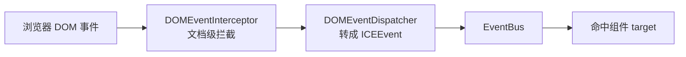

# 05 · 事件系统

> **用户向文档在文档站**：本页是**贡献者向**的实现说明（类关系 / 内部机制 / 口径取舍）。
> 使用者真正会读的是 [`ice-render-doc/docs/guide/events.mdx`](https://ice-render.github.io/ice-render-doc/docs/guide/events)
> —— 它有两个真机 LiveExample（`static/ice-render/examples/event-{bubbling,api}.html`）、一张
> 「常见困惑（现象 → 原因 → 写法）」表、以及 2.17 → 2.18 的升级清单。**改了本页的口径，请同步那一页**；
> 引擎仓库侧的对外门面是 README 的「事件：先订阅，再渲染」一节与 `examples/event/bubbling.html`。

## 设计目标

Canvas 标签内部没有事件机制。引擎借鉴 W3C `EventTarget` 接口 + jQuery 风格 API，在 canvas 内部实现一套事件机制，并把原生 DOM 事件（mouse/keyboard/touch）桥接进组件。

## 类关系



- `ICEEventTarget` 是**抽象基类**，提供事件监听能力；`EventBus` 与所有组件（`ICEComponent extends ICEEventTarget`）都是它的子类。
- `ICEEvent` 是事件对象，实现 W3C `Event` 接口。

## ICEEventTarget 的 API

| 方法 | 作用 |
|---|---|
| `on(name, fn, scope?, options?)` | 注册监听（去重按 `(fn, scope, capture)`；`options` 见下） |
| `off(name, fn?, scope?)` | 移除监听；`off(name)`（不传回调）清空该事件全部监听 |
| `trigger(name, originalEvent, param)` | 触发事件，回调拿到 `ICEEvent`；返回「是否派发成功」（无监听器/被 suspend 时为 false） |
| `once(name, fn, scope?)` | 触发一次后自动移除（记录标记，不再是自摘包装函数） |
| `addEventListener(type, fn, options?)` / `removeEventListener(type, fn, options?)` / `dispatchEvent(event)` | W3C 别名：**与上面同一实现**，参数形状按 W3C（`removeEventListener` 忽略 scope；`dispatchEvent` 返回 `!defaultPrevented`） |
| `suspend(name)` / `resume(name)` | 挂起/恢复某事件（挂起后 `trigger` 直接返回 false） |
| `purgeEvents()` | 清空所有监听 |
| `hasListener(name, fn, scope)` | 查询是否已监听 |

`options`：`{ once, passive, capture, signal }`；`listener` 可以是函数或 `{ handleEvent }` 对象。

**两条写代码时会踩的约定（2026-09-19）**：

1. **想把事件转给别的组件，必须先把 `evt.target` 改成那个组件**：`ICEComponent` 的默认拖动/键盘处理
   带守卫（`evt.target !== this` 就返回），转发时不改 `target` 会被守卫当成「冒泡上来的祖先事件」丢掉
   （例：`TransformControlPanel.keyboardEvtHandler` 转发键盘给选中组件）。
2. **容器的 click 处理若只想认「点在自己身上」，用 `evt.target === this` 守卫**：冒泡之后子节点的点击
   也会到容器（例：`ICEModal` 的遮罩只在点背景时关闭、`ICEFloatButton` 只在点按钮本体时展开）。
   这条守卫在**新旧引擎上都成立**，是跨版本安全的写法；`stopPropagation()` 在新引擎才生效（旧版会抛异常）。

## 事件名与事件对象的类型（2026-09-19）

`ICE_EVENT_NAME_CONSTS` 现在是 `as const`，配合 `event/event-types.ts` 提供一套类型：

| 类型 | 用途 |
|---|---|
| `ICEEventName` | 引擎认识的事件名 = 内置事件（`ICEEngineEventName`）+ DOM 语义输入事件（`ICEDOMEventName`） |
| `ICEEventOf<K>` | 按事件名取出事件对象类型（`ICEEvent<对应 param>`）；自定义事件名回退 `any` |
| `ICEEventParamMap` | 事件名 → `evt.param` 形状（**只收录引擎实际这么用的**，见下方说明） |
| `ICEEventListenerOptions` | `on` 的第四参 / `addEventListener` 的第三参：`{ once, passive, capture, signal }` |

`on / once / trigger` 都带了重载：写引擎名或 DOM 语义名时回调里的 `evt` 是**有类型的**
（`evt.param.component`、`evt.offsetX` 都能过编译），写应用自定义事件名时回退 `any`（不限制扩展）。
`ICEEvent` 上也补齐了归一化输入字段（`offsetX/offsetY/movementX/movementY/pointerType/key/修饰键…`），
它们由 `event/input-normalize.ts` 在事件边界写入。

⚠️ **载荷仍分两处存放**（如实描述，未强行统一）：`evt.param`（`trigger` 第三参）与
**事件对象字段**（变换类事件把 `quadrant` / `rotate` 直接写事件上，消费方也直接读字段）。
"全部走 `param`"是一次行为变更，等有需要再做。

**类型级回归**：`tests/types/event-names.ts`（用 `Expect<Equal<…>>` 断言三条：内置事件 param 有类型、
DOM 事件能读输入字段、自定义事件回退 any）。⚠️ 这个目录**不在原 `tsconfig.json` 的 include 里**
（它只有 `src`），所以新增了 `tsconfig.typecheck.json`，`npm run types:check` 现在跑两份 ——
否则这类断言是死的（实测：断言写错也不会报错）。

### 两套 API 的对应关系（2026-09-19 收口：**同一个实现，两种参数形状**）

| jQuery 风格（引擎与家族在用的那套） | W3C 风格 | 说明 |
|---|---|---|
| `on(name, fn, scope?, options?)` | `addEventListener(type, fn, options?)` | 同一个 `__register`；`scope` 决定回调里的 `this`（默认跨平台 root），W3C 形状没有 `scope` |
| `off(name, fn?, scope?)` | `removeEventListener(type, fn, options?)` | `off(name)` 清空该事件全部监听；`off` 按 `(fn, scope)` 精确匹配，`removeEventListener` **忽略 scope**（W3C 心智：身份是 `(type, listener, capture)`） |
| `trigger(name, originalEvent?, param?)` → `boolean` | `dispatchEvent(event)` → `boolean` | 后者按 W3C 语义返回 `!defaultPrevented`（"有没有监听器"不影响返回值） |
| `once(name, fn, scope?)` | `addEventListener(type, fn, { once: true })` | 同一份实现：`once` 是监听记录上的标记，不再是"自摘包装函数" |
| `suspend(name)` / `resume(name)` | —— | 引擎专有（按事件名冻结派发），W3C 无对应概念 |

共同支持（两套形状语义逐条一致）：`listener` 可以是函数或 `{ handleEvent }` 对象；
`options` 支持 `{ once, passive, capture, signal }`：

- `passive`：该监听器里调 `preventDefault()` **不生效**（与 W3C 一致），并按事件名提醒一次 ——
  静默失效是最难查的一类失败；
- `capture`：**只作为注册身份**参与去重/移除（引擎的组件树只有冒泡阶段，没有捕获阶段）；
- `signal`：`AbortSignal` abort 时自动摘除；已 abort 的直接不注册。

旧实现把 `on/off/trigger` 直接挂到这三个 W3C 名字上，签名全不对 —— `addEventListener` 的第三参
（`{ once: true }` / `true` 捕获标志）会被当成 `scope`，`dispatchEvent` 期望收**事件对象**
却被当成了事件名；按 W3C 写法接进来的代码因此"看着能用、行为不是那回事"。
回归：`tests/event/api-consistency.test.ts`（交叉注册/移除、`once` 等价、`{handleEvent}`、
`capture` 身份、`passive` 屏蔽 + 提醒、`signal` 摘除、`dispatchEvent` 返回值、单调时间戳）。

**监听器结构**（`listeners`）：

```javascript
{ "click": [ { callback, scope }, ... ], "mousemove": [...] }
```

**语义要点**：

- `on` 会先 `off` 同 `(fn, scope)` 再 push，**天然去重**。
- `trigger` 若 `originalEvent` 非空，会把它包成 `ICEEvent` 并保留 `originalEvent` 引用；否则新建一个只含 `type/timeStamp/param` 的轻量事件。
- **已经是 `ICEEvent` 就不再包一层**（2026-09-19）：包一层会换掉事件对象，于是上一个监听器里
  打的 `stopPropagation()` / `preventDefault()` 标记落在副本上（冒泡与取消永不生效），
  `param` 也会被后包的那层覆盖成 `{}`。
- `scope` 决定回调里 `this` 的指向，默认是 `root`（跨平台根对象）。
- **`on` / `once` / `off` / `suspend` / `resume` / `purgeEvents` 都返回 `this`**（可链式）；
  `off(name)`（不传回调）＝ 清空该事件的**全部**监听。

## 事件传播：沿组件树冒泡（2026-09-19 新增）

一次输入事件的传播路径：

```
命中组件（AT_TARGET=2） → 父容器 → 祖父 ……（BUBBLING_PHASE=3） → 事件总线（最后收一次）
```

- 组件树就是 DOM 树的对应物，"子组件上的点击父容器也能知道"是**容器型组件**
  （面板 / 卡片 / 抽屉 / 巡览）唯一能用的组合方式；旧实现只把事件投给命中组件，
  于是下游出现了"在面板自己身上再挂一次 `click` 去 `stopPropagation`"这类写法 ——
  既无效（根本没有冒泡可阻止），又危险（见下）。
- `evt.target` 始终是**命中组件**；`evt.currentTarget` 是当前正在处理的节点；
  `evt.composedPath()` 给出"命中组件 → 各级父容器"。
- `stopPropagation()`：**不再向祖先冒泡**（同层其他监听器照常执行）；
  `stopImmediatePropagation()`：连当前目标上剩下的监听器也跳过。
- ⚠️ **总线一定会收到一次**，不受 `stopPropagation()` 影响：总线是引擎内部通道
  （控制面板选中、连线插槽、悬停、键盘作用域都挂在上面），让组件里的一次
  `stopPropagation()` 把它整条掐掉，会变成"看着只是阻止冒泡，实际引擎失灵"。

## `ICEEvent`：W3C 方法真实现（2026-09-19 改）

旧实现的 `preventDefault` / `stopPropagation` / `stopImmediatePropagation` / `composedPath` /
`initEvent` **全是 `throw new Error('Method not implemented.')`**：应用里一调用，异常就从监听器里
冒出去 —— 后面的监听器与总线都收不到事件。`ice-chart` 因此专门写了"只对原始 DOM 事件调用
`preventDefault`"的绕过代码，`ice-web-components` 里则留下若干"看着防了、其实一调用就炸"的写法。

现在的语义：

- `preventDefault()`：只有 `cancelable === true` 才生效（与 W3C 一致），置 `defaultPrevented = true`，
  并**顺手调用原始 DOM 事件的 `preventDefault()`**（"我在 canvas 里处理了这个手势，别让浏览器再滚一屏"）。
- 字段有确定默认值：引擎自造事件上 `bubbles / cancelable / defaultPrevented / eventPhase`
  不再是 `undefined`。
- ⚠️ 构造函数的字段平铺**不会覆盖本类自己的方法**（`NON_COPYABLE_KEYS`）：
  普通对象做的事件桩（测试夹具、业务里手搓的 `{ type, preventDefault(){} }`）上的
  `preventDefault` 是**可枚举 own 属性**，一旦被拷进来就会盖掉我们的实现，
  于是"默认行为已阻止"永远是假、调用方还以为生效了（真实 DOM 事件的这些方法在原型上、不可枚举，
  所以旧实现没暴露这个坑）。

回归：`tests/event/bubbling-and-w3c.test.ts`（W3C 方法 / 冒泡顺序 / stop* 语义 / 总线不受影响 /
composedPath / 别名与链式 / `off(name)` 全清）。

## EventBus：协作通道

`EventBus` 是 `ICEEventTarget` 的**实现类**（无额外逻辑），每 ICE 实例一条。它是引擎内部 Manager 之间的协作通道：

- `FrameManager` 通过它广播 `ICE_FRAME_EVENT`；
- 各 Manager 通过 `on/off` 订阅感兴趣的事件（见 [01 运行时](01-runtime.md)）。

## DOM 事件桥接

原生 DOM 事件 → 引擎内部事件的链路：



- `DOMEventInterceptor` 在文档层做统一拦截/预处理（全局，跨 ICE）。
- `DOMEventDispatcher` 把原生事件转成 `ICEEvent`（保留 `originalEvent`、`target` 指向命中组件），再注入 `EventBus` 分发。
- 组件通过 `initEvents()` 注册默认事件（`mousedown`/`keydown`/`keyup`），子类可覆盖。

### 指针坐标：移动类事件**每帧重读** canvas 矩形

命中检测要把 `clientX/clientY` 换算到画布坐标，靠的是 `getBoundingClientRect()`。
**移动类事件必须每帧重读一次**（`ICE.refreshInputRect()`），不能缓存、也不能做"一帧一次"的节流：

- 页面滚动、画布**上方插入内容**（提示条 / 错误信息 / 广告位）都会让缓存的矩形整体过期；
  而移动事件是唯一高频入口 —— 不刷新就没人来纠正它，过期期间 `clientX - rect.left` 恒定偏移，
  命中、悬停、拖拽会**整体错位**，直到用户点一下或滚一格（`ice-chart` 的示例页真实撞到过：
  图表创建后插入状态行把画布下推 26px，悬停直接落空）；
- 实测一次 rect 读 **0.22µs**（每次读之前改样式、强制重排的最坏情况 2.8µs），相对每帧渲染可忽略；
- 尺寸没变时只把已缓存的**内容盒**跟着平移（省掉 `computedStyle` 读取），所以"每帧重读"不等于"每帧重算";
- 做位移增量必须用**值快照**，不能拿上一次的 rect 对象引用做差 —— 某些运行时（测试桩 / 小程序）
  返回同一个可变对象，增量会恒为 0，内容盒再也不跟着走。

回归：`tests/ICE.input-rect.test.ts`、`tests/event/DOMEventDispatcher.input.test.ts`、
`e2e/visual/input-rect-shift.spec.ts`。

## 常见事件名

引擎定义了一批事件常量（`ICE_EVENT_NAME_CONSTS`），例如：

- 生命周期：`BEFORE_ADD` / `AFTER_ADD` / `BEFORE_REMOVE` / `BEFORE_RENDER` / `AFTER_RENDER`
- 交互：`BEFORE_MOVE` / `AFTER_MOVE` / `BEFORE_ROTATE` / `AFTER_ROTATE` / `BEFORE_RESIZE` / `AFTER_RESIZE`
- 框架：`ICE_FRAME_EVENT` / `ROUND_FINISH`
- 连线钩子：`HOOK_MOUSEDOWN` / `HOOK_MOUSEMOVE` / `HOOK_MOUSEUP`

回归用例见 `tests/event/EventBus.test.ts`。
