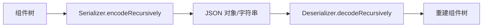

# 06 · 序列化

## 目标

把整张图序列化成 JSON 字符串，并可从 JSON 字符串无损反序列化回图形（README 宣传的核心特性之一）。

## 数据结构

```javascript
{
  version,                         // 序列化格式版本（用于迁移）
  createTime, lastModifyTime,      // ISO 8601 UTC，如 '2026-09-13T04:12:33.123Z'（见下方说明）
  childNodes: [
    {
      type: 'ice-render:Group',    // 类型标识：已注册类型写 canonical typeId（namespace:Type），未注册才回退 constructor.name
      state: { ... },              // 组件的 state（运行时状态）
      childNodes: [ ... ]          // 递归子节点
    }
  ]
}
```

- **编码时用 `state`**（而非 `props`）——`state` 是经过动画/交互后的"当前真相"。
- **时间戳是 ISO 8601 UTC**：`createTime` = 这份文档**首次创建**的时刻，`lastModifyTime` = **这一次写出**的时刻。
  `createTime` 在载入时从数据里读回来（存在 `ice.documentMeta.createTime`），因此「打开 → 编辑 → 保存」
  里它稳定不变，只有一个字段在动；数据里没有 / 解析不了（例如历史脏值）就回退到"当前时刻"。
  `ice.clearAll()` 会清掉它 —— 清空即新文档，不该继承旧文档的创建时间。
  这两个字段**只是导出元信息**（引擎不读、反序列化不依赖它们的值）。用 ISO 而非 `toLocaleString()`：
  前者与运行环境的语言/时区无关、定长可排序、任何工具都能解析；后者在 zh-CN 机器上写
  `2026/9/13 12:12:33`、在 en-US 机器上写 `9/13/2026, 12:12:33 PM`，同一份数据换个环境就不一样。
  也不用 epoch 毫秒 —— 这两个字段是给人看的，JSON 里可读性比省字节重要。需要「同一次编辑导出逐字节相同」
  的场景（去重、签名）**丢掉 `lastModifyTime` 就够了**（`createTime` 跨保存稳定，可以留），
  参考 `ice-entity-designer` 的 `FlowDesigner.toSnapshot()`。
- **`type` 用稳定标识而非类名**：写出前用 `ice.getTypeId(ctor)` 由构造函数**反查 canonical typeId**
  （与类的 JS 名解耦，terser 压缩改名不会破坏已存数据）；只有**未注册**的自定义类型才回退 `constructor.name`
  （此时 `Serializer.unregisteredTypes` 会记录并告警 —— 回退名在下游打包后可能读不回来）。
  无 namespace 的旧类名（`ICERect`…）**不再被识别**，见下方「类型标识与注册表」。

## 序列化器与反序列化器



- `Serializer.toJSONObject()/toJSONString()`：递归遍历 `ice.childNodes`，产出 `{ type, state, childNodes }` 结构。
- `Deserializer.fromJSONObject()/fromJSONString()`：递归地 `getType(type)` → `new Clazz(state)` → `addChild` 重建树。
  **遇到未注册的类型不会整份数据打不开**：跳过该节点（含子树）并记入 `deserializer.unknownTypes`，
  便于提示用户 `registerType()` 后重载。

### `zIndex` 在存盘时归一化（2026-09-19）

`zIndex` 是**进文档**的字段（`NON_SERIALIZABLE_KEYS` 里没有它），但它的默认值取自
**进程级计数器**（`ICEComponent.instanceCounter++`）。直接把计数器留下的数字写进文档会有两个后果：
文档里出现与内容无关的大整数；换个会话打开后，那个会话的计数器还在个位数，**新建的组件会画到
已有内容下面**（跨会话倒挂，实测：文档里 198~200、新建的是 4）。

所以存盘时按**同一个父容器**归一化：绘制次序（兄弟按 `zIndex` 升序，稳定）与插入次序一致时
**不写** `zIndex`；不一致才写绘制次序里的下标 `0..n-1`（`Serializer.__encodeChildren`）。

- 读回时子节点按文件顺序构造（= 插入次序），所以**往返之后绘制次序逐项不变**；
- 读旧数据不受影响：`zIndex` 本来就是可选字段，缺失时走默认值；
- 跨会话"新建组件在最上层"由另一条保证：显式写过 `zIndex` 之后计数器会被顶上去
  （见 [02 组件模型](02-component-model.md) 的 `zIndex` 一节）。

回归：`tests/graphic/z-index-order.test.ts`（含"大 zIndex 不进文档 + 往返次序不变"）、
`tests/persistence/layout-serialization.test.ts`（布局与 `zIndex` 一起往返）。

## 类型标识与注册表（关键）

### `namespace:Type` 契约

类型标识（typeId）统一为 **`namespace:Type`**，**只有这一种形式**：

```text
/^[a-z][a-z0-9-]*:[A-Za-z_][A-Za-z0-9_-]*$/

ice-render:Rect                 引擎内置
ice-entity-designer:FlowNode    实体设计器（流程图）
ice-chart:PlotArea              图表
my-company:Widget               第三方 / 业务方（用自己的小写包名）
```

namespace 小写字母开头（只允许小写字母、数字、连字符），Type 字母或下划线开头。
工具函数见 `src/util/type-id.ts`，并随包导出（`TYPE_ID_PATTERN` / `isTypeId` / `assertTypeId` /
`parseTypeId` / `makeTypeId`），下游包注册自己的图元时直接复用，不必各处手写正则。
**为什么必须带 namespace**：不带 namespace 的全局类名是「一个平面命名空间」，下游（设计器 / 图表 / 业务方）
各自的 `Badge`、`Title`、`Node` 必然撞车，而注册表的冲突策略只能是「静默覆盖」或「抛错」——
前者让已存数据错乱，后者让互不相关的插件互相干扰。带 namespace 之后，冲突只可能发生在**同一个
namespace 内部**（同一个团队 / 同一个包），这才是可以协商、可以修的问题。

### 注册与冲突策略

```javascript
// 内置类型：由 ICE 构造函数自动注册（src/consts/COMPONENT_TYPE_MAPPING.ts 只提供条目表）
ice.registerType('my-app:Badge', Badge);
```

- **同一 typeId + 同一个构造函数**：幂等，重复注册不抛错（便于多入口 / 热更新重复调用）。
- **同一 typeId + 不同构造函数**：**明确抛错**，绝不静默覆盖。
- **同一构造函数 + 第二个 canonical typeId**：**明确抛错**（否则 `getTypeId()` 反查会歧义，
  序列化写出哪个名字取决于注册顺序，属不可复现行为）。
- **不做旧名兼容**：ICE 家族仍在发布初期（引用者少、没有历史包袱），因此引擎不维护
  「旧的无 namespace 类名 → 新 typeId」的别名表。旧格式快照里的节点会被当作**未注册类型**
  跳过并记入 `unknownTypes`，需要的话直接改数据即可。
- `ice.typeMapping` 是**无原型对象**：`getType('constructor')` 不会命中
  `Object.prototype.constructor` 而把脏数据变成 `new Object(state)`。
- 插件在 `ICE.use(plugin)` 的 `components` 里声明类型时同样受这套规则约束，
  注册失败会把插件名带进错误信息（`插件 "xxx" 注册组件类型失败：...`）。

### 查询接口

| 接口 | 语义 |
|---|---|
| `ice.getType(typeId)` | canonical typeId → 构造函数（反序列化用） |
| `ice.getTypeId(ctor)` | 构造函数 → canonical typeId（序列化用；未注册返回 `undefined`） |
| `ice.hasType(typeId)` | 是否注册了该 canonical typeId |
| `ice.getRegisteredTypeIds()` | 当前实例的 canonical typeId 列表（快照） |

回归用例见 `tests/persistence/type-id.test.ts`。

### 未注册类型

- **反序列化**：跳过该节点（含子树）并记入 `deserializer.unknownTypes`，不抛错、不影响其余节点。
- **序列化**：回退写出 `constructor.name` 并记入 `Serializer.unregisteredTypes`（含告警）——
  这条路径只在「忘了注册」时才会走到，别指望它产出可复现的数据（类名可能被下游打包器 mangle）。

## 序列化边界

- 只序列化 `ice.childNodes`，**不含 `toolNodes`**（工具组件如变换手柄、连接插槽是运行时临时对象，不参与持久化）。
- 容器组件负责序列化自己的子节点（递归）。
- 矩阵类字段（`linearMatrix` / `composedMatrix`）**不参与序列化**，也**不做往返**：它们进 `NON_SERIALIZABLE_KEYS`
  白名单被直接剔除，反序列化后由引擎按 `left/top/transform/origin` 重新计算。旧文档曾写「矩阵也能正常往返」，
  与实现相反（往返只保证**用户数据**，派生缓存一律重算）。

### 版本与迁移

- 序列化产物带 `version` 字段；`SERIALIZATION_MIGRATIONS` 是可扩展的迁移表，按目标版本**升序逐级执行**。
- 读到的版本**高于**当前引擎支持的版本时明确抛错（而不是用旧代码硬解新格式）。
- 运行时缓存值（`linearMatrix` / `composedMatrix` / `localOrigin` / `absoluteOrigin` / `dots` / 文本量测结果）
  不参与序列化。

回归用例见 `tests/persistence/serialization.test.ts`。
