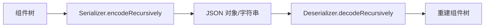

# 06 · 序列化

## 目标

把整张图序列化成 JSON 字符串，并可从 JSON 字符串无损反序列化回图形（README 宣传的核心特性之一）。

## 数据结构

```javascript
{
  version,                         // 序列化格式版本（用于迁移）
  createTime, lastModifyTime,
  childNodes: [
    {
      type: 'ICEGroup',            // 类型标识：已注册类型写**注册名**，未注册才回退 constructor.name
      state: { ... },              // 组件的 state（运行时状态）
      childNodes: [ ... ]          // 递归子节点
    }
  ]
}
```

- **编码时用 `state`**（而非 `props`）——`state` 是经过动画/交互后的"当前真相"。
- **`type` 用稳定标识而非类名**：写出前用 `ice.getTypeId(ctor)` 由构造函数**反查注册名**
  （与类的 JS 名解耦，terser 压缩改名不会破坏已存数据）；只有**未注册**的自定义类型才回退 `constructor.name`。
  旧数据（`type` 写类名、无 `version`）仍可加载。

## 序列化器与反序列化器



- `Serializer.toJSONObject()/toJSONString()`：递归遍历 `ice.childNodes`，产出 `{ type, state, childNodes }` 结构。
- `Deserializer.fromJSONObject()/fromJSONString()`：递归地 `getType(type)` → `new Clazz(state)` → `addChild` 重建树。
  **遇到未注册的类型不会整份数据打不开**：跳过该节点（含子树）并记入 `deserializer.unknownTypes`，
  便于提示用户 `registerType()` 后重载。

## 类型映射（关键）

反序列化需要"类名字符串 → 构造函数"的映射，即 `COMPONENT_TYPE_MAPPING`：

```javascript
{ ICERect, ICECircle, ICEEllipse, ICEStar, ICEIsogon, ICEText,
  ICEImage, ICEGroup, ICEVisioLink, ICEPolyLine, ... }
```

- 该映射在 `ICE.init()` 时拷贝到 `ice.typeMapping`；`ICE.registerType()` 会使其反查表失效、下次序列化时重建。
- **自定义组件**必须 `ice.registerType(className, Clazz)` 注册后才能被反序列化，否则 `getType` 拿不到构造函数（序列化时会回退写 `constructor.name`，两者不一致会导致自己写的数据读不回来）。

## 序列化边界

- 只序列化 `ice.childNodes`，**不含 `toolNodes`**（工具组件如变换手柄、连接插槽是运行时临时对象，不参与持久化）。
- 容器组件负责序列化自己的子节点（递归）。
- 矩阵类字段（`linearMatrix` / `composedMatrix`）**不参与序列化**，也**不做往返**：它们进 `NON_SERIALIZABLE_KEYS`
  白名单被直接剔除，反序列化后由引擎按 `left/top/transform/origin` 重新计算。旧文档曾写「矩阵也能正常往返」，
  与实现相反（往返只保证**用户数据**，派生缓存一律重算）。

### 版本与迁移

- 序列化产物带 `version` 字段；`SERIALIZATION_MIGRATIONS` 是可扩展的迁移表，按目标版本**升序逐级执行**。
- 读到的版本**高于**当前引擎支持的版本时明确抛错（而不是用旧代码硬解新格式）。
- 运行时缓存值（`linearMatrix` / `composedMatrix` / `localOrigin` / `absoluteOrigin` / `dots` / 文本量测结果）
  不参与序列化。

回归用例见 `tests/persistence/serialization.test.ts`。
