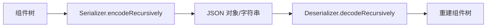

# 06 · 序列化

## 目标

把整张图序列化成 JSON 字符串，并可从 JSON 字符串无损反序列化回图形（README 宣传的核心特性之一）。

## 数据结构

```javascript
{
  createTime, lastModifyTime,
  childNodes: [
    {
      type: 'ICEGroup',            // 组件类名（constructor.name）
      state: { ... },              // 组件的 state（运行时状态）
      childNodes: [ ... ]          // 递归子节点
    }
  ]
}
```

- **编码时用 `state`**（而非 `props`）——`state` 是经过动画/交互后的"当前真相"。
- **`type` 用类名字符串**（`constructor.name`），反序列化时靠它找回构造函数。

## 序列化器与反序列化器



- `Serializer.toJSONObject()/toJSONString()`：递归遍历 `ice.childNodes`，产出 `{ type, state, childNodes }` 结构。
- `Deserializer.fromJSONObject()/fromJSONString()`：递归地 `getType(type)` → `new Clazz(state)` → `addChild` 重建树。

## 类型映射（关键）

反序列化需要"类名字符串 → 构造函数"的映射，即 `COMPONENT_TYPE_MAPPING`：

```javascript
{ ICERect, ICECircle, ICEEllipse, ICEStar, ICEIsogon, ICEText,
  ICEImage, ICEGroup, ICEVisioLink, ICEPolyLine, ... }
```

- 该映射在 `ICE.init()` 时拷贝到 `ice.typeMapping`。
- **自定义组件**必须 `ice.registerType(className, Clazz)` 注册后才能被反序列化，否则 `getType` 拿不到构造函数。

## 序列化边界

- 只序列化 `ice.childNodes`，**不含 `toolNodes`**（工具组件如变换手柄、连接插槽是运行时临时对象，不参与持久化）。
- 容器组件负责序列化自己的子节点（递归）。
- 序列化发生在未渲染时，`state` 里的矩阵字段还是空数组 `[]`，是干净的纯数据；即便渲染过，矩阵是普通数组/可 JSON 化的值，也能正常往返。

回归用例见 `tests/persistence/serialization.test.ts`。
