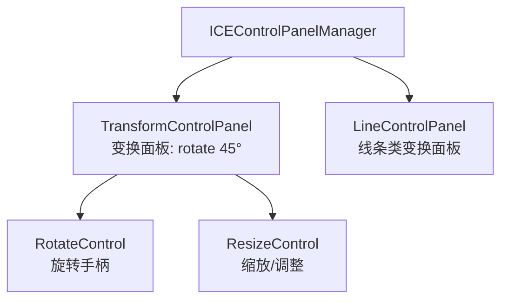
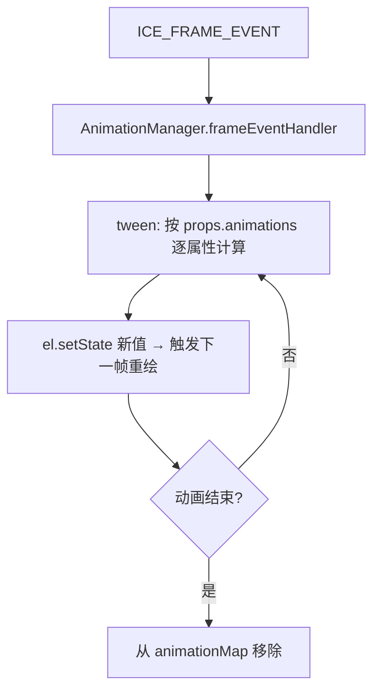

# 07 · 交互与动画

## 交互层：控制面板

`ICEControlPanelManager` 负责管理**选中与变换工具**（纯逻辑组件，无外观）：

- 两类面板默认 **disable**；用户 `mousedown` 命中可变换组件时，`mouseDownHandler` 根据组件类型启用对应面板：
  - `component.isLine`（线条类）→ 启用 `LineControlPanel`；
  - 其它 → 启用 `TransformControlPanel`。
- 面板本身与手柄是 `toolNodes`，复用同一套组件模型（`ICEControlPanel extends ICEGroup`，手柄继承 `ICECircle`）。
- `interactive`/`transformable` 等开关决定组件是否可交互、可变换。

## 拖拽与变换

- 拖拽：`mouseDown` 命中后注册 `mousemove`/`mouseup`，`mouseMoveEvtHandler` 调 `moveGlobalPosition`（见 [03 嵌套坐标](03-coordinate-system.md) 里全局位移需抵消父层变换）。
- 旋转手柄 `RotateControl`：`AFTER_MOVE` 时用父组件 `absoluteOrigin` 计算旋转角，回写父组件 `rotate`。
- 键盘：`keyboardEvtHandler` 支持方向键步进移动（`ArrowUp/Down/Left/Right`）、`Delete` 删除组件。

## 连接线（Visio 风格）

`ICELinkSlotManager` 负责连线逻辑：

- **5 个共享插槽**（`ICELinkSlot`，位置 T/R/B/L/C = 上/右/下/左/中心）在 `ICE.init` 时创建、**所有可连接组件复用**，不随组件增删。
- 连线交互：拖动连线端点（`ICELinkHook`）→ `HOOK_MOUSEMOVE` 阶段用**包围盒相交检测**（`getMaxBoundingBox().isIntersect()`）找碰撞的 `linkable` 组件与插槽 → `HOOK_MOUSEUP` 建立或断开 `links` 关系。
- 连线关系记录在 `ICEPolyLine.state.links`（`{ [端点位置]: { id, position } }`）。

## 动画

`AnimationManager` 订阅 `ICE_FRAME_EVENT`，对 `animationMap` 里的组件做补间：

- 动画配置挂在 `props.animations`，形如 `{ 属性名: { from, to, duration, easing, startTime?, finished? } }`，语义接近 CSS `keyframes`。
- 缓动函数 `Easing`（`linear`、`easeInQuad`、`easeOutQuad`、`easeInOutQuad`、`easeInQuart`、`easeInCubic` 等）。
- 动画期间把组件 `state.interactive` 临时置 `false`，避免交互干扰属性计算。
- 计算结果 `Math.floor` 到整数像素，保证渲染稳定。

> 已知限制（源码 TODO）：未处理无限循环动画与"各属性持续时间不同"的同步问题，动画结束时才从列表移除。
