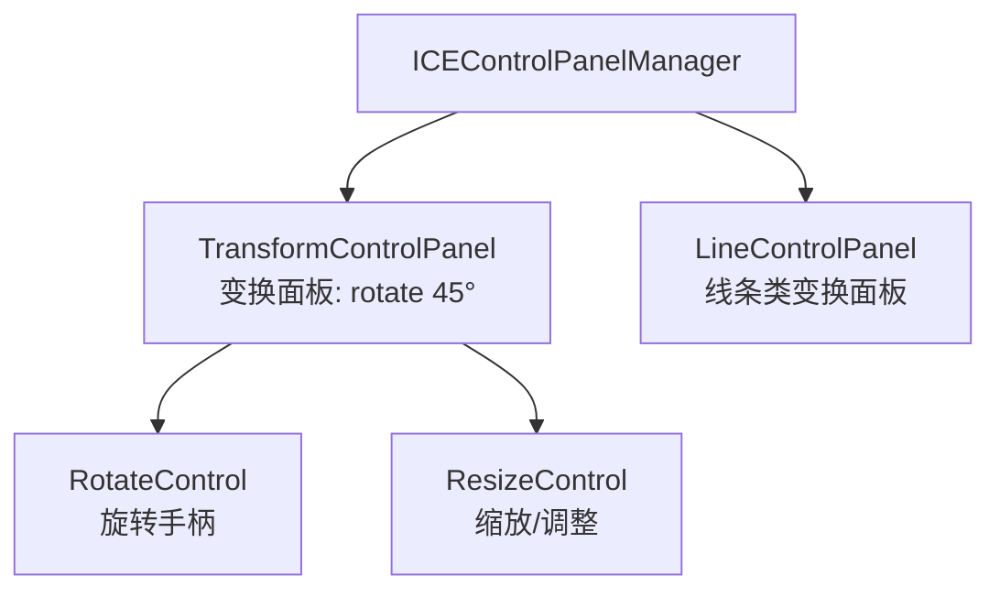
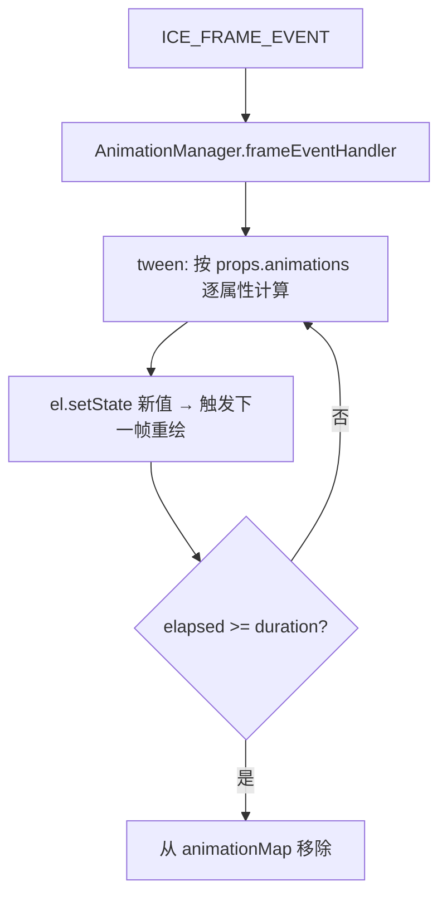

# 07 · 交互与动画

## 交互层：控制面板

`ICEControlPanelManager` 负责管理**选中与变换工具**（纯逻辑组件，无外观）：

- 两类面板默认 **disable**；用户 `mousedown` 命中可变换组件时，`mouseDownHandler` 根据组件类型启用对应面板：
  - `component.isLine`（线条类）→ 启用 `LineControlPanel`；
  - 其它 → 启用 `TransformControlPanel`。
- 面板本身与手柄是 `toolNodes`，复用同一套组件模型（`ICEControlPanel extends ICEGroup`，手柄继承 `ICECircle`）。
- `interactive`/`transformable` 等开关决定组件是否可交互、可变换。

## 拖拽与变换

- 拖拽：`mouseDown` 命中后注册 `mousemove`/`mouseup`，`mouseMoveEvtHandler` 调 `moveGlobalPosition`（见 [03 嵌套坐标](03-coordinate-system.md) 里全局位移需抵消父层变换）。
- 旋转手柄 `RotateControl`：`AFTER_MOVE` 时用父组件 `absoluteOrigin` 计算旋转角，回写父组件 `rotate`。
- 键盘：`keyboardEvtHandler` 支持方向键步进移动（`ArrowUp/Down/Left/Right`）、`Delete` 删除组件。

## 连接线（Visio 风格）

`ICELinkSlotManager` 负责连线逻辑：

- **5 个共享插槽**（`ICELinkSlot`，位置 T/R/B/L/C = 上/右/下/左/中心）在 `ICE.init` 时创建、**所有可连接组件复用**，不随组件增删。
- 连线交互：拖动连线端点（`ICELinkHook`）→ `HOOK_MOUSEMOVE` 阶段用**包围盒相交检测**（`getMaxBoundingBox().isIntersect()`）找碰撞的 `linkable` 组件与插槽 → `HOOK_MOUSEUP` 建立或断开 `links` 关系。
- 连线关系记录在 `ICEPolyLine.state.links`（`{ [端点位置]: { id, position } }`）。

## 动画

`AnimationManager` 订阅 `ICE_FRAME_EVENT`，对 `animationMap` 里的组件做补间：

动画配置挂在 `props.animations`，键可以是属性名或**点路径**（`'transform.rotate'` / `'style.globalAlpha'`），
取值有两种形态：

| 形态 | 写法 | 说明 |
|---|---|---|
| 单段 | `{ from, to, duration, easing? }` | 在两个值之间补间 |
| 关键帧 | `{ keyframes: [{ offset, value, easing? }], duration }` | `offset` 为 0~1 时间占比，缺省按顺序均分、超出会被夹紧、乱序自动排序；`easing` 写在**段起始帧**上，只作用于「该帧 → 下一帧」这一段（未写则回落到动画级 `easing`）；时间轴之外的取值保持首/末帧值，不外推 |

- 取值可为**数值**或**等长的数字数组**（`transform.scale` / `transform.translate` / `transform.skew`
  等按分量逐元素补间）。两端长度不一致或含非数字会被拒绝，并只 `console.warn` 一次
  （不再像早期实现那样写出 `NaN` 破坏矩阵）。
- 通用配置：`duration`、`delay`（延迟期内保持起始值，可做多属性错峰/多组件序列）、`easing`、`loop`、
  `iterationCount`、`round`。`duration` / `easing` 可用主题 `motion` token 的语义名
  （`'normal'` / `'out'` / `'spring'` …）。
- 缓动分两层：**`EasingProgress`**（归一化进度函数，`t: [0,1] → 进度`，纯函数、不读时钟）是唯一实现；
  **`Easing`**（`(from, to, duration, startTime)` 值语义，内部读 `Date.now()`）是它的适配层，保持历史签名。
  弹簧类（`spring` / `springSoft` / `springSnappy`，欠阻尼谐振子解析解）**自带过冲**，进度会短暂 `> 1`。
- **结束判定按已流逝时间**（`elapsed >= duration`），而**不是**「值是否越过 `to`」——否则弹簧过冲的第一帧
  就会被误判成结束。到点后精确落到终点值，不留浮点残差。
- `duration` 非正数/缺失时**立即落到终点并结束**（旧实现会算出 `NaN` / `Infinity`，当 `from === to` 时
  比较恒为 `false`，动画永不结束、每帧空转 `setState`）。
- 动画期间把组件 `state.interactive` 临时置 `false`（**保存并恢复原值**，不覆盖用户显式设置的 `false`），
  避免交互干扰属性计算；组件销毁时自动从 `animationMap` 摘除。
- 默认**不取整**（避免 0→1 的透明度/角度/缩放被压掉），需要整数步进时显式 `round: true`（数组逐元素取整）。
- `fps`（可选）：**次要动画降频**，如 `{ duration: 900, fps: 30 }`。采样按时间、跳过帧不改变曲线，终点仍精确落值。
- **减少动态效果**：系统开着 `prefers-reduced-motion: reduce`（或应用层 `ice.setReducedMotion(true)`）时，
  动画**不播放过程、直接落终态**，并记一条 `ICE_ANIM_REDUCED_MOTION` 诊断（见 `getDiagnostics()`）。
- **空闲停帧**：没有脏、没有动画在推进时 `FrameManager` 会**停掉 rAF**（省电）；置脏、`animationManager.add()`、
  `resume()` 都会自动唤醒。应用层自己按帧做计算时用 `ice.setContinuousFrames(true)` 保持常驻。
- 未知缓动名回退 `linear` 并只提示一次；非法配置的告警不会逐帧刷屏。
