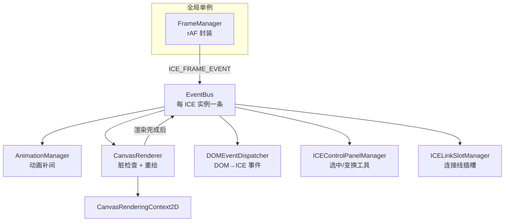

# ICERender 架构设计文档

> 一份关于 ICERender Canvas 2D 渲染引擎的系统性架构说明，作为该引擎的**单一事实来源**（single source of truth），与代码库同仓、随版本演进。
>
> 目标读者：需要二次开发、维护或评审该引擎的工程师。

## 引擎定位

ICERender 是一款 **Canvas 2D 交互图形渲染引擎**（MIT 协议，作者 大漠穷秋）。它借鉴 React 的 `props`/`state` 概念构建组件模型，借鉴 W3C `EventTarget`/jQuery 风格构建事件系统，提供嵌套坐标系、序列化、动画、连接线（Visio 风格）等能力。

**核心设计约束**（贯穿所有子系统的铁律）：

1. **运行时依赖极简** —— 仅 `gl-matrix` 一个库，无其它依赖。
2. **多运行时兼容** —— 同一套代码同时面向 **Web 浏览器**与**各类小程序**（WeChat/Alipay 等），因此不能依赖浏览器专有 API。
3. **高性能** —— 脏标记 + 脏矩形局部重绘（默认，条件回退全量重绘）的渲染模型，配合渲染队列缓存与矩阵零分配，保证数千图元的交互流畅度。

## 文档地图

| 章节 | 内容 |
|---|---|
| [01 · 运行时链路](01-runtime.md) | `FrameManager` → `EventBus` → 各 Manager → `CanvasRenderer` 的调度管道与启动顺序 |
| [02 · 组件模型](02-component-model.md) | `props`/`state` 分离、类继承体系、容器与 zIndex |
| [03 · 坐标系与矩阵](03-coordinate-system.md) | 列向量约定、`composedMatrix` 组合、原点语义、嵌套坐标（最容易出错的部分） |
| [04 · 渲染与性能](04-rendering-performance.md) | 脏标记 + 脏矩形局部重绘（默认）与条件回退、渲染队列缓存、矩阵零分配 |
| [05 · 事件系统](05-event-system.md) | `ICEEventTarget`、`EventBus`、DOM 事件桥接 |
| [06 · 序列化](06-serialization.md) | `Serializer`/`Deserializer`、类型映射、`registerType` |
| [07 · 交互与动画](07-interaction-animation.md) | 控制面板、拖拽/变换、连接线、动画 |
| [08 · 多运行时兼容](08-compatibility.md) | `cross-platform/root`、rAF 封装、Path2D 与小程序适配 |
| [09 · 路线图](09-roadmap.md) | 引擎原语 vs 应用层边界、原语现状（已落地 / 仍未做） |
| [10 · Worker/OffscreenCanvas](10-worker-offscreen.md) | Web-only 的 worker 渲染设计 + 最小可行性原型 |
| [11 · 视口缩放](11-viewport-zoom.md) | 视图缩放/平移原语：视口矩阵、渲染与命中的坐标换算 |
| [12 · 对齐吸附](12-alignment-guide.md) | 拖拽对齐/磁吸 + 提示线：边缘/中心/等间距，可配置、默认禁用 |
| [13 · 能力缺口分析](13-gap-analysis.md) | 对标主流引擎的「应该做而没做」清单：P0/P1/P2 分级 + 代码/外链证据索引 + 范围边界。**滚动更新**：§1 带「评估时 vs 当前」双列对照，§8 为逐条进展 |
| [14 · 无障碍原语](14-accessibility.md) | a11y 边界（引擎给原语、应用层做 DOM 镜像）、`getAccessibilityTree` / `setFocusedComponent` 契约 |
| [15 · 应用驱动的评估](15-app-driven-review.md) | 用两个真实案例（六页后台 + 全屏 Windows XP 桌面）反推：引擎扛住了什么、在哪里把人卡住、每条短板的归属与优先级 |
| [16 · 连线端点扩展评估](16-link-port-evaluation.md) | 母线「T 接」这类「沿边任意点连接」要不要动引擎：端点语义的完整调用链、三套方案的改动面与风险、动引擎前必须先满足的验收条件 |
| [17 · i18n 边界](17-i18n-boundary.md) | 引擎不做 i18n，但必须负责「让 i18n 显示正确」的三件事（断行策略 / 文字方向 / 输入法）+ 稳定错误码；组件库内置文案可配、不持全局状态；应用层管词条与 `Intl` 格式化 |
| [18 · 动画机制](18-animation-architecture.md) | 动画改造的**目标架构 + 约束（红线）+ 验收指标**：分层渲染（静态层/动画层）、动画专属写值通道、脏区按面积判定、帧调度；含"不用 CSS 变换做图元动画"等**决策记录** |
| [19 · 脏区空间索引评估](19-dirty-rect-spatial-index-evaluation.md) | 要不要给局部重绘加一层空间索引：脏区判定的真实边界（**能不能局部重绘取决于脏区的几何分布而非数量**）、原型实测（1.9×，天花板 3~4×）、与静态层的关系、真要做必须先守住的设计点与验收条件；**结论：暂缓** |
| [20 · 引擎升版后的应用侧验证清单](20-engine-upgrade-verification.md) | 给"升级引擎的人"的操作清单：对齐依赖 → 门禁 → **全部示例页逐页** → 按引擎改动类型做定向检查（静态层是否真参与 / hover 命中路径 / 序列化往返）→ 发布；含**像素对照的两档口径**、**归因顺序**（先量噪声底线再切变量）与六个踩过的坑 |
| [21 · 主题与样式机制](21-theme-and-style.md) | 四层 token（base / semantic / chrome / preset）、**主题引用在 paint 时解析**（自定义组件也能跟随 `setTheme`）、**主题变更通知**（`ice.onThemeChange`，上层被动跟随的唯一时机）、交互状态样式与可选自动驱动、主题作用域、主题进快照、`validateTheme()` 结构化校验（拼错内置名报 warning、应用自带词汇报 info、含 WCAG 对比度）、命名主题注册护栏、预设注册纪律、**热路径性能约束**（快路径与基线同构，微基准 0.98×）与已知取舍 |
| [22 · 布局（LayoutManager）](22-layout.md) | 容器持有策略、策略只算位置；7 个内置策略与构造参数；**尺寸协商只走 `getPreferredSize()`**（构造期的宽高是边界不是首选尺寸）；内外距只有一套实现；子项声明（`margin`/`grow`/`gridSpan`/`layoutConstraint`）；择时四步（测量 → 排布 → `fitContent` → `validateTree` 校验趟）；交互锁的副作用与还原；显隐口径；布局序列化（`layout: { type, props }`）与未注册类型的降级 |

## 运行时全景（一图概览）

- `FrameManager` 是**跨 ICE 实例共享**的全局单例，只负责把 rAF 回调转成 `ICE_FRAME_EVENT` 广播，不直接渲染。
- 每个 `ICE` 实例持有一条独立的 `EventBus`，各 Manager 通过订阅这条总线协作。
- 渲染由 `CanvasRenderer` 完成，它只在 `ice.dirty` 为真时工作。

## 阅读建议

- 想快速理解"一张图怎么画出来"→ 先读 [01 运行时](01-runtime.md) 和 [04 渲染](04-rendering-performance.md)。
- 想搞清楚"坐标为什么/怎么算"→ 精读 [03 坐标系与矩阵](03-coordinate-system.md)（引擎最核心、最易错的部分）。
- 想扩展自定义组件或接入持久化 → 看 [02 组件模型](02-component-model.md) + [06 序列化](06-serialization.md)。
