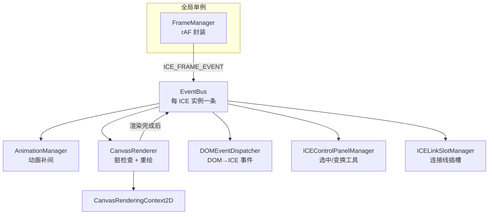

# ICERender 架构设计文档

> 一份关于 ICERender Canvas 2D 渲染引擎的系统性架构说明，作为该引擎的**单一事实来源**（single source of truth），与代码库同仓、随版本演进。
>
> 目标读者：需要二次开发、维护或评审该引擎的工程师。

## 引擎定位

ICERender 是一款 **Canvas 2D 交互图形渲染引擎**（MIT 协议，作者 大漠穷秋）。它借鉴 React 的 `props`/`state` 概念构建组件模型，借鉴 W3C `EventTarget`/jQuery 风格构建事件系统，提供嵌套坐标系、序列化、动画、连接线（Visio 风格）等能力。

**核心设计约束**（贯穿所有子系统的铁律）：

1. **运行时依赖极简** —— 仅 `gl-matrix` 一个库，无其它依赖。
2. **多运行时兼容** —— 同一套代码同时面向 **Web 浏览器**与**各类小程序**（WeChat/Alipay 等），因此不能依赖浏览器专有 API。
3. **高性能** —— 脏标记 + 全量重绘的简单渲染模型，配合渲染队列缓存与矩阵零分配，保证数千图元的交互流畅度。

## 文档地图

| 章节 | 内容 |
|---|---|
| [01 · 运行时链路](01-runtime.md) | `FrameManager` → `EventBus` → 各 Manager → `CanvasRenderer` 的调度管道与启动顺序 |
| [02 · 组件模型](02-component-model.md) | `props`/`state` 分离、类继承体系、容器与 zIndex |
| [03 · 坐标系与矩阵](03-coordinate-system.md) | 列向量约定、`composedMatrix` 组合、原点语义、嵌套坐标（最容易出错的部分） |
| [04 · 渲染与性能](04-rendering-performance.md) | 脏标记 + 全量重绘、渲染队列缓存、矩阵零分配 |
| [05 · 事件系统](05-event-system.md) | `ICEEventTarget`、`EventBus`、DOM 事件桥接 |
| [06 · 序列化](06-serialization.md) | `Serializer`/`Deserializer`、类型映射、`registerType` |
| [07 · 交互与动画](07-interaction-animation.md) | 控制面板、拖拽/变换、连接线、动画 |
| [08 · 多运行时兼容](08-compatibility.md) | `cross-platform/root`、rAF 封装、Path2D 与小程序适配 |

## 运行时全景（一图概览）

- `FrameManager` 是**跨 ICE 实例共享**的全局单例，只负责把 rAF 回调转成 `ICE_FRAME_EVENT` 广播，不直接渲染。
- 每个 `ICE` 实例持有一条独立的 `EventBus`，各 Manager 通过订阅这条总线协作。
- 渲染由 `CanvasRenderer` 完成，它只在 `ice.dirty` 为真时工作。

## 阅读建议

- 想快速理解"一张图怎么画出来"→ 先读 [01 运行时](01-runtime.md) 和 [04 渲染](04-rendering-performance.md)。
- 想搞清楚"坐标为什么/怎么算"→ 精读 [03 坐标系与矩阵](03-coordinate-system.md)（引擎最核心、最易错的部分）。
- 想扩展自定义组件或接入持久化 → 看 [02 组件模型](02-component-model.md) + [06 序列化](06-serialization.md)。
